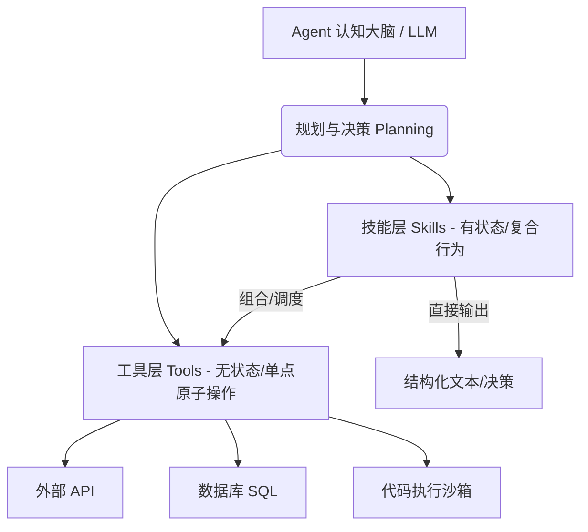

# 📝 面试问题解构：AI Agent 设计中，技能（Skill）能否完全替代工具（Tool）？

---

## 1. 🌐 知识背景与底层原理

在构建大语言模型（LLM）驱动的 AI Agent 时，“工具（Tool）”与“技能（Skill）”是实现 Agent 落地、从“空谈者”变成“实干家”的核心组件。理解这两者的关系，是设计高可用 Agent 架构的基石。

### 引入背景（Why & When）
随着 GPT-4 等大模型表现出强大的推理能力，业界发现单次 Prompt-Response 的交互模式（Single-turn）无法解决复杂的现实问题。Agent 架构应运而生。
* **早期阶段**，业界引入了 **Tool**（通过 MRKL 架构或 ReAct 范式），赋予 LLM 调用外部 API（如搜索、计算器）的能力。
* **随着场景复杂化**，直接让 LLM 面对一堆零散的、底层的 Tool 会导致规划失败（Planning Failure）、Token 消耗过大、调用链路过长等问题。于是，更高抽象维度的 **Skill** 概念被引入（如 Voyager 论文中的技能库、Semantic Kernel 中的 Skill/Plugin 概念），旨在对复杂行为进行封装和复用。

### 解决的核心问题（What）
* **Tool 解决的是“能力边界”问题**：LLM 无法获取实时信息、无法做精确计算、无法直接操作物理世界。Tool 充当了 Agent 的**感官和双手（Actuators & Sensors）**。
* **Skill 解决的是“行为效率与复用”问题**：避免 LLM 每次面对复杂任务时都要“重新发明轮子”（Re-planning）。Skill 将通用的复杂工作流（Workflow）、特定的领域 Prompt 以及多工具调用组合封装起来，形成 Agent 的**程序性记忆（Procedural Memory）**。

### 核心原理剖析（How）
技能与工具在 Agent 系统中处于不同的抽象层级。以下是典型的 Agent 层次架构：

* **工具（Tool）的本质**：是一个**无状态的、确定性的原子函数**。它向 LLM 暴露其 Schema（名称、描述、入参格式），LLM 通过 JSON 或 Function Calling 协议生成参数并调用，Tool 返回结果。
* **技能（Skill）的本质**：是一个**有状态的、高阶的复合行为**。它通常包含：
  1. 一段特定的 Prompt（专家角色、约束条件）。
  2. 一个内部的 Workflow（可能包含多次 LLM 自省/Refinement、条件分支、循环）。
  3. 一个或多个 Tool 的组合调用。
  4. 局部的记忆（Local State/Memory）。

### 典型应用场景（Where）
* **首选 Tool 的场景**：高确定性、单步执行的任务。例如：获取当前天气、查询数据库、计算数学公式、发送一封邮件。
* **首选 Skill 的场景**：目标导向、多步骤、需要动态调整的复杂任务。例如：“编写一份竞品分析报告”（Skill 内部会调用搜索 Tool、翻译 Tool、格式化 Tool，并包含大模型自身的分析和总结逻辑）。

### 引入的缺陷与折中（Trade-offs）
* **Tools 的局限**：过于底层，LLM 调用时容易参数出错；当 Tools 数量破百时，LLM 容易产生“选择幻觉”（Tool Selection Hallucination）。
* **Skills 的副作用**：由于 Skill 内部往往嵌套了 LLM 调用，会带来**延迟（Latency）级联放大**和**Token 成本激增**。同时，过度封装的 Skill 会降低 Agent 应对突发状况的灵活性。

### 潜在的避坑陷阱（Pitfalls）
1. **无限嵌套陷阱**：Skill A 调用 Skill B，Skill B 又调用 Tool C。一旦底层的 Tool 返回异常，异常在嵌套的 Skill 链条中难以优雅降级，导致 Agent 直接崩溃或陷入死循环。
2. **硬编码（Hardcoding）失去弹性**：将本该由 LLM 动态规划的过程，全部写死在 Skill 的 workflow 中，使 Agent 退化成了传统的规则引擎（Rule Engine），失去了 AI 的泛化能力。

---

## 2. 🎯 面试官的真实提问目的

面试官抛出这个“看似哲学”的设计问题，真实目的在于考察候选人是否具备**一线 AI 系统落地经验**，而非仅仅停留在跑通 Demo 的阶段。

* **表层目的**：
  * 考察候选人对主流 Agent 框架（如 Semantic Kernel, LangChain, AutoGen, CrewAI）中基本概念的理解。
  * 考察候选人能否清晰界定两者的边界。
* **深层目的**：
  * **系统架构设计能力**：能否从“高内聚、低耦合”的软件工程视角来审视 Agent 设计。
  * **工程落地与成本意识**：是否理解在生产环境中，完全用 Skill（高频 LLM 交互）替代 Tool（低成本 API 调用）所带来的延迟、Token 消耗以及不确定性（Non-determinism）灾难。
  * **前沿论文追踪能力**：是否了解 Voyager 等论文中关于“技能自动习得（Skill Acquisition）”和“技能库保存/检索”的最前沿学术动态。
* **区分度要点**：
  * **Junior 级别**：认为两者差不多，或者认为“既然 Skill 包含 Tool，那 Skill 当然可以完全替代 Tool”，缺乏软件工程的层次感。
  * **Mid 级别**：能清晰说出两者的定义差异（Tool 是 API，Skill 是 Prompt/Workflow 组合），并得出“不能完全替代”的结论。
  * **Senior/Staff 级别**：能够从 **控制论/系统科学**、**确定性 vs. 随机性**、**冷启动与演进通路**、以及 **生产环境下的工程约束（时延、计算资源、安全性）** 四个维度深度剖析无法完全替代的原因，并能给出“Tool 是 Skill 的执行终点，Skill 是 Tool 的认知封装”这种高屋建瓴的总结。

---

## 3. 📊 回答的科学10分制评估体系

| 评估维度/核心要点 | 对应分值 | 判定标准 (怎样才能拿分) | 扣分项/未达标表现 |
| :--- | :---: | :--- | :--- |
| **要点 1：核心概念定义与异同** | 2 分 | 精准定义 Tool（原子、无状态、确定性、外部接口）与 Skill（复合、有状态、概率性、认知逻辑）。明确指出**不能完全替代**。 | 混淆概念，认为 Tool 只是 Skill 的别名，或逻辑不清。 |
| **要点 2：架构分层与依赖关系** | 3 分 | 阐明两者的依赖关系：Tool 是 Actor（执行者），Skill 是 Cognitive Program（认知程序）。Skill 通常是 Tool 的高阶逻辑封装，Tool 是 Skill 的物理延伸。 | 无法说清两者的调用关系，将两者看作平行的两个概念。 |
| **要点 3：无法替代的深层原因** | 3 分 | 从以下维度论证为什么不能替代： 1. **确定性边界**（Tool 保证计算和执行的 100% 准确性，Skill 带有 LLM 的随机性）。 2. **资源与时延约束**（完全用 Skill 替代 Tool 会导致过多的 LLM 冗余推理）。 3. **解耦设计**（Tool 保持简单，降低 LLM 幻觉和上下文占用）。 | 论证空洞，只会说“因为它们不一样”，无法从工程、成本、不确定性等深度逻辑进行论证。 |
| **要点 4：实战演进（Skill Learning）** | 2 分 | 提到高级 Agent 的设计模式。例如 **Voyager 的技能库模式**：Agent 在环境中通过 Tool 探索，成功后将代码/工作流沉淀为 Skill，下次直接调用。体现出“动态演进”的视野。 | 缺乏前沿视野，回答过于静态，没有表现出对 Agent 自主学习机制的理解。 |

---

## 4. 🧠 问题复杂度评级

* **复杂度评级**：⭐ ⭐ ⭐ ⭐ （4星）
* **评级依据与受众**：
  * **适用级别**：高级 AI 算法工程师、AI 系统架构师。
  * **难点所在**：该题目没有标准答案（标准行业规范尚未完全形成）。它不是考察死记硬背的“八股文”，而是考察**架构审美**和**工程直觉**。候选人必须在脑海中有一幅清晰的 Agent 运行全景图，才能把“技能”和“工具”的咬合关系讲得透彻生动。

---

## 💡 终极回答示范（供候选人参考）

> “我认为，**在 AI Agent 设计中，技能（Skill）绝对不能完全替代工具（Tool）**。它们不是替代关系，而是**高低不同抽象层级的互补与共生关系**。
>
> 我们可以用一个比喻来形容：**Tool 是 Agent 的‘肌肉与感官’，而 Skill 是 Agent 的‘运动反射与专业经验’**。
>
> ### 1. 为什么 Skill 无法替代 Tool？
> * **确定性与物理边界**：Tool（如 Python 沙箱、SQL 查询、外部邮件 API）代表了对物理世界或数字系统的**确定性操纵**。LLM 无论怎么写 Prompt（Skill 的核心），它也无法凭空在内存里精准计算 `123456 * 789012`，它必须依赖计算器（Tool）。Tool 是 Agent 触达客观物理世界、克服 LLM 幻觉的唯一底座。
> * **工程解耦与降低幻觉**：如果把所有逻辑都写成 Skill（依靠 Prompt 约束的步骤），会导致 LLM 面对极长的上下文。把基础能力抽象为 Tool，可以让 Agent 大脑专注于规划（Planning），降低因信息过载带来的幻觉。
> * **计算性价比（ROI）**：Tool 的执行是毫秒级、零 Token 成本的；而 Skill 内部由于包含 LLM 的推理、反思和多轮对话，其时延（Latency）和 Token 成本高出几个数量级。在商业落地中，用 Skill 去硬抗本该由 Tool 完成的确定性计算，在商业上是不可行的。
>
> ### 2. 它们如何协同工作（以 Voyager 技能库为例）？
> 在最先进的 Agent 设计中，Tool 和 Skill 形成了一个**正向循环的进化漏斗**：
> 1. **冷启动**：Agent 只有一堆基础的 **Tools**（移动、挖掘、合成）。
> 2. **探索与学习**：Agent 通过 Planning 调度这些 Tools 去尝试解决复杂任务（比如在我的世界中制作一把铁剑）。
> 3. **固化为 Skill**：一旦任务成功，Agent 将这一串成功的控制代码和 prompt 逻辑，打包成一个可复用的 **Skill**（‘制作铁剑的技能’），存入技能库（Skill Lib）。
> 4. **高阶调用**：下次需要铁剑时，Agent 不再重新规划，而是直接调用这个 **Skill**，该 Skill 内部自动调度基础 **Tools** 执行。
>
> **总结来说**，Tool 保证了 Agent 执行的**深度和准度**（底线），而 Skill 提升了 Agent 规划的**高度和效率**（上限）。一个优秀的 Agent 架构，应该保持 Tool 的简单无状态，同时通过 Skill 实现行为的沉淀与复用。两者缺一不可。”
