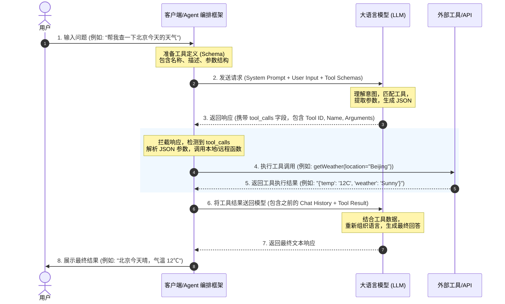

# 📝 面试问题解构：AI Agent 中工具（Tool）调用的具体流程是怎样的？

---

## 1. 🌐 知识背景与底层原理

### 引入背景（Why & When）
大型语言模型（LLM）虽然具备强大的文本生成和逻辑推理能力，但它们天生存在三个致命缺陷：
1. **信息滞后**：知识受限于训练数据的截止日期（Cut-off Date）。
2. **缺乏行动力**：无法直接与物理世界或外部软件系统交互（如发送邮件、查询数据库、控制智能家居）。
3. **计算与事实幻觉**：在处理复杂数学计算、精准事实查询时容易胡说八道。

为了打破这些限制，2022 年底至 2023 年初，学术界和工业界引入了 **ReAct (Reasoning + Acting)** 框架、MRKL 系统，并随后由 OpenAI 在 2023 年 6 月正式推出了 **Function Calling（函数调用）** 机制。这标志着 LLM 从一个“只能聊天的孤岛”进化为能够使用工具的“AI Agent（智能体）”。

### 解决的核心问题（What）
在工具调用出现之前，让 LLM 使用外部工具极其困难。开发者需要通过复杂的 Prompt 诱导模型输出特定格式的文本（如 `[Action: Calculate, Input: 2+2]`），然后用正则表达式艰难地解析。
Tool Calling 机制彻底解决了这一痛点：它**将非结构化的自然语言理解，标准化地转化为结构化的参数输出（通常是 JSON 格式）**。

> **核心痛点解决**：LLM 本身不执行工具，它只做**决策（Decision）**和**参数提取（Arguments Extraction）**，具体的**执行（Execution）**由客户端代码完成。

### 核心原理剖析（How）
工具调用的本质是一个**多阶段的双向闭环通信流程**（Loop）。其底层工作机制如下：

#### 关键步骤详解：
1. **工具声明（Registration）**：向 LLM 声明工具的 Schema（使用 JSON Schema 规范），明确工具的名字（name）、功能描述（description）以及参数列表（parameters）和必填项（required）。
2. **推理与决策（Routing）**：模型判断用户的意图是否需要调用工具。如果需要，它会暂停输出普通文本，转而输出一个结构化的 `tool_calls` 结构。
3. **本地执行（Execution）**：宿主程序（如 LangChain、LlamaIndex 或自定义 Python 代码）拦截到 `tool_calls`，解析出参数，执行真正的 API 或本地函数。
4. **上下文拼接（Feedback Loop）**：将工具返回的原始数据封装成特定的 `tool` 角色消息（Message Role: `tool` 或 `function`），连同之前的对话历史再次发送给 LLM。
5. **总结输出（Synthesis）**：LLM 将工具返回的数据融会贯通，翻译成人类可读的自然语言。

### 典型应用场景（Where）
* **RAG（检索增强生成）系统**：当用户提问私域知识时，Agent 自动调用 `search_vector_database` 工具。
* **企业 ERP/CRM 自动化**：用户说“帮我把张三的销售额录入系统”，Agent 自动调用 `update_crm_record(name='张三', value=1000)`。
* **数据分析与可视化**：Agent 遇到复杂数学问题，调用 Python 解释器 `execute_python_code` 计算并画图。

### 引入的缺陷与折中（Trade-offs）
* **延迟显著增加（High Latency）**：完成一次工具调用至少需要 **2 次 LLM 的推理请求（Two-turn conversation）** 加上一次工具实际执行时间，这在实时交互（如语音助手）中体验较差。
* **Token 成本翻倍（Cost Increase）**：开发者必须在每次请求中都携带完整的 Tool Schemas。如果工具很多，系统 Prompt 会变得极其庞大，消耗大量 Input Tokens。
* **状态管理的复杂性**：如果在工具执行期间出错，或者需要多次链式调用（Multi-step Tool Calling），如何优雅地管理对话状态和回滚事务是极大的挑战。

### 潜在的避坑陷阱（Pitfalls）
* **JSON 格式不合法**：虽然主流模型（如 GPT-4, Claude 3.5）对 Tool Calling 进行了微调优化，但弱模型经常会输出错误的 JSON 格式或参数类型缺失，导致解析异常。
* **幻觉调用非现有工具**：模型可能会凭空想象出一个不存在的工具名称（例如，有 `get_weather`，它却输出了 `fetch_temperature`）。
* **安全风险（代码注入/未授权操作）**：如果给 Agent 赋予了 `execute_sql` 或 `delete_file` 的工具，一旦遭遇**提示词注入攻击（Prompt Injection）**，攻击者可以通过恶意提示词唆使 Agent 执行破坏性命令。

---

## 2. 🎯 面试官的真实提问目的

* **表层目的**：
  * 评估候选人是否跟进最新的大模型开发技术，是否理解大模型从单纯的“Chat”走向“Agent”的技术演进路线。
  * 考察候选人是否能清晰描述完整的异步/多轮交互生命周期。

* **深层目的**：
  * **真假实战鉴别**：纸上谈兵的候选人只会背诵“模型会自动调用工具”这类模糊概念。真正写过 Agent 的人能指出 **“模型只负责生成调用意图（JSON），真正的执行是由客户端代码驱动的”** 这一关键点。
  * **工程落地与鲁棒性考量**：考察候选人在面对外部 API 报错、网络超时、模型输出畸形 JSON、并发调用等实际生产环境痛点时的处理思路（如 Retry 机制、JSON 修复、Schema 裁剪）。
  * **安全与架构思维**：优秀的候选人会主动提及沙箱环境（Sandbox）、权限控制（ACL）以及提示词注入等安全边界问题。

* **区分度要点 (Junior vs. Senior)**：
  * **Junior / Mid 候选人**：能说出流程图中的 1~8 个步骤。知道使用 LangChain 的 `initialize_agent` 或 OpenAI API。
  * **Senior / Staff 候选人（分水岭）**：
    * 能够讲清楚 **Parallel Tool Calling（并行工具调用）** 的机制和合并逻辑。
    * 会讨论**工具路由（Tool Routing）的规模化问题**：当系统有 1000 个工具时，如何做动态检索（Tool Retrieval）而不是把所有 Schema 都塞进 Prompt 里。
    * 会提出严格的**防御性设计**：如何对工具参数进行 Pydantic 校验，如何限制单次 ReAct 循环的最大迭代次数（防止死循环）。

---

## 3. 📊 回答的科学 10 分制评估体系

| 评估维度/核心要点 | 对应分值 | 判定标准 (怎样才能拿分) | 扣分项/未达标表现 |
| :--- | :---: | :--- | :--- |
| **要点 1：工作流与执行主体的清晰认知** | 3 分 | 1. 清晰绘制或口述出双向通信闭环流程（包含 2 次 LLM 交互）。 2. **必须明确指出：大模型本身不具备执行代码/API的能力**，工具执行发生在宿主应用端（Client Side）。 | 认为大模型内部直接运行了工具代码；说不清模型和客户端在工具调用中的分工。 |
| **要点 2：数据结构与 API 角色（Message Role）** | 2 分 | 1. 准确说出 OpenAI/Claude 体系中，涉及的 `system`、`user`、`assistant`（携带 `tool_calls` 结构）以及特殊的 `tool`/`function` 角色。 2. 能描述出 Tool Schema 的构成（Name, Description, Parameters JSON Schema）。 | 混淆了 Message 角色；说不清模型是如何表达“我想调用工具”这一意图的底层数据结构的。 |
| **要点 3：工程异常处理与鲁棒性** | 2 分 | 1. 提出当工具返回错误（如 API 500）时，如何优雅地将错误信息反馈给 LLM 让其自我修正（Self-correction）。 2. 提到对于大模型输出的畸形 JSON，如何使用解析器（Pydantic/Regex）或兜底重试机制进行处理。 | 默认流程永远完美运行，不考虑网络波动、格式错误等现实工程问题。 |
| **要点 4：高级性能优化与策略** | 2 分 | 1. 提及**并行调用（Parallel Tool Calling）**（如一次性查询北京、上海、广州三地天气并合并结果）。 2. 提及**动态工具检索（Dynamic Tool Retrieval）**（当工具有几百个时，利用 Vector DB 语义检索最相关的 5 个工具 Schema 传入 Prompt，节约 Token）。 | 缺乏优化思维，认为所有的工具必须一股脑全部静态写死在 Prompt 中。 |
| **要点 5：安全防范与工程边界** | 1 分 | 1. 主动讨论安全机制：代码执行类工具必须运行在隔离的沙箱（如 Docker、WASM）中。 2. 敏感工具（如扣款、发信）必须引入 **Human-in-the-loop（人工介入审批）** 机制。 | 没有任何安全意识，允许 AI Agent 拥有无限权限或直接在宿主机执行系统命令。 |

> **评分指引**：
> * **1 ~ 4分**：初级阶段。仅知晓基础八股概念，能够用 LangChain 跑通 Hello World 级别 Demo。
> * **5 ~ 7分**：中高级阶段。对数据流、API 角色设计、基础异常处理有清晰把握。
> * **8 ~ 10分**：资深/专家阶段。具备极强的系统架构和防御性编程思维，能够从性能（Latency/Token）、安全（Sandbox）、规模化（Vector Routing）等维度进行系统级权衡。

---

## 4. 🧠 问题复杂度评级

* **复杂度评级**：⭐ ⭐ ⭐ ⭐ （4星）
* **评级依据与受众**：
  * **目标受众**：该问题最适合用于面试 **大模型应用开发工程师（LLM Application Engineer）**、**AI Agent 架构师** 或 **高级中台研发工程师**。
  * **难点解析**：
    * **看似简单，实则工程细节极多**：工具调用的概念非常直观，但要在真实生产环境（Production Ready）中稳定运行，涉及到**异步编程、非确定性系统的异常处理、提示词注入防御、多轮对话状态机维护**等极其繁琐的工程细节。
    * **考查前沿架构思维**：它直接反映了候选人对当前 AI 2.0 时代“大模型作为中央处理器（CPU），外部 API 作为外设”这一崭新计算架构的理解深度。
