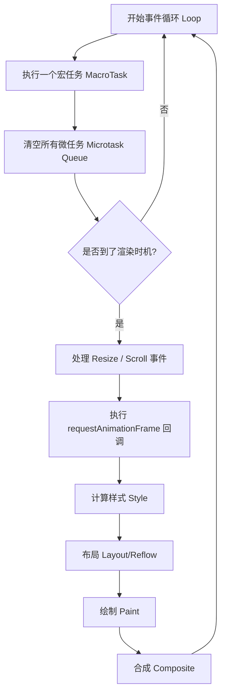

# 📝 面试问题解构：`requestAnimationFrame` 的回调函数是否会被 JavaScript 任务阻塞？

---

## 1. 🌐 知识背景与底层原理

### 引入背景（Why & When）
在早期 Web 开发中，实现动画主要依赖 `setTimeout` 或 `setInterval`。然而，这两个 API 存在致命缺陷：**它们的时间精度无法保证**。
- 它们只是在指定时间后将任务推入**宏任务队列**，并不意味着能立即执行。
- 它们与浏览器的屏幕刷新率（通常是 60Hz，即每 16.7ms 刷新一次）完全是异步的，会导致“丢帧”（Jank）或不必要的重复渲染，浪费 CPU/GPU 资源。

为了解决这一痛点，W3C 在 HTML5 时代引入了 `requestAnimationFrame`（简称 rAF）。

### 解决的核心问题（What）
rAF 的核心目的是**让动画的执行时机与浏览器的屏幕刷新频率（Refresh Rate）完美同步**。
它解决了：
1. **丢帧与卡顿**：确保在浏览器准备重绘之前执行回调。
2. **节能**：当页面处于后台或隐藏在 `iframe` 中时，rAF 会暂停执行，而 `setTimeout` 会继续在后台运行。

### 核心原理剖析（How）
**答案是肯定的：`requestAnimationFrame` 的回调函数绝对会被 JavaScript 任务阻塞。**

要理解这一点，必须深入浏览器的 **Event Loop（事件循环）** 和 **Rendering Pipeline（渲染流水线）**。

#### 浏览器事件循环与渲染时机
在浏览器的单个 Loop 中，其执行顺序大致如下：
1. **执行一个宏任务（Task）**（如：点击事件、setTimeout 回调）。
2. **清空微任务队列（Microtasks）**（如：Promise.then）。
3. **判断是否需要渲染（Render Opportunity）**：根据屏幕刷新率、页面可见性等因素决定是否进行重绘。
4. **如果需要渲染，则进入渲染阶段**：
   - 触发 `Resize` / `Scroll` 事件。
   - **执行 `requestAnimationFrame` 的回调**。
   - **解析样式（Style/Recalculate Style）**。
   - **布局（Layout/Reflow）**。
   - **绘制（Paint）并合（Composite）**。

#### Mermaid 流程图：Event Loop 中的 rAF 阶段



**关键点**：
* **单线程限制**：由于 JavaScript 执行和渲染共享同一个**主线程（Main Thread）**。如果步骤 1（宏任务）或步骤 2（微任务）执行时间过长（例如一个计算量极大的 `for` 循环），主线程将被一直占用，导致事件循环无法进入“渲染时机判断”及后续的“渲染阶段”。
* **链式延迟**：这意味着，即使 rAF 的触发时间到了，它也必须在主线程空闲后，排在当前正在执行的 JS 任务（以及微任务）之后才能执行。

---

### 典型应用场景（Where）
* **高频视觉更新**：Canvas 游戏循环、DOM 属性动画、SVG 变换。
* **滚动与交互动效**：实现平滑滚动（Smooth Scroll）或视差滚动（Parallax Scrolling）。
* **UI 状态同步**：在修改 DOM 之前读取最新布局信息，避免强制同步布局（Forced Synchronous Layout）。

---

### 引入的缺陷与折中（Trade-offs）
* **无法保证执行间隔**：在高性能屏幕（如 120Hz/144Hz）上，rAF 的触发间隔是 ~7ms/8ms；在普通屏幕上是 ~16.7ms。代码必须**基于时间差（Delta Time）**计算位移，而不是假设每次调用间隔固定。
* **仍受主线程拖累**：如果动画逻辑自身过于复杂（例如在 rAF 回调中进行大量计算或频繁读取 offsetHeight），同样会导致帧率下降。

---

### 潜在的避坑陷阱（Pitfalls）
* **布局抖动（Layout Thrashing）**：在 rAF 回调中**先写 DOM 再读 DOM**，会导致浏览器在当前帧内强制重新进行 Layout（Forced Synchronous Layout），从而极大拖慢执行速度。
  ```javascript
  // ❌ 坏习惯：交替读写导致布局重排
  requestAnimationFrame(() => {
    const width = element.offsetWidth; // 读
    element.style.width = width + 10 + 'px'; // 写
    const height = element.offsetHeight; // 读 (强制触发 Layout)
    element.style.height = height + 10 + 'px'; // 写
  });
  ```

---

## 2. 🎯 面试官的真实提问目的

* **表层目的**：
  * 考察候选人是否理解 JavaScript 的单线程本质。
  * 考察是否仅停留在“rAF 比 `setTimeout` 性能好”的八股文结论上。

* **深层目的**：
  * **Event Loop 深度掌握**：候选人能否精准画出（或说出）Event Loop 的完整生命周期，特别是 Render 阶段与 Microtask/Macrotask 的交错关系。
  * **性能优化体感**：候选人是否有过解决前端动画卡顿、分析性能瓶颈（如使用 Chrome DevTools Performance 面板）的实战经验。
  * **边界情况思考**：是否理解高刷新率屏幕、后台标签页对 rAF 的影响。

* **区分度要点**：
  * **Junior**：知道 rAF 会被阻塞，回答理由是“JS 是单线程的”。
  * **Mid**：能说出 Event Loop，并指出 rAF 发生在“微任务之后，Paint 之前”，了解长任务（Long Task）会导致丢帧。
  * **Senior/Staff**：
    * 能够指出浏览器并不是每轮 Loop 都会渲染，而是约 16.7ms 一次。
    * 能够详细解释 **Layout Thrashing（布局抖动）** 以及如何在 rAF 中优雅地进行“读写分离”（如利用 `FastDOM` 库的思想）。
    * 能够提出解决方案：如将高能耗计算移至 **Web Workers**，或利用 **CSS 3D 硬件加速**绕过主线程 Layout/Paint 阶段，直接在 Compositor 线程处理。

---

## 3. 📊 回答的科学10分制评估体系

| 评估维度/核心要点 | 对应分值 | 判定标准 (怎样才能拿分) | 扣分项/未达标表现 |
| :--- | :---: | :--- | :--- |
| **要点 1：基本定性与单线程原理** | 2 分 | 明确给出“**会被阻塞**”的肯定回答。能解释是因为 JS 引擎和渲染引擎共享同一个单线程（主线程）。 | 回答“不会被阻塞”或含糊其辞；无法解释单线程概念。 |
| **要点 2：Event Loop 与渲染时机** | 3 分 | 能够清晰准确地阐述 rAF 在 Event Loop 中的位置（处于 **MacroTask -> MicroTask 之后，Style/Layout/Paint 之前**）。并指出浏览器约 16.7ms（60Hz）才会进行一次渲染机会。 | 误认为 rAF 是一个微任务或普通的宏任务；混淆了 rAF 与 `setTimeout` 在事件循环中的队列归属。 |
| **要点 3：阻塞机制与卡顿成因** | 2 分 | 能够说明当存在 **Long Task（长任务）**（如耗时 100ms 的同步 JS 代码或 Promise 微任务暴涨）时，主线程无法释放，导致渲染管道（包含 rAF）无法被调度，从而造成丢帧。 | 无法说出“长任务”或“微任务积压”是如何具体影响到渲染流程的。 |
| **要点 4：实战避坑与性能调优** | 2 分 | **（加分项）** 提出 rAF 内部的 **Layout Thrashing（强制同步布局）** 风险；提到读写分离机制；或提到使用 Chrome Performance 工具排查火焰图。 | 认为只要用了 rAF 动画就绝对流畅，没有性能意识。 |
| **要点 5：高级方案与技术折中** | 1 分 | **（高阶项）** 提出避免主线程阻塞动画的架构方案：如使用 **CSS 动画 / Web Animations API**（可运行在 Compositor 线程，不被 JS 阻塞），或将大计算量任务移入 **Web Worker**。 | 完全没有考虑过主线程被占满时的兜底或替代方案。 |

---

## 4. 🧠 问题复杂度评级

* **复杂度评级**：⭐ ⭐ ⭐ ⭐ （4 星）
* **评级依据与受众**：
  * **适用级别**：中级、高级前端开发工程师，以及前端架构师。
  * **难点所在**：这个题目看似是简单的“是/否”问题，但要答得漂亮，必须对**浏览器的底层渲染架构（Blink/Gecko 引擎工作流）**、**W3C HTML5 Event Loop 规范** 有极其严谨的认知。大多数候选人只背过“rAF 优化动画”的结论，一旦追问其在事件循环中的确切时机以及与微任务的关系，极易暴露出底层基础不扎实的问题。
