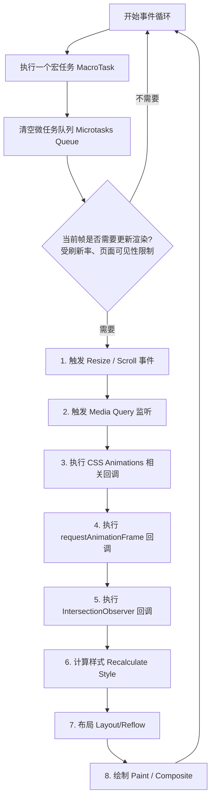

# 📝 面试问题解构：`requestAnimationFrame` 执行时机与浏览器渲染周期

本题的核心在于考察前端工程师对**浏览器事件循环（Event Loop）**与**浏览器渲染管道（Rendering Pipeline）**的深度理解。这是一个典型的“听起来简单，但深挖无底洞”的经典前端底层面试题。

---

## 1. 🌐 知识背景与底层原理

### 引入背景（Why & When）
在 Web 早期，开发者主要使用 `setInterval` 或 `setTimeout` 来实现 JavaScript 动画。然而，这类定时器存在致命缺陷：
1. **时间不精确**：受事件循环中其他宏任务阻塞的影响，定时器常常无法按时触发。
2. **与屏幕刷新率不同步**：大部分显示器是 60Hz（约 16.7ms 刷新一次），而定时器的时间间隔（如 10ms 或 16ms）无法与屏幕物理刷新信号（V-Sync）对齐，从而导致**丢帧（Jank）**和**卡顿**。

为了解决这一痛点，W3C 在 HTML5 时代引入了 `requestAnimationFrame`（简称 rAF）。

### 解决的核心问题（What）
`requestAnimationFrame` 的核心目的是**让开发者注册的 JS 动画代码，精确地在浏览器下一次重绘（Repaint）之前执行**。它由系统（浏览器）决定回调函数的执行时机，自动与屏幕的刷新率（60Hz、144Hz 等）保持同步，从而实现丝滑流畅的动画。

### 核心原理剖析（How）
要精确回答“在 DOM 渲染前还是渲染后执行”，必须拆解浏览器单次事件循环（Event Loop）中的 **Update the Rendering（更新渲染）** 阶段。

以下是完整的单次事件循环迭代中，渲染相关的执行顺序：

#### 💡 核心结论
**`requestAnimationFrame` 的回调函数是在 DOM 渲染（即 Style 计算、Layout 布局、Paint 绘制）之前执行的。** 

更准确地说：
* **DOM 树的修改（JS 内存层面）**：随时可以进行。如果在 rAF 回调中修改了 DOM，这些修改会被收集。
* **DOM 的物理渲染（像素层面）**：rAF 执行完毕后，紧接着浏览器就会执行 Style -> Layout -> Paint。因此，rAF 里的 DOM 修改会在**紧随其后的那次屏幕刷新中被一次性渲染出来**。

### 典型应用场景（Where）
1. **高频、高性能视觉动画**：如页面滚动视差（Parallax Scrolling）、DOM 元素拖拽、Canvas 游戏渲染循环。
2. **避免布局抖动（Layout Thrashing）的写操作**：将所有对 DOM 的写操作（如修改 width, height）放入 rAF 中，确保它们在下一次布局计算前统一执行。
3. **首屏渲染优化**：将非核心的 DOM 节点创建拆分到后续帧的 rAF 中分批执行（时间分片思想）。

### 引入的缺陷与折中（Trade-offs）
* **主线程依赖**：rAF 仍然运行在 JS 主线程上。如果主线程有超长耗时的同步任务，rAF 依然会被阻塞，无法保证 16.7ms 的稳定执行。
* **后台暂停**：当页面处于后台运行、标签页隐藏或在 `<iframe>` 中不可见时，rAF 会暂停执行。这对于省电和省 CPU 极好，但如果你依赖它做后台定时任务（如倒计时），则会导致逻辑暂停。

### 潜在的避坑陷阱（Pitfalls）
* **强制同步布局（Forced Synchronous Layout）**：如果在 rAF 回调中先写 DOM（如 `el.style.width = '100px'`），紧接着又读 DOM（如 `let w = el.offsetWidth`），会逼迫浏览器在 rAF 执行中途立即进行一次 Layout，从而彻底破坏 rAF 避免卡顿的初衷。
* **过度嵌套**：在 rAF 中递归调用自身，如果忘记设置终止条件或使用 `cancelAnimationFrame`，会导致无限循环。

---

## 2. 🎯 面试官的真实提问目的

* **表层目的**：考察候选人是否知道 rAF 这一基础 Web API 的执行时机，避免写出阻塞渲染的代码。
* **深层目的**：
  * **Event Loop 理解深度**：是否清楚 Microtask, Macrotask 与 Render 阶段的协作关系。
  * **浏览器渲染原理**：是否能说出从 JS 执行到屏幕上像素呈现的完整 Pipeline（Style -> Layout -> Paint -> Composite）。
  * **性能优化意识**：是否理解如何利用渲染周期避免“布局抖动”，是否具备 60FPS 动画优化的实战经验。
* **区分度要点**：
  * **Junior**：知道 rAF 比 `setTimeout` 性能好，能说出“在渲染前执行”这一结论，但说不清完整的 Pipeline。
  * **Mid**：能画出 Event Loop 中渲染阶段的细分步骤，知道 rAF 处于 Style/Layout 之前；能解释后台标签页暂停特性。
  * **Senior/Staff**：能深入讨论 V-Sync 信号、强制同步布局（Forced Synchronous Layout）的成因与规避手段、rAF 与 Microtask 的竞态关系，甚至能指出不同浏览器内核（Chromium vs WebKit）在早期版本中对 rAF 执行时机实现的细微差异。

---

## 3. 📊 回答的科学10分制评估体系

| 评估维度/核心要点 | 对应分值 | 判定标准 (怎样才能拿分) | 扣分项/未达标表现 |
| :--- | :---: | :--- | :--- |
| **要点 1：核心结论与时机定位** | 2 分 | 准确指出 rAF 在 **DOM 渲染（Style / Layout / Paint）之前**执行，并且是渲染阶段（Update the Rendering）的一部分。 | 判定模糊，认为是在渲染后执行，或者将“DOM 内存修改”与“物理渲染”混淆。 |
| **要点 2：事件循环与渲染管线** | 3 分 | 能清晰梳理出 `Task -> Microtask -> [Render: rAF -> Style -> Layout -> Paint]` 的完整事件循环时序关系。 | 无法解释 rAF 与 Promise（Microtask）或 setTimeout 的执行先后顺序。 |
| **要点 3：物理同步机制 (V-Sync)** | 2 分 | 提到屏幕刷新率（60Hz/144Hz）与 V-Sync 物理信号，说明 rAF 的触发是由浏览器自动对齐物理刷新的。 | 认为 rAF 只是一个“时间固定为 16.7ms 的定时器”。 |
| **要点 4：实战性能优化与避坑** | 2 分 | 能够结合实例说明如何利用 rAF 避免“布局抖动”（Layout Thrashing），阐述“读写分离”的黄金法则。 | 纸上谈兵，说不出具体的实战优化场景，或者不知道强制同步布局的概念。 |
| **要点 5：边界与缺陷分析** | 1 分 | 提到页面后台静置时 rAF 的暂停机制（省电/降载），以及主线程阻塞对 rAF 的负面影响。 | 认为 rAF 是万能银弹，忽视其依然运行在主线程这一局限性。 |

---

## 4. 🧠 问题复杂度评级

* **复杂度评级**：⭐ ⭐ ⭐ ✦ ☆ （3.5 星）
* **评级依据与受众**：
  * 该题目非常适合**中高级前端开发工程师**的面试。
  * **难点在于底层的系统性**。如果候选人仅仅死记硬背“渲染前”，一旦面试官追问：“*在 rAF 里面读取 `offsetWidth` 会发生什么？*”或者“*rAF 回调和 Promise.then 哪个先执行？*”，没有深入探究过浏览器源码或 W3C 规范的候选人会瞬间露怯。
