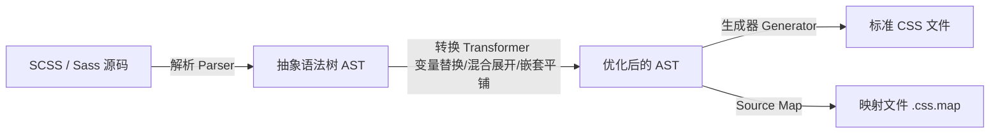

# 📝 面试问题解构：请介绍 Sass 及其主要特性和优势

---

## 1. 🌐 知识背景与底层原理

### 引入背景（Why & When）
在 2000 年代中期（Sass 诞生于 2006 年），Web 2.0 蓬勃发展，网页逐渐演变为复杂的 Web 应用程序。然而，原生的 CSS 语言作为一种**声明式样式表语言**，缺乏编程语言的基本特性（如变量、函数、逻辑控制、模块化）。
随着项目规模扩大，开发者面临着严重的 CSS 维护灾难：数万行的单体 CSS 文件、大量的重复代码（Color、Font-size）、由于命名冲突导致的样式污染，以及难以维护的层级选择器。

### 解决的核心问题（What）
Sass（Syntactically Awesome Style Sheets）作为一种 **CSS 预处理器（Preprocessor）**，核心解决了以下痛点：
1. **DRY（Don't Repeat Yourself）原则的缺失**：消除了大量重复的颜色值、字体配置和常用样式片段。
2. **缺乏代码组织与模块化能力**：原生 CSS 当时不支持高效的导入（原生的 `@import` 会产生额外的 HTTP 请求，影响性能）。
3. **嵌套关系不直观**：为了表示 HTML 的层级结构，必须重复书写父级选择器。

### 核心原理剖析（How）
Sass 本质上是一个**编译器**。它将开发者编写的 `.scss` 或 `.sass` 语法文件，通过词法分析、语法分析生成 **AST（抽象语法树）**，再经过转换与代码生成，最终编译输出为标准的、浏览器可识别的 `.css` 文件。

现在主流的编译器是 **Dart Sass**（官方推荐，用 Dart 编写，可编译为 JS），而早期的 Ruby Sass 和基于 C/C++ 的 LibSass 已被废弃。

#### 🌟 Sass 的核心特性：
*   **嵌套（Nesting）**：允许将 CSS 规则嵌套在另一个规则中，完美契合 HTML 结构。
*   **变量（Variables）**：使用 `$` 定义变量，如 `$primary-color: #3498db;`。
*   **混合（Mixins）**：通过 `@mixin` 定义可复用的样式块，通过 `@include` 引用，并支持传参。
*   **继承/延伸（Extend）**：使用 `@extend` 让一个选择器继承另一个选择器的样式。
*   **模块系统（Modules）**：现代 Sass 引入了 `@use` 和 `@forward`，替代了会造成全局命名污染的 `@import`。
*   **函数与计算**：内置丰富的颜色、数学计算函数，并支持通过 `@function` 自定义函数。

### 典型应用场景（Where）
*   **企业级中后台系统**：样式组件化开发，便于统一管理主题色和布局规范。
*   **UI 组件库开发**：如 Element Plus、Bootstrap (v4/v5) 等，利用 Sass 的变量和混合机制实现高度可定制的皮肤。
*   **大型多页面/单页面应用**：通过 Sass 模块化拆分结构，按需加载样式。

### 引入的缺陷与折中（Trade-offs）
1. **构建成本（Build-time Cost）**：Sass 必须经过编译步骤，这增加了前端构建流程（如 Webpack/Vite）的复杂度和编译耗时。
2. **体积膨胀风险**：过度使用 `@extend` 或不合理地使用 `@mixin` 会导致编译出来的 CSS 文件体积急剧增大。
3. **调试心智负担**：浏览器端运行的是编译后的 CSS，必须依赖 **Source Map** 才能定位到 `.scss` 源码行，增加了调试成本。

### 潜在的避坑陷阱（Pitfalls）
*   **“盗梦空间”式深层嵌套（Inception Rule）**：过度嵌套（超过 3-4 层）会导致生成的 CSS 选择器过长（如 `.nav .list .item .link .icon`），降低浏览器渲染性能，且极难复用和重写。
*   **`@import` 的全局污染**：传统的 `@import` 会将所有变量、mixin 暴露在全局，容易引发命名冲突。现代 Sass 强制要求使用 `@use`。
*   **`@extend` 的副作用**：`@extend` 会将选择器合并组合，容易产生意料之外的选择器级联，破坏 CSS 的源顺序（Source Order）。

---

## 2. 🎯 面试官的真实提问目的

*   **表层目的**：考察候选人对前端工程化基础工具（CSS 预处理器）的了解程度，确认其是否掌握现代 CSS 开发的基本技能。
*   **深层目的**：
    *   **工程化深度**：候选人是否停留在“只会用嵌套和变量”的阶段？是否了解 Sass 现代模块系统（`@use` vs `@import`）？
    *   **架构与性能思维**：是否理解 `@extend` 与 `@mixin` 的底层生成差异？是否知道如何避免编译后的 CSS 体积暴涨？
    *   **技术前瞻性**：在 CSS 已经原生支持变量（CSS Custom Properties）和原生嵌套（CSS Nesting Draft）的今天，候选人如何看待 Sass 的存在价值？
*   **区分度要点**：
    *   **Junior**：只能说出变量、嵌套、`@mixin` 基础语法。
    *   **Mid**：能分清 `@mixin` 与 `@extend` 的区别及适用场景，知道通过构建工具集成 Sass。
    *   **Senior/Staff**：能指出 Sass 最新规范变化（如 `@use` 的作用域隔离、Dart Sass 编译器迁移），深入探讨过嵌套对浏览器渲染性能的影响，能结合**原生 CSS 变量**与 **Sass 变量**进行混合架构设计（如动态主题切换）。

---

## 3. 📊 回答的科学10分制评估体系

| 评估维度/核心要点 | 对应分值 | 判定标准 (怎样才能拿分) | 扣分项/未达标表现 |
| :--- | :---: | :--- | :--- |
| **要点 1：基础定义与核心特性** (基础分) | 2 分 | 清晰定义 Sass 是 CSS 预处理器，并准确阐述其三大核心特性：**嵌套**、**变量**、**混合 (Mixin)**。 | 概念模糊，分不清预处理器和后处理器的区别。 |
| **要点 2：模块化与最新规范** (工程化) | 3 分 | 1. 能对比说明 `Sass` 与 `SCSS` 语法的区别（缩进 vs 花括号）。 2. 主动提及 **Dart Sass** 是当前主流。 3. 能够指出旧版 `@import` 的弊端，并详细阐述**新版模块系统 `@use` 和 `@forward`** 的 namespace 隔离机制。 | 仍在使用过时的 `@import` 作为模块化标杆，不知道现代 Sass 的演进。 |
| **要点 3：底层机制与性能权衡** (深度剖析) | 3 分 | 1. 深度对比 **`@mixin`**（代码复制，传参灵活）与 **`@extend`**（代码合并，易导致选择器膨胀）的生成产物差异。 2. 提及**嵌套层级限制**（如不超过3层规则）及对 CSS 性能、体积的影响。 | 无法解释 `@mixin` 和 `@extend` 在编译后生成的 CSS 结构有何不同。 |
| **要点 4：现代 CSS 演进与选型思考** (专家思维) | 2 分 | 1. 能客观分析 **Sass 变量（编译期静态）** 与 **原生 CSS 变量（运行时动态，利于换肤）** 的配合使用。 2. 探讨 Sass 在当前 Tailwind CSS、CSS-in-JS 等新范式下的定位与互补关系。 | 认为 Sass 是万能银弹，忽视了现代 CSS（如原生 Nesting, Custom Properties）的发展。 |

---

## 4. 🧠 问题复杂度评级

*   **复杂度评级**：⭐ ⭐ ⭐ （3星 - 中等）
*   **评级依据与受众**：
    *   **受众**：主要针对**中高级前端工程师**。
    *   **难点解析**：这道题看似是“八股文”，但上限极高。难点不在于罗列特性，而在于**工程实践和避坑经验**。面试官会通过追问“`@use` 与 `@import` 的区别”、“编译产物优化”或“与原生 CSS 变量的协同”来剔除那些只背书、没写过大型项目的候选人。
