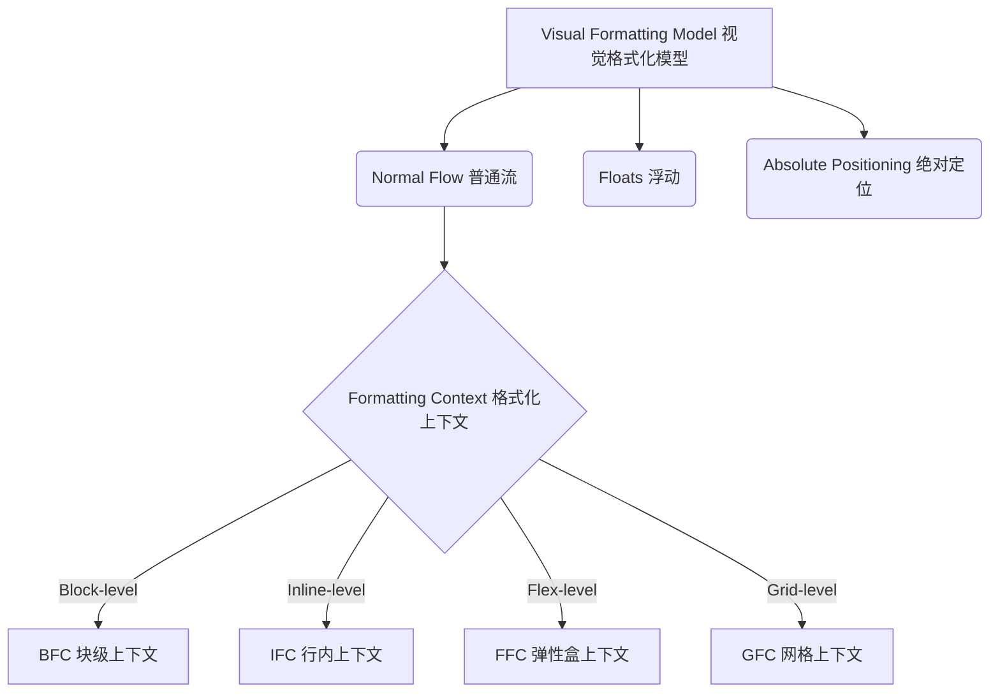

# 📝 面试问题解构：CSS 中的 BFC 与 IFC 深度剖析

---

## 1. 🌐 知识背景与底层原理

### 引入背景（Why & When）
在 Web 发展早期，网页设计主要依赖 `table` 布局或极其简单的流式排版（Normal Flow）。随着页面复杂度的增加，开发者需要更精细地控制元素的对齐、浮动以及重叠行为。W3C 在 CSS2 规范中引入了 **视觉格式化模型（Visual Formatting Model）**，它定义了浏览器如何处理文档树并将之渲染在屏幕上。**BFC（Block Formatting Context，块格式化上下文）** 和 **IFC（Inline Formatting Context，行内格式化上下文）** 正是该模型中的核心概念，用于隔离不同类型的排版环境。

### 解决的核心问题（What）
在没有 BFC 和 IFC 的规范约束前，网页渲染面临以下痛点：
1. **高度塌陷**：子元素浮动后，父元素高度变为 0，导致背景色和边框无法撑开。
2. **外边距折叠（Margin Collapsing）**：垂直方向上相邻的两个块级元素，外边距会发生意料之外的合并。
3. **排版混乱**：行内元素（如图片、文字）在同一行内对齐时，缺乏统一的对齐基准（如基线、中线），导致排版不整齐。

BFC 和 IFC 的引入，提供了一种**隔离的、自适应的排版环境**，使得环境内部的元素布局不会影响到外部，反之亦然。

### 核心原理剖析（How）

#### 1. BFC（块格式化上下文）
*   **触发条件**：
    *   根元素（`<html>`）
    *   `float` 属性不为 `none`
    *   `position` 为 `absolute` 或 `fixed`
    *   `display` 为 `inline-block`、`flex`、`grid`、`flow-root`（**最规范的现代触发方式**）
    *   `overflow` 不为 `visible`（如 `hidden`、`auto`、`scroll`）
*   **核心布局规则**：
    *   内部的 Box 会在垂直方向一个接一个地放置。
    *   属于同一个 BFC 的两个相邻 Box 的上下 `margin` 会发生折叠。
    *   BFC 的区域不会与 `float` box 重叠（可用于实现自适应双栏布局）。
    *   计算 BFC 的高度时，浮动元素也参与计算（解决高度塌陷/清除浮动）。
    *   BFC 是一个独立的容器，外面的元素不会影响里面，里面的元素也不会影响外面。

#### 2. IFC（行内格式化上下文）
*   **触发条件**：
    *   当一个块级容器中**仅包含行内级别元素**（如 `span`、`img`、文本等）时，就会自动创建 IFC。
*   **核心布局规则**：
    *   内部的 Box 会在水平方向一个接一个地放置。
    *   这些 Box 的水平方向的 `margin`、`border`、`padding` 生效，但垂直方向的不影响行高（即不触发排版挤压）。
    *   一行内所有的行内元素会被包裹在一个虚拟的 **Line Box（行框）** 中。
    *   Line Box 的高度由内部最高的行内盒决定（受 `line-height` 和 `vertical-align` 共同控制）。
    *   当一行放不下时，会被折行。水平对齐方式由 `text-align` 控制，垂直对齐由 `vertical-align` 控制。

---

### 典型应用场景（Where）

| 格式化上下文 | 场景 | 解决方案 |
| :--- | :--- | :--- |
| **BFC** | **自适应两栏布局** | 左侧元素 `float: left`，右侧主内容区设置 `overflow: hidden` 或 `display: flow-root` 触发 BFC，使右侧不与左侧浮动重叠。 |
| **BFC** | **防止 Margin 折叠** | 给子元素包裹一层父元素，并触发该父元素的 BFC，使子元素的 margin 无法外溢与外部元素折叠。 |
| **BFC** | **清除内部浮动** | 父元素设置 `overflow: auto` 或 `display: flow-root`，强行计算浮动子元素高度。 |
| **IFC** | **多行文本水平/垂直对齐** | 利用 `text-align: justify` 实现两端对齐；利用 `vertical-align: middle` 实现图片与文字的垂直居中。 |
| **IFC** | **水平居中** | 容器设置 `text-align: center`，内部行内元素自动在 Line Box 中水平居中。 |

---

### 引入的缺陷与折中（Trade-offs）
*   **历史触发 BFC 的副作用**：以前常用 `overflow: hidden` 来触发 BFC，但这会导致定位超出父容器的阴影（`box-shadow`）或下拉菜单被无情裁剪。
*   **`display: flow-root` 的兼容性**：虽然它是创建无副作用 BFC 的标准方式，但在极老旧的浏览器（IE时代）中不支持（现代项目基本可忽略此限制）。
*   **IFC 的不可控性**：行内元素的空白折叠特性（多个空格/换行渲染为一个空格）经常导致布局多出莫名其妙的 4px 空隙。

---

### 潜在的避坑陷阱（Pitfalls）
1.  **“幽灵空白节点” (Strut)**：在 IFC 中，即使一个 `div` 内部只有一个空的 `span`，这个 `div` 依然会有高度。这是因为浏览器在 IFC 中会默认插入一个看不见的、具有当前字体大小和行高特征的空字符（Strut）。
    *   *避坑指南*：设置父元素 `font-size: 0` 或将子元素设为 `display: block`。
2.  **`vertical-align` 失效**：开发者常给 `div` 设置 `vertical-align: middle` 期望它居中，但该属性**只对 IFC 内部的行内级元素（或 `table-cell`）生效**，对块级元素无效。

---

## 2. 🎯 面试官的真实提问目的

*   **表层目的**：
    *   考核候选人是否死记硬背了 CSS 基础知识点（能否说出 BFC 的 5 个触发条件）。
*   **深层目的**：
    *   **排查实际排版经验**：候选人是否在生产环境中解决过“高度塌陷”和“外边距重叠”等问题，还是只会用 `clear: both` 这种老旧黑魔法。
    *   **底层渲染理解（Critical Rendering Path）**：候选人是否理解浏览器排版引擎的运作机制。知道 `margin-collapsing` 是因为它们在同一个格式化上下文，才能从根本上解决问题，而不是靠试错去调像素（Pixel Pushing）。
*   **区分度要点**：
    *   **Junior (初级)**：能说出 BFC 的定义和 1-2 个触发条件（如 `overflow: hidden`），对 IFC 概念模糊。
    *   **Mid (中级)**：能清晰列举 BFC 完整触发条件，解释清除浮动的原理。理解 IFC 的 `vertical-align` 和行框高度计算机制，能解决 4px 间距等常见坑。
    *   **Senior/Staff (高级/专家)**：
        *   能从 **Visual Formatting Model** 的宏观视角阐述上下文的关系。
        *   知道 CSS3 引入的 `display: flow-root` 才是解构 BFC 的本源设计。
        *   能横向对比新一代格式化上下文：**FFC (Flex)** 和 **GFC (Grid)**，并分析在现代 CSS 布局下，传统 BFC/IFC 逐渐退居二线但仍作为渲染底层基础的现状。
        *   能结合字体度量学（Font Metrics：Baseline、Ascender、Descender）深度剖析 IFC 的对齐细节。

---

## 3. 📊 回答的科学 10 分制评估体系

| 评估维度/核心要点 | 对应分值 | 判定标准 (怎样才能拿分) | 扣分项/未达标表现 |
| :--- | :---: | :--- | :--- |
| **要点 1：基本定义与触发条件** | 2.0 分 | 能准确、完整地定义 BFC 和 IFC。清晰列出 BFC 的 4 种以上触发方式，特别是能提到 `display: flow-root`。 | 概念混淆，把 BFC 说成是某种特定的 HTML 标签，或者漏掉核心触发属性。 |
| **要点 2：BFC 内部规则与实战场景** | 3.0 分 | 准确说出 BFC 的隔离机制。重点阐述 BFC 在“防止 margin 重叠”、“自适应多栏布局”、“清除内部浮动（包裹高度）”中的应用。 | 只知道 `overflow: hidden`，说不清背后的“高度计算包含浮动”和“区域不与浮动重叠”原理。 |
| **要点 3：IFC 机制与 Line Box 细节** | 3.0 分 | 能解释 IFC 中 Inline Box、Line Box 的嵌套关系。阐述 `line-height`、`vertical-align` 如何决定一行的实际高度。能够合理解释“幽灵空白节点”成因。 | 对 IFC 概念完全不懂，或者将行内元素（Inline Box）的高度计算简单理解为 `height` 属性控制。 |
| **要点 4：高级思考与现代布局对比** | 2.0 分 | 主动将 BFC/IFC 拔高到“视觉格式化模型”的高度，并与 FFC (Flexbox)、GFC (Grid) 进行对比。谈及不同格式化上下文之间的嵌套关系。 | 认为 BFC 是唯一的格式化上下文，对 Flex/Grid 的底层也是格式化上下文（FFC/GFC）缺乏认知。 |

---

## 4. 🧠 问题复杂度评级

*   **复杂度评级**：⭐ ⭐ ⭐ ⭐ （4 星，属于中高级前端的核心分水岭问题）
*   **评级依据与受众**：
    *   **受众**：主要针对中、高级前端开发工程师（3 - 8年经验）。
    *   **难点所在**：
        1.  **BFC 易记难懂**：背诵 BFC 规则简单，但在复杂、层级深的 DOM 树下，精准判断哪个元素属于哪个 BFC，以及如何优雅地创建 BFC（不引入副作用）需要扎实功底。
        2.  **IFC 是盲区**：大部分开发者由于现代有 Flexbox 布局，忽略了对 IFC 底层机制的学习。一旦遇到涉及多语言混合排版、文字与 Icon 垂直对齐像素微调、自适应截断等细节问题时，缺乏 IFC 及字体排版知识的开发者极易束手无策。
