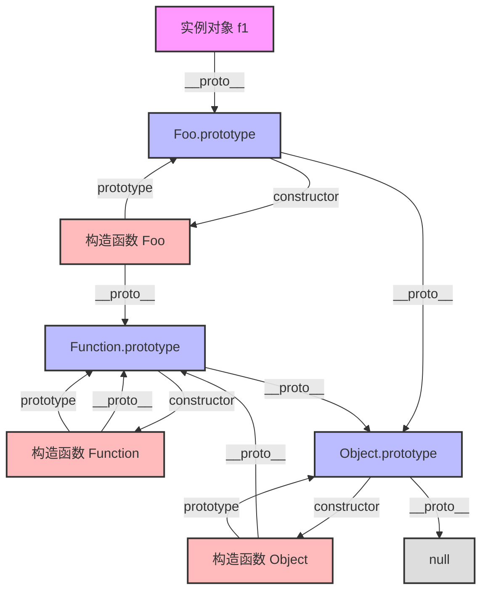

# 📝 面试问题解构：JavaScript 原型与原型链的理解

---

## 1. 🌐 知识背景与底层原理

### 引入背景（Why & When）
1995 年，网景（Netscape）公司的 Brendan Eich 在设计 JavaScript 时，面临着两个核心约束：
1. **时间极其紧迫**（仅用了 10 天）；
2. **定位是轻量级的辅助脚本语言**，需要简单易学，让非专业的网页设计人员也能快速上手。

当时 Java 正值风口，网景管理层希望 JS 在语法上向 Java 靠拢（如引入 `new` 关键字）。但 Brendan Eich 认为，引入完整的 class-based（基于类）的继承机制对于轻量级脚本语言来说过于笨重。因此，他参考了 Self 和 Scheme 语言，采用了一种更简化的、基于**原型（Prototype）**的委托模型来实现对象之间的关联与属性继承。

---

### 解决的核心问题（What）
在没有“类”概念的早期 JS 中，原型和原型链主要解决了以下核心痛点：
1. **内存浪费问题**：在没有原型前，如果要创建多个具有相同方法的对象，每个对象都会在内存中复制一份该方法。通过将共享的方法放在原型对象上，所有实例通过指针共享该方法，极大地节省了内存。
2. **代码复用与继承（Inheritance）**：提供了一种动态的、运行时的代码复用机制，允许一个对象直接访问另一个对象的属性和方法，实现了面向对象编程中的“继承”特性。

---

### 核心原理剖析（How）
JavaScript 对象的原型机制可以通过以下三个核心概念来概括：
1. **`prototype`（显式原型）**：每一个**函数（Function）**在创建时，JS 引擎都会为其自动关联一个属性 `prototype`。这个属性指向一个对象，这个对象就是该函数作为构造函数时创建的实例的**原型**。
2. **`__proto__`（隐式原型）**：每一个**对象（Object）**（包括函数、数组等）都有一个内部属性 `[[Prototype]]`（在浏览器中通常暴露为 `__proto__`）。它指向创建该对象的构造函数的 `prototype`。
3. **`constructor`（构造函数）**：原型对象默认拥有一个 `constructor` 属性，指向它关联的那个构造函数。

#### 🌀 原型链（Prototype Chain）的工作机制：
当试图访问一个对象的属性时，JS 引擎会启动“搜索协议”：
1. 先在该对象自身的属性（Own Properties）中查找。
2. 如果找不到，就会顺着该对象的 `__proto__` 指针，去它的原型对象中查找。
3. 如果还找不到，再顺着原型对象的 `__proto__` 指针往上找。
4. 这个链条会一直延伸到 `Object.prototype`。如果依然找不到，由于 `Object.prototype.__proto__` 的值为 `null`，搜索宣告结束，返回 `undefined`。

#### 🗺️ 经典的 JavaScript 原型关系图（Mermaid）：



---

### 典型应用场景（Where）
1. **Polyfill / Shims（兼容性补丁）**：在低版本浏览器中，向内置对象的原型（如 `Array.prototype.includes`）手动注入新规范的方法。
2. **轻量级插件与 SDK 开发**：在编写不依赖编译工具链的原生 JS 库时，利用原型链封装高内聚、低内存占用的类库（如老版本的 JQuery 插件机制 `$.fn`）。
3. **框架底层的核心机制**：例如 Vue 2 中，为了拦截数组的变化以实现响应式，它通过拦截数组实例的原型链，并在中间插入一套自定义的数组方法（`push`/`pop`等）来实现依赖通知。

---

### 引入的缺陷与折中（Trade-offs）
1. **属性查找的性能损耗（Lookup Performance）**：试图访问不存在的属性，或位于链条深处的属性，会导致遍历整条原型链，这在高频、对耗时敏感的场景下会造成性能损耗。
2. **动态修改带来的反模式（Monkey Patching）**：在运行时修改内置对象的原型（如 `Object.prototype`）会带来极高的副作用。这种“猴子补丁”可能导致与其他第三方库的方法命名冲突。

---

### 潜在的避坑陷阱（Pitfalls）
1. **原型共享引用类型的问题**：
   如果原型的属性是引用类型（如数组、对象），所有实例将共享同一个内存空间。修改其中一个实例的该属性，会影响到所有其他实例：
   ```javascript
   function Parent() { this.names = []; } // 应当在构造函数中定义实例属性
   // 如果错误地写成：Parent.prototype.names = []; 
   // 则所有子类实例将共用 names 数组！
   ```
2. **修改/重写 `prototype` 导致 `constructor` 丢失**：
   如果直接将一个新对象赋值给 `prototype`，会覆盖掉原有的 `constructor` 属性。
   ```javascript
   function Foo() {}
   Foo.prototype = { bar: 1 }; // 此时 Foo.prototype.constructor 指向了 Object，丢失了 Foo
   // 修正做法：手动指定 constructor: Foo
   ```
3. **V8 引擎的“去优化”风险（Hidden Classes）**：
   现代 JS 引擎（如 V8）使用“隐藏类”（Hidden Classes/Shapes）来优化属性访问。如果一个对象在运行时动态更改了其原型（例如使用 `Object.setPrototypeOf()`），会导致 V8 放弃对此对象的优化（Deoptimization），使代码运行变慢。

---

## 2. 🎯 面试官的真实提问目的

- **表层目的**：
  - 确认候选人是否掌握 JS 语言最基本的对象模型、继承机制和作用域链之外的另一条重要链条（原型链）。
  - 验证候选人对核心 API（如 `Object.create()`, `hasOwnProperty()`）的掌握程度。

- **深层目的**：
  - **避坑经验与实战体感**：考察候选人是否在实际开发中踩过“原型属性共享引用类型导致数据污染”的坑，或者是否了解“原型链污染”等安全问题。
  - **底层钻研精神**：考察候选人对 `Function.__proto__ === Function.prototype` 这类特殊边界的设计美学理解，以及对 V8 引擎内部优化（如 Hidden Classes）的涉猎。
  - **演进思维（History of Technology）**：考察候选人是否理解 ES6 `class` 只是原型的语法糖，能否说出 `class` 继承与 ES5 组合寄生继承在底层实现上的关键差异（如 `super()` 的调用时机和对 `this` 的创建顺序）。

- **区分度要点**：
  | 候选人层级 | 典型表现 |
  | :--- | :--- |
  | **Junior (初级)** | 只能背出“`__proto__` 指向原型，`prototype` 是函数的属性”，能说出原型链末端是 `null`。无法清晰描述 `Function` 与 `Object` 的互咬关系。 |
  | **Mid (中级)** | 能手写“寄生组合继承”，说清楚 `new` 操作符的内部原理。理解 `class` 是语法糖，并知道原型共享引用类型带来的风险。 |
  | **Senior/Staff (高级/专家)** | 能从 JS 引擎 V8 的视角讨论原型动态修改带来的性能风险；能指出**原型链污染（Prototype Pollution）**等安全漏洞成因与防范；能清晰指出 ES6 `class` 继承中父类先创建 `this`（ES6 机制）与 ES5 中子类先创建 `this` 绑定父类属性（ES5 机制）的区别。 |

---

## 3. 📊 回答的科学10分制评估体系

| 评估维度/核心要点 | 对应分值 | 判定标准 (怎样才能拿分) | 扣分项/未达标表现 |
| :--- | :---: | :--- | :--- |
| **要点 1：核心概念及搜索机制** <br>(基础) | **2 分** | 清晰阐述 `prototype` 与 `__proto__` 的定义，并能完整口述原型链的属性搜索过程（直到 `null`）。 | 混淆 `__proto__` 和 `prototype`；认为原型链的终点是 `Object.prototype` 而非 `null`。 |
| **要点 2：上帝之环（特殊关系）** <br>(进阶) | **2 分** | 能够解释清楚 `Function.__proto__ === Function.prototype` 以及 `Object.__proto__ === Function.prototype` 的设计逻辑（函数是对象，而构造函数又是 Function 的实例）。 | 无法解释 Function 和 Object 的原型关系，遇到此类问题陷入逻辑死循环。 |
| **要点 3：底层机制模拟（new / 继承）** <br>(实战) | **3 分** | 1. 准确写出/描述 `new` 操作符的 4 个步骤（创建对象、连接原型、绑定 this、返回对象）。<br>2. 能手写出**寄生组合继承**的核心代码，并解释为什么它是 ES5 中最完美的继承方式。 | 无法手写 `new` 的模拟实现；写出的继承方式存在二次调用父类构造函数等缺陷（如普通组合继承）。 |
| **要点 4：ES6 Class 深度对比** <br>(深度) | **2 分** | 能指出 ES6 `class` 继承与 ES5 继承的核心区别：ES5 是先创建子类的 `this`，再将父类的方法属性添加到 `this` 上；ES6 是先创建父类的实例 `this`（通过 `super()`），再用子类的构造函数修改 `this`。 | 简单认为 `class` 只是 100% 的等价语法糖，不知道 `super()` 在底层创建 `this` 的时机差异。 |
| **要点 5：工程化思考、安全与性能** <br>(专家) | **1 分** | 1. 提到**原型链污染（Prototype Pollution）**安全漏洞（如 Lodash 曾出现的 CVE 漏洞）及防护手段（`Object.create(null)`、`Object.freeze()`）。<br>2. 提及动态修改 `__proto__` 对 V8 引擎 Hidden Classes 性能优化的负面影响。 | 无法说出任何原型相关的安全或性能考量，回答流于八股文。 |

---

## 4. 🧠 问题复杂度评级

- **复杂度评级**：⭐ ⭐ ⭐ ⭐ （4 星）
- **评级依据与受众**：
  - **适合受众**：从校招/初级前端到前端专家/架构师。这是一道“**无底深渊型**”面试题，上下限极高。
  - **难点剖析**：
    - **记忆复杂度**：虽然基本链条好记，但涉及 `Function`、`Object`、内置对象之间的交织网络（上帝之环）时，极其容易绕晕。
    - **原理深度**：要答好此题，不仅要懂 JS 语法，还要懂其背后的历史渊源、内存模型（Heap/Stack）、V8 引擎的垃圾回收机制、Hidden Classes 优化，以及 Node.js/Web 开发中由于原型链导致的严重安全漏洞（原型链污染）。因此，属于经典的“试金石”面试题。
