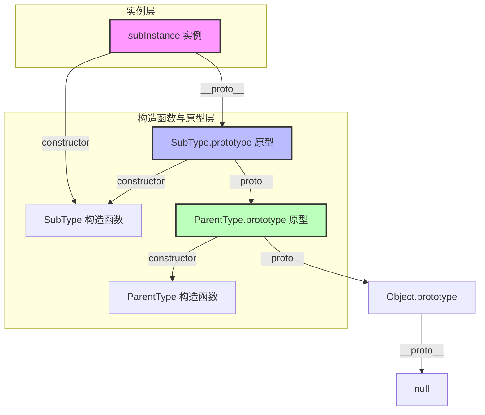

# 📝 面试问题解构：JavaScript 继承的六种方式及优缺点

在前端面试中，“JavaScript 继承”不仅是考察候选人 JS 基础是否扎实的“试金石”，更是通往理解原型链、闭包、执行上下文以及 ES6 类底层的必经之路。

---

## 1. 🌐 知识背景与底层原理

### 引入背景（Why & When）
JavaScript 诞生之初（1995年），Brendan Eich 并没有打算将其设计为一门像 Java 那样拥有完整类（Class）体系的面向对象语言。为了保持语言的轻量与灵活，同时又能实现对象间属性和方法的复用，JS 引入了**原型（Prototype）**的概念。

在 2015 年 ES6 推出 `class` 语法糖之前，开发者为了实现面向对象的“继承”特性，利用原型和构造函数进行各种巧妙的组合。这些组合探索最终演变出了经典的“六种继承方式”。

---

### 解决的核心问题（What）
在没有原生 `class` 的时代，JS 继承要解决的核心痛点是：
1. **属性复用**：子类实例如何获取父类实例的属性，且各实例的引用类型属性互不干扰。
2. **方法共享**：子类实例如何共享父类原型上的方法，避免每次创建实例都重复创建方法（浪费内存）。
3. **参数传递**：子类实例化时，能否向父类构造函数传递参数。

---

### 核心原理剖析（How）
JS 继承的底层完全依赖于**原型链（Prototype Chain）**。每个对象都有一个内置属性 `[[Prototype]]`（在浏览器中体现为 `__proto__`），指向它的原型对象。当访问一个对象的属性时，如果对象自身不存在，JS 引擎就会沿着这条链向上寻找，直到到达 `Object.prototype.__proto__`（即 `null`）。

下面是“寄生组合式继承”（ES5 阶段最完美的继承方案）的底层内存与原型链指向图：



---

### 六种继承方式演进与优缺点对比（Where & Trade-offs）

#### 1. 原型链继承 (Prototype Chain Inheritance)
*   **实现**：`SubType.prototype = new SuperType();`
*   **优点**：父类的方法被很好地定义在父类原型上，子类可以复用。
*   **缺点/致命陷阱**：
    *   **引用类型属性共享**：父类的引用类型属性（如数组）会被所有子类实例共享。一个实例修改了该数组，其他实例都会受到影响。
    *   **无法传参**：创建子类实例时，无法向父类构造函数传参。

#### 2. 借用构造函数继承 (Constructor Stealing / 经典继承)
*   **实现**：在子类构造函数中执行 `SuperType.call(this, ...args);`
*   **优点**：
    *   避免了引用类型的属性共享。
    *   可以在子类中向父类传参。
*   **缺点**：
    *   **方法无法复用**：所有方法都必须在构造函数中定义，每次创建实例都会重新创建一遍方法，失去了函数复用的意义。
    *   子类无法访问父类原型上定义的方法。

#### 3. 组合继承 (Combination Inheritance / 伪经典继承)
*   **实现**：结合了 1 和 2。用原型链继承方法，用借用构造函数继承属性。
    ```javascript
    function Sub(name) { Super.call(this, name); } // 第二次调用
    Sub.prototype = new Super(); // 第一次调用
    Sub.prototype.constructor = Sub;
    ```
*   **优点**：融合了前两者的优点，是 ES5 中最常用的继承方式。
*   **缺点**：**调用了两次父类构造函数**，导致子类的原型上存在一份多余的、未初始化的父类属性，造成了内存浪费。

#### 4. 原型式继承 (Prototypal Inheritance)
*   **实现**：`Object.create(obj)` 的前身。
    ```javascript
    function object(o) {
        function F() {}
        F.prototype = o;
        return new F();
    }
    ```
*   **优点**：不需要兴师动众地写构造函数，直接实现对象间的标准复用。
*   **缺点**：同原型链继承，包含引用类型的属性值始终会共享。

#### 5. 寄生式继承 (Parasitic Inheritance)
*   **实现**：在原型式继承的基础上，套一个函数，在函数内部增强对象，最后返回。
    ```javascript
    function createAnother(original) {
        let clone = Object.create(original);
        clone.sayHi = function() { console.log("hi"); }; // 增强对象
        return clone;
    }
    ```
*   **优点**：在主要考虑对象而不在乎构造函数和类型的情况下，可以快速给对象增加方法。
*   **缺点**：跟借用构造函数一样，每次调用都会创建新的方法，**无法做到函数复用**。

#### 6. 寄生组合式继承 (Parasitic Combination Inheritance)
*   **实现**：通过借用构造函数来继承属性，通过原型链的混入形式（而不是调用父类构造函数）来继承方法。
    ```javascript
    function inheritPrototype(subType, superType) {
        let prototype = Object.create(superType.prototype); // 创建父类原型的副本
        prototype.constructor = subType;                   // 修正 constructor 指向
        subType.prototype = prototype;                      // 将副本赋值给子类原型
    }
    ```
*   **优点**：**最完美的 ES5 继承方案**。只调用了一次父类构造函数，避免了在子类原型上创建不必要的、多余的属性。原型链保持完整。
*   **ES6 Class 继承的本质**：ES6 的 `class extends` 经 Babel 编译后，底层核心原理就是寄生组合式继承。

---

### 潜在的避坑陷阱（Pitfalls）
*   **`constructor` 丢失**：在使用原型链或组合继承重写子类原型时（如 `Sub.prototype = new Super()`），子类原型的 `constructor` 指向会变成 `Super`。必须手动修正：`Sub.prototype.constructor = Sub;`，否则在利用实例反查构造函数时会出错。
*   **静态方法/属性丢失**：ES5 的所有继承方式默认都只能继承实例属性和原型方法，无法继承父类的**静态方法**。而 ES6 的 `extends` 通过修改子类构造函数的 `__proto__` 指向父类构造函数（`Object.setPrototypeOf(SubType, SuperType)`）完美解决了静态属性/方法的继承。

---

## 2. 🎯 面试官的真实提问目的

*   **表层目的**：检查候选人是否背过这“六种继承”的八股文。
*   **深层目的**：
    1.  **原型链的深度理解**：能否清晰画出或描述 `__proto__`、`prototype`、`constructor` 之间的闭环指向。
    2.  **工程演进思维**：是否理解每一种继承方式的痛点是什么，后续方案是如何针对前人方案进行优化的。
    3.  **技术落地与底层探究**：是否了解 ES6 `class` 的原理？是否看过 Babel 转译后的代码？知不知道 ES6 继承与 ES5 继承的微观区别（如 `super()` 引起的 `this` 初始化顺序差异：ES5 是先创建子类 `this`，再通过 `call` 绑定父类属性；ES6 是先通过父类构造函数创建 `this`，再由子类修饰）。

### 区分度要点
*   **Junior (初级)**：能说出 2-3 种继承名字，能勉强写出 `call` 继承或原型继承，说不清两者的区别，概念混淆。
*   **Mid (中级)**：能完整说出六种继承，并说清其优缺点。能手写出“组合继承”和“寄生组合继承”，知道 `Object.create` 的作用。
*   **Senior/Staff (高级/专家)**：
    *   能从 JS 的历史演进角度侃侃而谈，将六种继承梳理为一条清晰的“重构/演进路线”。
    *   主动探究 ES6 `class extends` 的底层 Babel 实现（如 `_inherits` 辅助函数）。
    *   能指出 ES6 继承与 ES5 的核心区别（如：静态方法继承原理、`this` 创造时机、`super` 关键字的绑定）。

---

## 3. 📊 回答的科学10分制评估体系

| 评估维度/核心要点 | 对应分值 | 判定标准 (怎样才能拿分) | 扣分项/未达标表现 |
| :--- | :---: | :--- | :--- |
| **要点 1：原型链基础与经典方案** | 3 分 | 能够清晰陈述原型链概念。可以说出前三种继承方式（原型链、借用构造、组合继承）并准确指出各自的致命优缺点（如引用类型共享、调用两次构造函数）。 | 连最基础的原型链继承和 `call` 继承都说不清楚；记错优缺点（例如认为借用构造函数能复用方法）。 |
| **要点 2：高阶继承与终极演进** | 3 分 | 能够说明原型式、寄生式，并清晰写出/描述 **寄生组合式继承**（利用 `Object.create` 或空函数桥接原型）。强调其避免了二次调用构造函数的优势。 | 无法手写或画出寄生组合式的实现逻辑；不明白为什么要修正 `constructor` 指向。 |
| **要点 3：ES6 Class 对接与 Babel 转译** | 2 分 | 主动将 ES5 的寄生组合继承与 ES6 的 `class extends` 进行关联。说明 `extends` 是该模式的语法糖。 | 认为 ES6 Class 是一套全新的、非原型的继承机制（说明不了解 JS 的底层机制）。 |
| **要点 4：深度边界探索 (高级特性)** | 2 分 | 能够说出 ES6 继承与 ES5 继承的**两大微观核心差异**：<br>1. 静态属性继承：`Sub.__proto__ === Super`<br>2. `this` 生成顺序：ES6 是父类先生成 `this`（必须先调用 `super()`），ES5 是子类先生成 `this`。 | 无法回答出 ES6 静态方法是如何被子类继承的；不清楚 `super()` 为什么必须在使用 `this` 之前调用。 |

---

## 4. 🧠 问题复杂度评级

*   **复杂度评级**：⭐ ⭐ ⭐ ⭐ （4 星）
*   **评级依据与受众**：
    *   **受众**：适合**中高级前端开发工程师**。虽然这是一个经典到有些“泛滥”的面试题，但正因如此，它的深度上限非常高。
    *   **难点所在**：难点不在于背诵六种方式的名字，而在于：
        1. 逻辑自洽地描述出这六种机制的演进链条（为什么会有 A -> 诞生了 B -> 结合出 C -> 最终优化成 D）。
        2. 原型链闭环中各种指针（`__proto__`, `prototype`, `constructor`）在内存中的真实走向。
        3. 深入到 V8 引擎层面或 Babel 编译层面对 ES6 继承与 ES5 继承异同的底层剖析。
