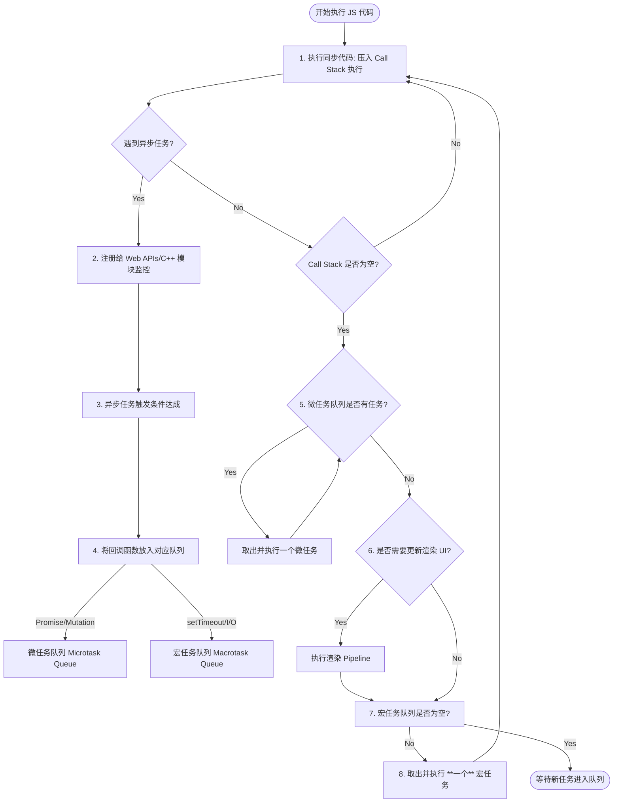

# 📝 面试问题解构：JavaScript Event Loop 机制及其工作原理

---

## 1. 🌐 知识背景与底层原理

### 引入背景（Why & When）
JavaScript 诞生于 1995 年，最初的设计定位是运行在浏览器端的**脚本语言**，用于实现简单的网页交互（如表单验证、DOM 操作）。
* **单线程的选择**：由于其主要任务是操作 DOM，如果设计为多线程，就会引入极度复杂的线程同步问题。例如：线程 A 删除了某个 DOM 节点，而线程 B 同时在修改该节点，浏览器将无法决定以谁为准。为了避免死锁、竞态条件等并发难题，JavaScript 最终被设计为**单线程**（Single-Threaded）运行环境。

### 解决的核心问题（What）
单线程意味着“同一时间只能做一件事”。如果在执行过程中遇到网络请求、定时器或文件 I/O 等耗时操作，整张网页就会直接卡死（阻塞），用户体验极差。
为了在**不增加多线程复杂性**的前提下，解决**非阻塞异步 I/O** 的问题，JavaScript 引入了**事件循环（Event Loop）机制**。它允许 JavaScript 将耗时任务挂起，继续执行后续代码，并在任务完成后通过回调函数的形式进行处理。

### 核心原理剖析（How）
Event Loop 的核心在于**调用栈（Call Stack）**、**宿主环境（Web APIs）**和**任务队列（Task Queues）**的协同工作。

1. **调用栈（Call Stack）**：遵循 LIFO（后进先出）原则，存放当前正在执行的同步代码。
2. **宿主环境（Web APIs）**：如浏览器的定时器模块、网络请求模块（Fetch/XHR）、DOM 事件监听。它们独立于 JS 引擎线程运行。
3. **任务队列（Task Queue）**：分为两种类型：
   * **微任务队列（Microtask Queue）**：存放 `Promise.then`、`MutationObserver`、`queueMicrotask` 等。
   * **宏任务队列（Macrotask Queue / Task Queue）**：存放 `setTimeout`、`setInterval`、`I/O`、UI 渲染、`postMessage` 等。

#### 🔄 Event Loop 执行流程图

### 典型应用场景（Where）
* **高并发 I/O（Node.js 端）**：处理数万个并发连接时，无需为每个连接创建线程，通过 Event Loop 调度异步 I/O，极大降低了系统开销。
* **无卡顿动画（浏览器端）**：利用 `requestAnimationFrame` 将动画帧的执行时机精确绑定到浏览器重绘之前，避免因宏任务阻塞导致的掉帧。

### 引入的缺陷与折中（Trade-offs）
* **无法利用多核 CPU**：由于是单线程，即使服务器或 PC 是 16 核，JS 默认也只能压榨其中 1 个核。
* **CPU 密集型任务灾难**：若在主线程进行大量密集的数学计算（如图像处理、加密解密），会直接阻塞 Event Loop，导致页面假死或 Node.js 服务无响应。
* **折中方案**：引入了 `Web Workers`（浏览器端）和 `worker_threads`（Node.js 端），允许开辟子线程，但子线程受限（如不能直接操作 DOM），仍通过消息传递（`postMessage`）与主线程通信。

### 潜在的避坑陷阱（Pitfalls）
1. **微任务饥饿（Microtask Starvation）**：
   如果在一个微任务中不停地递归创建新的微任务（例如：`function loop() { Promise.resolve().then(loop); }`），**宏任务队列和 UI 渲染将永远得不到执行的机会**，从而使浏览器彻底卡死。
2. **`setTimeout` 的不准时性**：
   `setTimeout(() => {}, 1000)` 并不意味着“1秒后绝对执行”。它代表“1秒后**将回调函数放入宏任务队列**”。如果此时调用栈有超长同步代码，或者微任务队列极长，该回调会被严重延后执行。

---

## 2. 🎯 面试官的真实提问目的

* **表层目的**：
  * 考察候选人是否只是单纯背诵“宏任务先、微任务后”这类片面的八股文。
  * 考察候选人对 `Promise`、`setTimeout`、`async/await` 执行顺序的控制能力（通常会给出一道复杂的代码输出题）。

* **深层目的**：
  * **异步机制认知**：是否能清晰区分 JS 引擎（如 V8）与宿主环境（浏览器/Node）的关系（Event Loop 实际上是宿主环境实现的，而不是 V8 引擎本身实现的）。
  * **页面性能优化意识**：是否理解**事件循环**与**浏览器渲染（Paint）**的生命周期关系。知道什么时候用微任务（不希望用户看到中间态），什么时候用宏任务（给浏览器喘息和重绘的时间）。
  * **系统设计与权衡思维**：当面对计算密集型任务时，候选人能提出何种优化架构（如 Task Chunking 分片、Web Workers 方案）。

* **区分度要点**：
  | 候选人等级 | 典型表现 |
  | :--- | :--- |
  | **Junior (初级)** | 只能背出 `setTimeout` 是宏任务，`Promise` 是微任务。遇到复杂的 `async/await` 嵌套输出题就靠瞎猜，无法梳理出完整的执行栈流转。 |
  | **Mid (中级)** | 能精准说出同步任务、微任务、宏任务的执行顺序；知道在一个宏任务执行完后要清空所有微任务；能完美写出复杂的异步执行顺序题。 |
  | **Senior/Staff (高级/专家)** | 1. 能指出 **Browser Event Loop** 与 **Node.js libuv Event Loop** 的机制差异（Node 11+ 前后版本的行为变化）。 2. 能够清晰解释**渲染时机**（何时触发 Layout 和 Paint，以及 `requestAnimationFrame` 位于哪个阶段）。 3. 能够利用这一原理解决生产环境的卡顿问题（如长任务拆分 `Scheduler API`、`MessageChannel` 的妙用）。 |

---

## 3. 📊 回答的科学 10 分制评估体系

| 评估维度/核心要点 | 对应分值 | 判定标准 (怎样才能拿分) | 扣分项/未达标表现 |
| :--- | :---: | :--- | :--- |
| **要点 1：单线程基础与异步设计的由来** | **2 分** | 指出 JS 是单线程的，阐明为什么需要 Event Loop（非阻塞异步 I/O 解决方案），并能准确区分 **JS 引擎（V8）** 与 **宿主环境（Runtime）** 的职责。 | 认为 Event Loop 是 V8 引擎自带的功能；解释不清为什么 JS 要设计成单线程。 |
| **要点 2：调用栈与两大任务队列的流转机制** | **3 分** | 精确描述执行流程：同步任务入栈 $\rightarrow$ 清空栈 $\rightarrow$ 驱动微任务队列（清空） $\rightarrow$ 尝试渲染 $\rightarrow$ 取出**一个**宏任务执行。能准确归类常用 API（如 Promise 为微任务，setTimeout 为宏任务）。 | 错误地认为“执行一个宏任务，执行一个微任务”；或者把 `Promise` 的构造器本身也当作异步（其实是同步）。 |
| **要点 3：浏览器渲染管道（Rendering Pipeline）的整合** | **2 分** | 主动提到 Event Loop 与浏览器重绘的绑定关系。明确说明 UI 渲染通常发生在微任务清空之后、下一个宏任务执行之前，并能准确定位 `requestAnimationFrame`（rAF）在其中的位置。 | 完全没有提到浏览器渲染机制，以为 Event Loop 只跟 JS 代码执行有关。 |
| **要点 4：生产实战：长任务（Long Tasks）优化与避坑** | **2 分** | 能够指出长任务会导致 UI 丢帧卡顿，给出合理的解决方案：如使用 `requestIdleCallback` 优化非紧急任务，或使用 `Web Workers` 移交计算，或通过 `setTimeout/MessageChannel` 进行任务切片（Time Slicing）。 | 缺乏实战思维，面对主线程阻塞问题拿不出任何有效的底层优化方案。 |
| **要点 5：进阶探究：Node.js 与浏览器事件循环差异** | **1 分** | 能够说出 Node.js 的 Event Loop 是基于 `libuv` 的，有 6 个主要阶段（timers, poll, check等），并能指出 Node 11 之后其微任务执行时机已与浏览器基本对齐（每个宏任务执行完立即清空微任务）。 | 对 Node.js 事件循环一无所知，或概念停留在 Node 10 之前的旧机制且不自知。 |

---

## 4. 🧠 问题复杂度评级

* **复杂度评级**：⭐ ⭐ ⭐ ⭐ （4 星）
  *虽然这是一个几乎每个前端、Node.js 程序员都必背的经典问题，但若想将其彻底讲透（上升到 HTML 规范、渲染帧同步、性能调优和跨端 Runtime 对比），其深度与复杂度极高。*

* **评级依据与受众**：
  * **校招/初级**：重点考察“能正确说出执行顺序，会做执行逻辑判断题”（3 星难度）。
  * **中高级/架构师**：重点考察“如何利用 Event Loop 原理解决前端渲染卡顿、编写高性能非阻塞代码、以及对底层运行环境的深刻认知”（4.5 星难度）。它的难点不在于记忆概念，而在于**将执行流与浏览器的渲染线程、网络线程、GPU 渲染管道融会贯通**。
