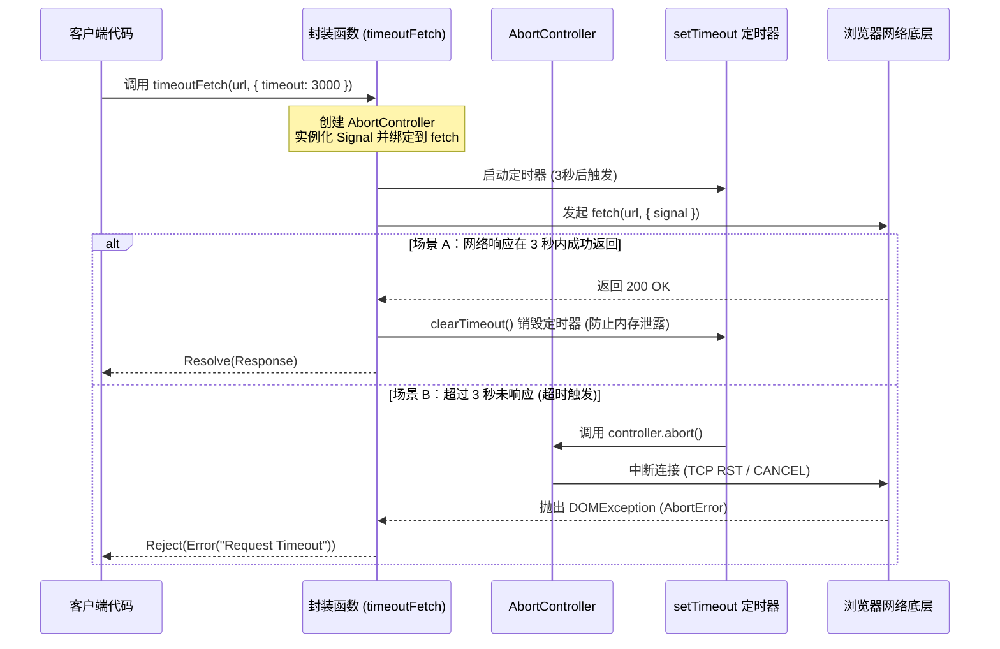

# 📝 面试问题解构：如何封装 Fetch API 实现请求超时报错，并取消执行中的 Promise？

---

## 1. 🌐 知识背景与底层原理

### 引入背景（Why & When）
在 Web 开发的早期，`XMLHttpRequest` (XHR) 是实现 Ajax 的唯一标准，它原生支持 `timeout` 属性和 `abort()` 方法。随着 ES6 引入 Promise，传统的基于回调的 XHR 显得臃肿不堪。为了提供更现代、更具可读性的异步请求方案，W3C 在 2015 年引入了 **Fetch API**。
然而，早期的 Fetch API 极度简化，甚至**没有提供任何取消请求（Abort）和设置超时（Timeout）机制**。这导致在弱网环境或高并发场景下，未完成的请求会一直挂起，白白消耗浏览器和服务器资源。

### 解决的核心问题（What）
在没有原生超时支持的情况下，开发者面临两个核心痛点：
1. **无法及时释放资源**：TCP 连接长期被挂起的请求占用（浏览器对同源域名有 6 个并发连接限制）。
2. **内存泄露与状态混乱**：一个已经无意义的请求在很久之后成功返回，其回调依然会执行，可能导致前端数据覆盖或状态错误。

要解决这个问题，必须实现：
* **超时控制**：在指定时间内未响应则判定为失败。
* **取消执行（真正中断 TCP 连接）**：不仅要在 JS 层面让 Promise 进入 `rejected` 状态，还要在网络层真正中断请求。

### 核心原理剖析（How）
实现该功能的核心是现代 Web 标准中的 **`AbortController`** 和 **`AbortSignal`**。

* **`AbortController`**：一个控制器对象，允许你根据需要中止一个或多个 Web 请求。
* **`AbortSignal`**：控制器的属性（`controller.signal`），作为选项传递给 `fetch`。`fetch` 内部会监听这个信号，一旦信号被触发中止（调用 `controller.abort()`），`fetch` 的 Promise 就会立即被 reject，并且浏览器会**中断底层的 TCP 连接**。

#### 工作流程时序图



### 典型应用场景（Where）
* **移动端弱网环境**：防止用户在地铁等信号不佳的地方，页面长时间处于 Loading 状态。
* **大文件上传/下载取消**：用户在传输大文件时点击“取消”按钮，必须立即中断网络传输以节省流量。
* **输入框联想搜索（Debounce + Abort）**：当用户连续输入时，取消上一次还未返回的搜索请求，确保最后渲染的数据与输入框内容一致，避免“先发后至”的乱序问题。

### 引入的缺陷与折中（Trade-offs）
* **错误边界变得复杂**：引入 `AbortController` 后，Promise 被 reject 的原因变得多样（网络错误、服务器 500、用户主动取消、系统超时）。代码中必须进行精细化的错误分类处理。
* **Polyfill 成本**：在极老旧的浏览器（如 IE）或早期的 Node.js 环境中不支持 `AbortController`，需要引入额外的 Polyfill（如 `abort-controller` 库），增加了打包体积。

### 潜在的避坑陷阱（Pitfalls）
* **【致命陷阱 1】忘了解除定时器（Memory Leak）**：如果请求成功，必须执行 `clearTimeout`。否则，定时器依然会在后台运行，时间到了之后会尝试调用 `abort()`，虽然对已完成的请求无影响，但会导致闭包中的变量无法被 GC 回收，造成**内存泄露**。
* **【致命陷阱 2】控制器单次性（Single-use）**：一个 `AbortController` 实例的信号一旦被 `abort()`，该实例就永远处于 "aborted" 状态。**不能复用**同一个控制器去发送新的请求，每次新请求必须 `new AbortController()`。
* **【面试高频区】`Promise.race` 的伪取消**：很多候选人会写出 `Promise.race([fetch, timeoutPromise])`。**这是极大的误区！** `Promise.race` 只是让外层 Promise 提前变为了 reject 状态，但**底层的 HTTP 请求依然在继续传输**，并没有真正被取消，这完全无法解决带宽浪费和连接数占满的问题。

---

## 2. 🎯 面试官的真实提问目的

* **表层目的**：
  * 考察候选人对现代化 Web API（`fetch`、`AbortController`）的掌握程度。
  * 考察基本的 Promise 异步控制流编写能力。

* **深层目的**：
  * **网络与浏览器底层理解**：候选人是否知道“JS 状态取消”与“TCP 网络连接中断”的区别（即上面提到的 `Promise.race` 误区）。
  * **工程化与健壮性思维**：是否考虑到定时器的垃圾回收、是否考虑了错误边界的划分。
  * **代码封装能力**：能否写出高复用性、不侵入业务逻辑、符合优秀 SDK 设计标准的 API 包装函数。

* **区分度要点（Senior vs. Junior）**：
  * **Junior (初级)**：不知道 `AbortController`，提出用 `Promise.race` 勉强应付，或者写出的代码有严重的内存泄露（不清理定时器）。
  * **Mid (中级)**：知道并能写出 `AbortController` 的标准配合，但在错误处理上很粗糙，无法区分“用户主动取消”与“超时自动取消”。
  * **Senior/Staff (高级/专家)**：
    * 完美处理了定时器生命周期与异常捕获。
    * 封装的设计模式非常优雅：支持外部传入 `signal`（兼容用户手动取消与超时取消并存的场景）。
    * 能够解释清楚底层网络协议栈在 `abort` 时的变化。

---

## 3. 📊 回答的科学10分制评估体系

| 评估维度/核心要点 | 对应分值 | 判定标准 (怎样才能拿分) | 扣分项/未达标表现 |
| :--- | :---: | :--- | :--- |
| **要点 1：核心机制理解** <br>(AbortController) | **2 分** | 清晰说出 `AbortController` 和 `AbortSignal` 是实现取消的标准 API，并能准确说出将其作为 `options.signal` 传递给 `fetch` 的机制。 | 试图使用已废弃的 XHR，或者完全不知道 `AbortController`。 |
| **要点 2：避开 Race 误区** <br>(网络层真正中断) | **2 分** | 能够主动指出 `Promise.race` 只能改变 Promise 状态，而无法中断 TCP 请求的缺陷，强调必须用 `AbortController` 实现网络层中断。 | 给出 `Promise.race` 的方案且认为其完美无缺。 |
| **要点 3：定时器与内存管理** <br>(Resource Cleanup) | **2 分** | 在封装代码中，无论请求成功还是失败，都能够**严格执行 `clearTimeout`** 释放定时器资源，避免内存泄露。 | 代码中遗漏了 `clearTimeout`，或只在成功分支中清理，失败分支未清理。 |
| **要点 4：错误精细化处理** <br>(Error Handling) | **2 分** | 能够区分不同的 `DOMException`，将“因超时导致的 Abort”与“用户手动触发的 Abort”进行区分，并抛出自定义的可读错误。 | 统一报“请求失败”，无法让上层业务得知具体是超时、断网还是取消。 |
| **要点 5：高阶封装设计** <br>(API Reusability) | **2 分** | 编写的代码支持**双重 Signal 融合**（既支持内部超时，又允许外部传入用户自己的 `signal` 进行手动取消），符合生产级 SDK 标准。 | 封装的代码写死、不具备通用性，或者破坏了 `fetch` 原有的参数结构。 |

---

### 💡 优秀候选人代码示例 (TypeScript 版)

以下是能够拿到 **10分满分** 的工业级封装参考：

```typescript
interface CustomFetchOptions extends RequestInit {
  timeout?: number; // 超时时间，单位毫秒
}

async function timeoutFetch(url: string, options: CustomFetchOptions = {}): Promise<Response> {
  const { timeout = 8000, signal: externalSignal, ...fetchOpts } = options;

  // 1. 创建属于本次请求的 AbortController
  const controller = new AbortController();
  const { signal } = controller;

  // 2. 兼容外部传入的 signal (实现双重控制：超时取消 + 用户手动取消)
  if (externalSignal) {
    if (externalSignal.aborted) {
      controller.abort();
    } else {
      externalSignal.addEventListener('abort', () => controller.abort());
    }
  }

  // 3. 设置超时定时器
  let timeoutId: any;
  const timeoutPromise = new Promise<never>((_, reject) => {
    timeoutId = setTimeout(() => {
      // 触发 abort，此时 fetch 的底层连接会中断，并抛出 AbortError
      controller.abort();
      reject(new DOMException('Request timeout', 'TimeoutError'));
    }, timeout);
  });

  try {
    // 4. 将原本的 fetch 包装在 race 中，但注意：此时 fetch 已经绑定了 signal
    // 这意味着一旦超时触发了 controller.abort()，fetch 也会被底层中断
    const fetchPromise = fetch(url, { ...fetchOpts, signal });
    
    const response = await Promise.race([fetchPromise, timeoutPromise]);
    return response;
  } catch (error: any) {
    // 5. 精细化错误分类
    if (error.name === 'AbortError') {
      // 如果是被我们自己的 Timeout 逻辑中止的
      if (signal.aborted && !externalSignal?.aborted) {
        throw new Error(`Fetch failed: Connection timed out after ${timeout}ms`);
      }
      throw new Error('Fetch failed: User aborted the request');
    }
    throw error;
  } finally {
    // 6. 核心：无论成功还是失败，必须清除定时器，防止内存泄露
    clearTimeout(timeoutId);
  }
}
```

---

## 4. 🧠 问题复杂度评级

* **复杂度评级**：⭐ ⭐ ⭐ ⭐ （4星）
* **评级依据与受众**：
  * **受众**：最适合**中高级前端工程师（Mid-to-Senior）**。
  * **难点**：
    1. **非单一知识点**：不仅考查 Fetch 和 Promise，还考查了 `setTimeout` 的垃圾回收机制、DOM 规范中的 `AbortController` 机制、以及基础的网络协议常识。
    2. **细节决定成败**：写出一个能工作的 demo 很容易（2星难度），但写出一个**无内存泄露、兼容外部 Signal、错误分类精确、类型安全**的生产级封装函数，极度考验候选人的技术细节把控力。
