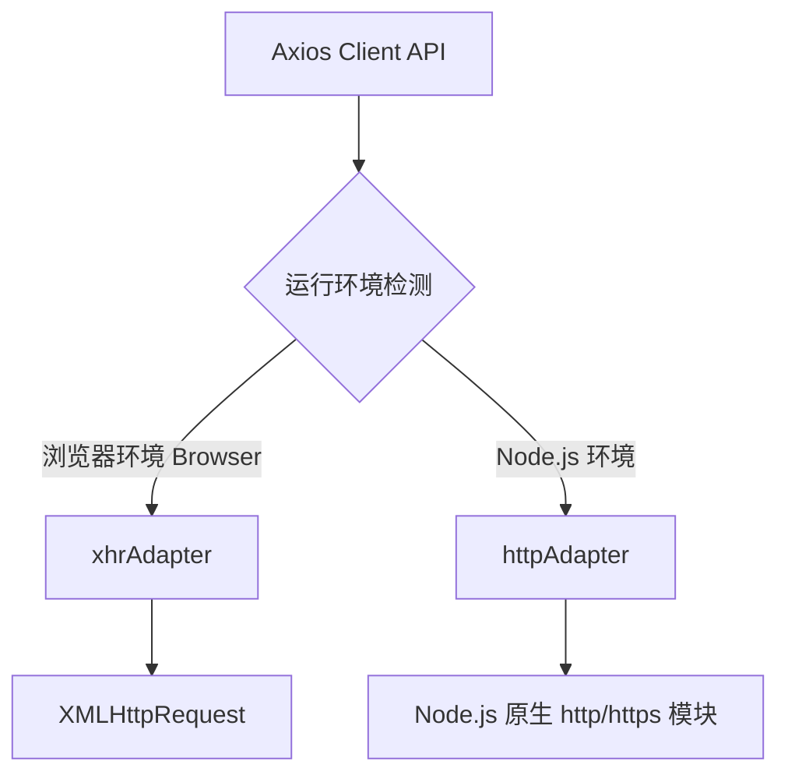
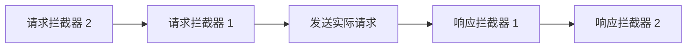

# 📝 面试问题解构：Axios 的核心原理、应用场景及其与 Fetch API 的深度对比

---

## 1. 🌐 知识背景与底层原理

### 引入背景（Why & When）
在 Web 开发的早期，浏览器端与服务器进行异步通信主要依赖于 **`XMLHttpRequest` (XHR)**。然而，原生 XHR 的 API 设计过于冗长、繁琐，且基于回调函数（Callback），在处理复杂的并发请求或链式调用时，极易陷入“回调地狱”。

随着 2015 年 ES6 标准发布，**Promise** 成为异步编程的新宠。**Axios** 正是在这个背景下诞生（约 2014 年底开源）。它顺应了 Promise 的历史潮流，旨在提供一个更优雅、更现代化的 HTTP 客户端解决方案。

### 解决的核心问题（What）
在 Axios 出现之前，前端开发者面临以下痛点：
1. **XHR 语法复杂**：发送一个简单的 POST 请求并解析 JSON 需要编写十几行模板代码。
2. **前后端代码无法复用（非同构）**：在浏览器端使用 XHR，在 Node.js 端则必须使用 `http`/`https` 模块，两套 API 完全不同，无法编写同构的 JavaScript 代码（如 SSR 服务端渲染场景）。
3. **缺乏全局拦截机制**：无法统一为所有请求添加 Authorization Token 或统一处理 401/500 等错误。

Axios 核心解决的就是：**提供一个跨平台（同构）、基于 Promise 的、API 极度友好的 HTTP 客户端。**

### 核心原理剖析（How）
Axios 的核心设计模式是**适配器模式（Adapter Pattern）**。它并不自己去实现底层的网络传输，而是根据当前运行环境，自动切换底层的网络请求库：



#### 1. 同构环境检测原理
Axios 源码内部通过判断宿主环境的全局对象来决定使用哪个适配器：
```javascript
function getDefaultAdapter() {
  let adapter;
  if (typeof XMLHttpRequest !== 'undefined') {
    // 浏览器环境使用 XHR
    adapter = require('./adapters/xhr');
  } else if (typeof process !== 'undefined' && Object.prototype.toString.call(process) === '[object process]') {
    // Node.js 环境使用原生 http 模块
    adapter = require('./adapters/http');
  }
  return adapter;
}
```

#### 2. 拦截器（Interceptors）管道流机制
Axios 的拦截器原理非常巧妙，它通过一个 **Promise 链**（`promise.then` 链式调用）来依次执行“请求拦截器 -> 实际请求 -> 响应拦截器”：



其底层核心代码逻辑如下：
```javascript
// 核心链条数组，初始放入实际发送请求的方法
const chain = [dispatchRequest, undefined]; 

// 请求拦截器：先加入的后执行（unshift）
this.interceptors.request.forEach(interceptor => {
  chain.unshift(interceptor.fulfilled, interceptor.rejected);
});

// 响应拦截器：先加入的先执行（push）
this.interceptors.response.forEach(interceptor => {
  chain.push(interceptor.fulfilled, interceptor.rejected);
});

// 链式执行
let promise = Promise.resolve(config);
while (chain.length) {
  promise = promise.then(chain.shift(), chain.shift());
}
return promise;
```

---

### 典型应用场景（Where）
1. **中大型 SPA（Vue/React）项目**：需要全局拦截 Token、统一错误处理、请求防重发。
2. **SSR（服务端渲染）项目**：如 Nuxt.js、Next.js，同一份数据获取代码（Data Fetching）既要在 Node.js 端运行，又要在浏览器端运行。
3. **需要支持大文件上传/下载进度条**：Axios 基于 XHR，原生支持 `onUploadProgress` 和 `onDownloadProgress`。

---

### 引入的缺陷与折中（Trade-offs）
* **体积问题（Bundle Size）**：Axios 的体积（Minified + Gzipped 后约 11~13KB）相对于原生的 Fetch API（0KB 额外引入）来说，在中轻量级 H5/小程序页面中会显得略重。
* **过度封装**：对于极简的 API 调用场景，Axios 的很多高级特性（如适配器、转换器）处于闲置状态，造成性能和体积上的浪费。

---

### 潜在的避坑陷阱（Pitfalls）
1. **默认的错误状态码拦截**：Axios 默认认为非 `2xx` 的状态码都是 `reject`（错误），会触发 `catch`。而有些业务设计中，`400` 或 `404` 需要在 `then` 中由前端自己解析错误 Body。开发者常忘记修改 `validateStatus` 配置。
2. **并发请求中的 `CancelToken` 内存泄露**：频繁创建 `CancelToken` 且未正确释放时，容易导致内存泄露（注：新版 Axios 推荐使用标准 `AbortController`）。
3. **同构环境下的 `window` 报错**：在 SSR 环境中，如果直接在全局作用域调用了依赖浏览器特性的 Axios 拦截器（如读取 `localStorage`），会导致 Node.js 端报 `ReferenceError: window is not defined` 错误。

---

## 2. 🎯 面试官的真实提问目的

* **表层目的**：
  * 考察候选人是否了解前端网络请求的发展史（XHR -> Fetch -> Axios）。
  * 检验候选人是否掌握 Axios 的基本 API（拦截器、取消请求、并发处理）。
* **深层目的**：
  * **架构与设计模式思维**：是否理解“同构（Isomorphic）”的概念？是否知道 Axios 是如何通过**适配器模式**抹平平台差异的？
  * **工程化落地经验**：是否能清晰阐述 Axios 与原生 Fetch 的本质区别？在实际项目中做技术选型时，是盲目跟风还是能做客观的 **Trade-off（权衡）**？
  * **底层原理钻研度**：拦截器的链式调用是如何实现的？（是否读过源码，能否说出那个经典的 Promise 链条实现）。

### 区分度要点
* **Junior（初级）**：仅能罗列语法差异（如“Axios 会自动转 JSON，Fetch 要手动 `.json()`”；“Axios 有拦截器，Fetch 没有”）。
* **Mid（中级）**：能说出同构的概念；知道 Axios 在浏览器用 XHR，在 Node 用 http；能手写简单的 Axios 封装和拦截器逻辑；知道如何使用 `AbortController` 或 `CancelToken` 取消请求。
* **Senior/Staff（高级/专家）**：能从设计模式（适配器模式、责任链模式）高度剖析 Axios 源码；能说出 Fetch 与 XHR 底层在浏览器进程/线程模型中的差异；能针对极致性能/体积要求，设计出一套“基于原生 Fetch 封装的高效、轻量级自定义 HTTP Client 方案”。

---

## 3. 📊 回答的科学 10 分制评估体系

| 评估维度/核心要点 | 对应分值 | 判定标准 (怎样才能拿分) | 扣分项/未达标表现 |
| :--- | :---: | :--- | :--- |
| **要点 1：基本定义与多平台同构** | **2 分** | 清晰指出 Axios 是基于 Promise 的 HTTP 库；准确说明其**跨平台（同构）**特性：浏览器端用 XHR，Node 端用原生 http/https。 | 认为 Axios 在浏览器端也是用 Fetch 实现的；说不清楚 Node 环境下的底层实现。 |
| **要点 2：Axios 与 Fetch 的核心区别** | **3 分** | 对比完整且深入：<br>1. **拦截器**：Axios 原生支持，Fetch 需自行封装；<br>2. **错误处理**：Axios 对非 2xx 抛错，Fetch 只有网络故障才 reject；<br>3. **进度监控**：Axios 原生支持上传进度，Fetch 不支持上传进度监控；<br>4. **自动转换**：Axios 自动处理 JSON，Fetch 需要手动反序列化。 | 只能说出“Axios 更好用”等笼统描述，无法列举具体的、底层的 API 差异。 |
| **要点 3：底层设计模式与拦截器源码** | **3 分** | 能够讲清 **适配器模式（Adapter）** 的作用；并能阐述拦截器是通过一个 **Promise 队列（Chain）** 双向推入（`unshift`/`push`）并依次执行的原理。 | 对拦截器的实现完全不知道，或者误以为是简单的数组循环。 |
| **要点 4：实战避坑与选型权衡 (Trade-offs)** | **2 分** | 主动提到体积差异（Axios vs Fetch）；能说出实际项目中如何利用 `AbortController` 取消重复请求以优化性能；提及 SSR 环境下的全局污染防范。 | 视 Axios 为完美银弹，认为在任何场景下都应该无脑使用 Axios。 |

---

## 4. 🧠 问题复杂度评级

* **复杂度评级**：⭐ ⭐ ⭐ （3 星 - 中级偏难）
* **评级依据与受众**：
  * **目标受众**：主要针对 **中、高级前端开发工程师**。对于初级开发来说，能答出基本特性和区别即可通过；对于高级开发，此题是探底其源码理解、网络底层协议及架构设计思维的重要窗口。
  * **难点所在**：难点不在于背诵 Axios 的 API，而是在于对 **Fetch API 规范的理解、XHR 的局限性、Axios 的 Promise 链条源码设计**，以及在实际大厂项目中，如何在“极致包体积”与“开发体验”之间做出架构选型决策。
