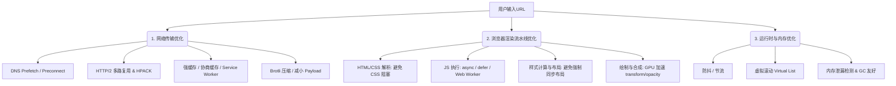

# 📝 面试问题解构：前端性能优化的常用方法

---

## 1. 🌐 知识背景与底层原理

前端性能优化是前端工程化领域中最为经典且经久不衰的话题。它直接关系到用户的留存率、转化率以及企业的商业收益。

### 引入背景（Why & When）
在 Web 1.0 时代，网页以静态文本和简单图片为主，瓶颈主要在网络带宽。随着 Web 2.0 及单页应用（SPA）的兴起，前端承载了复杂的交互、繁重的业务逻辑和大体积的 JS 包。用户设备的多元化（从高端 PC 到低端红米手机）和网络环境的复杂性（3G/4G/5G/Wi-Fi），使得前端性能优化从“可选的加分项”变成了“决定产品生死的必选项”。

### 解决的核心问题（What）
性能优化解决的核心痛点可以概括为：**“白屏时间长（Loading）”**、**“交互卡顿（Runtime）”**和**“资源消耗大（Resource）”**。
- **加载性能**：解决资源从服务器到浏览器端的传输延迟。
- **渲染性能**：解决浏览器解析 HTML/CSS/JS 并绘制到屏幕上的计算瓶颈。
- **运行性能**：解决用户交互（滚动、点击、动画）时的帧率波动与内存泄漏。

### 核心原理剖析（How）
前端性能优化的底层逻辑是围绕 **“网络传输周期”** 和 **“浏览器渲染流水线（Critical Rendering Path）”** 展开的。

1. **网络传输层（减少等待时间）**：
   - **减少请求次数与体积**：通过 Tree Shaking 剔除无用代码，通过 Code Splitting 进行按需加载，利用 Brotli/Gzip 压缩传输文本。
   - **利用缓存**：合理配置 HTTP 强缓存（`Cache-Control`）与协商缓存（`ETag`），使用 Service Worker 实现离线缓存（PWA）。
   - **协议升级**：利用 HTTP/2 的多路复用（Multiplexing）解决头部阻塞，或使用 HTTP/3 (QUIC) 降低握手延迟。

2. **渲染流水线层（减少 CPU/GPU 计算时间）**：
   - **关键渲染路径（CRP）优化**：
     - CSS 放头部（尽早构建 CSSOM），JS 放尾部或使用 `async`/`defer`（避免阻塞 DOM 解析）。
     - 避免**重排/回流（Reflow）**和**重绘（Repaint）**。改变几何属性（如 `width`, `height`, `top`）会触发重排，改变外观属性（如 `color`, `background-color`）会触发重绘。
     - 开启 **GPU 硬件加速**：使用 `transform`、`opacity`、`will-change`，避开 Layout 和 Paint 阶段，直接进入 Composite（合成）阶段。

3. **运行时层（保障交互流畅）**：
   - **时间分片（Time Slicing）**：将耗时长的 JS 任务拆分（如 React Fiber 的思想），避免阻塞主线程（Keep Main Thread Free）。
   - **Web Workers**：将纯计算密集型任务（如大数运算、图像处理）移出主线程。

### 典型应用场景（Where）
- **电商首页/活动页**：极度追求 **FCP（首次内容绘制）** 和 **LCP（最大内容绘制）**，通常首选 **SSR（服务端渲染）** 或 **SSG（静态站点生成）** + 关键 CSS 内联。
- **后台管理系统/SaaS 平台**：由于数据量巨大，重点在于**运行时优化**。例如：使用虚拟列表（Virtual List）展示万级数据、使用 Web Workers 导出百万级 Excel 报表。
- **H5 游戏 / 复杂动画页面**：重点在于 **60 FPS** 运行帧率，首选 `requestAnimationFrame`，避免使用定时器做动画，严格控制 DOM 节点数量。

### 引入的缺陷与折中（Trade-offs）
- **SSR/SSG**：提升了首屏速度，但极大地增加了服务器负担（Node.js 端 CPU 消耗），并且引入了 **Hydration（注水/激活）** 过程中的 TTI（可交互时间）延迟，同时架构复杂度飙升。
- **代码分割（Code Splitting）**：拆包过细会导致 HTTP 请求数暴增（尤其在非 H2 环境下），并可能引入网络瀑布流（Waterfall）请求延迟。
- **缓存策略**：强缓存虽然快，但一旦发布新版本，若 Hash 命名策略不当，容易导致用户端版本不一致的“缓存灾难”。

### 潜在的避坑陷阱（Pitfalls）
- **过度使用 GPU 加速**：盲目给元素添加 `will-change` 或 `transform: translateZ(0)` 会导致浏览器为每个元素创建独立的合成层（Layer），消耗海量显存，反而导致页面崩溃（OOM）或滑动卡顿。
- **非规范的内存泄露**：在 Vue/React 组件销毁时，未及时注销全局事件监听器（`window.addEventListener`）、定时器（`setInterval`）或闭包，导致内存持续攀升，页面越用越卡。

---

## 2. 🎯 面试官的真实提问目的

面试官抛出“前端性能优化常用方法”时，绝不是为了听候选人背诵“压缩、打包、CDN、懒加载”这几句八股文。

- **表层目的**：考察候选人是否具备前端开发的基本素养，是否了解网络、浏览器内核、构建工具等基础技术栈。
- **深层目的**：
  - **工程落地能力**：候选人是否真的在实际项目里做过优化？还是只是纸上谈兵？
  - **指标导向思维**：候选人是否知道如何**量化**性能？（是凭感觉“觉得变快了”，还是看 Google Web Vitals 指标的提升？）
  - **诊断定位能力**：给出一个卡顿的页面，候选人能否熟练运用 Chrome DevTools (Performance, LightHouse, Memory Heap) 找出瓶颈？
  - **技术权衡思维（Trade-off）**：面对复杂的业务场景，候选人能否在“开发体验”、“用户体验”和“机器成本”之间做出最优抉择。

### 区分度要点 (Junior vs. Senior/Staff)

| 维度 | 普通候选人 (Junior/Mid) | 优秀候选人 (Senior/Staff) |
| :--- | :--- | :--- |
| **知识体系** | 碎片化的清单（如：图片懒加载、精灵图、CDN）。 | 系统化的知识网。按**网络层 -> 解析渲染层 -> 运行时层 -> 监控机制**层层递进。 |
| **度量标准** | 感觉页面加载变快了，或者只知道 `onload` 时间。 | 熟练使用 **Web Vitals**（LCP, INP/FID, CLS）。能解释各个指标的触发时机和优化意义。 |
| **排查工具** | 只会看 Chrome Network 面板，看看包体大小。 | 熟练使用 **Performance 面板**录制火焰图，分析 Long Tasks（长任务）；使用 **Memory 面板**排查堆内存泄露。 |
| **实战落地** | “我们项目用了 Webpack，配置了压缩。”（实际是脚手架自带的）。 | “我们针对首屏 LCP 瓶颈，拆分了 Critical CSS，对三方 SDK 进行了 Partytown 隔离，并通过 RUM（真实用户监控）系统监控线上异常。” |

---

## 3. 📊 回答的科学 10 分制评估体系

以下针对该问题设计的一套量化评估标准：

| 评估维度/核心要点 | 对应分值 | 判定标准 (怎样才能拿分) | 扣分项/未达标表现 |
| :--- | :---: | :--- | :--- |
| **要点 1：系统化体系与网络层优化** | **2 分** | 能从**全局生命周期**（网络、解析、渲染、运行）分类陈述。说清 DNS 预解析、HTTP 缓存机制、Brotli/Gzip 压缩以及 CDN 的原理。 | 逻辑混乱，想到什么说什么；混淆强缓存与协商缓存的字段；对 HTTP/2 的多路复用解释有误。 |
| **要点 2：浏览器渲染与构建工具优化** | **3 分** | 1. 讲清**关键渲染路径（CRP）**，如何避免 JS/CSS 阻塞 DOM 解析。 2. 深入**重排与重绘**的触发机制，提出合成层（GPU 加速）优化。 3. 结合 webpack/vite，讲清 **Tree Shaking**、**Code Splitting** 机制。 | 无法解释重排与重绘的区别；不清楚 CSS 为什么会阻塞渲染；对 Tree Shaking 的 es module 前提不了解。 |
| **要点 3：运行时、大数据量与内存优化** | **2 分** | 1. 提出解决 JS 长任务的方案（Web Worker、时间分片）。 2. 详述**虚拟列表（Virtual List）**的原理（计算 offset、可见区域渲染）。 3. 说明**内存泄漏**的常见场景（闭包、未销毁的监听器）与排查方法。 | 遇到长任务或大数据量只会说“防抖节流”；说不清虚拟列表的底层实现原理。 |
| **要点 4：性能量化度量与诊断工具** | **2 分** | 1. 主动提到 **Google Web Vitals**标准（LCP, CLS, FID/INP），说清其物理意义。 2. 熟练阐述如何用 **Chrome DevTools (Performance)** 分析 Flame Chart（火焰图），找出 Long Task。 | 衡量性能只提 `onload`；没用过 Performance 面板，无法说出如何定位卡顿的具体代码行。 |
| **要点 5：架构权衡与生产实战案例** | **1 分** | 1. 结合实际项目，分享一个**完整的优化闭环**：发现问题 -> 指标量化 -> 方案实施 -> 线上监控。 2. 主动讨论架构折中（如 SSR 的利与弊）。 | 完全背诵八股文，没有任何真实的实战体感，认为性能优化有百利而无一害。 |

---

## 4. 🧠 问题复杂度评级

- **复杂度评级**：⭐ ⭐ ⭐ ⭐ （4 星）
- **评级依据与受众**：
  - **适合受众**：该问题是一个“**下限极低、上限极高**”的题目。适合从校招/初级到架构师的所有级别。
  - **为什么是 4 星**：
    - 它的难点不在于“说出几个优化方法”，而在于**深度的连环追问**。
    - 面试官可以从“图片懒加载”一路追问到“IntersectionObserver 原理与浏览器重排关系”；从“打包压缩”追问到“Vite/Webpack 的 ESM 与 CommonJS 构建差异”；从“页面卡顿”追问到“V8 引擎垃圾回收机制（Scavenger & Mark-Sweep）”。
    - 这需要候选人不仅有广度，更要在**浏览器内核、网络协议、构建工具底座、监控度量**方面有极深的功底。
