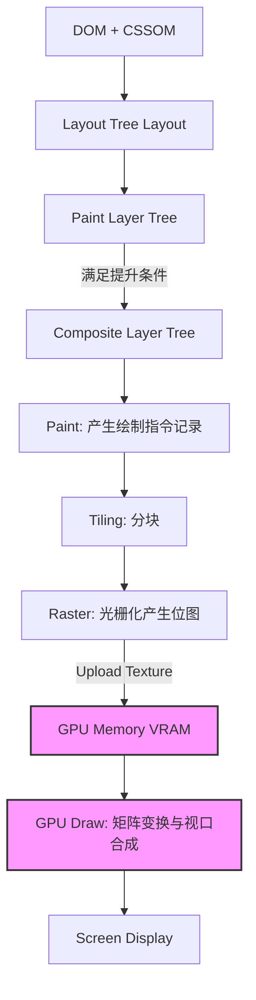

# 📝 面试问题解构：CSS transform 的 GPU 硬件加速与浏览器渲染机制

---

## 1. 🌐 知识背景与底层原理

### 引入背景（Why & When）
在 Web 1.0 和 2.0 早期，网页多以静态文本和简单图片为主。随着富客户端应用（SPA）的兴起以及移动端设备的普及，网页开始承载复杂的动效、大面积滚动和 3D 变换。
当时，浏览器的渲染逻辑完全依赖 **CPU 单线程**（即主线程，Main Thread）来完成样式的计算、布局和绘制。在面对复杂的连续动画（如使用 `top`/`left` 实现定位动画）时，CPU 需要在每一帧（通常是 16.7ms 内）重新计算整个页面的布局并重新绘制，这导致了严重的掉帧（Jank）和极高的功耗。为了打破这一瓶颈，浏览器引入了 **GPU 硬件加速** 与 **多线程渲染架构**。

### 解决的核心问题（What）
在引入 GPU 硬件加速和合成线程之前，任何微小的位置变动都会触发浏览器的 **重排（Reflow/Layout）** 或 **重绘（Repaint）**。
CSS `transform`（以及 `opacity`、`filter` 等）的设计，就是为了**绕过主线程的排版与绘制阶段**。它允许浏览器将元素单独提炼为一个“层”（Layer），并将这个层的位移、缩放、旋转等操作完全交由 GPU 专门的硬件芯片处理，从而实现平滑的 60fps（甚至 120fps）动效。

### 核心原理剖析（How）

#### 1. 关键概念：渲染层（Paint Layer） vs 合成层（Composite Layer / Graphics Layer）
*   **DOM 树** 转化为 **Layout 树**（排版树）。
*   满足特定条件的 Layout 节点会被归类到相同的 **渲染层（Paint Layer）**。
*   某些特殊的渲染层会被浏览器提升为 **合成层（Composite Layer）**。每个合成层都拥有独立的**后端存储（Backing Store，即一块内存中的位图/Texture）**。
*   **CSS `transform` 只有在元素被提升为“合成层”时，才会真正触发 GPU 硬件加速。**

#### 2. 浏览器的渲染管线与流程

1.  **主线程（Main Thread）**：负责样式计算、生成 Layout Tree、Paint Layer Tree。
2.  **绘制（Paint）**：主线程并不会直接画出像素，而是生成一系列“绘制指令”（如 `drawRect`、`drawPath`），并将这些指令提交给**合成线程（Compositor Thread）**。
3.  **分块与光栅化（Tiling & Rasterization）**：
    *   合成线程将合成层拆分为多个 **瓦片（Tiles）**。
    *   通过 **光栅化线程池（Raster Worker Pools）**，调用 GPU（通过 Skia 等图形库）将这些绘制指令转化为**位图（Bitmaps/Textures）**。
4.  **纹理上传（Texture Upload）**：生成的位图作为纹理上传至 **GPU 显存（VRAM）**。
5.  **GPU 合成（GPU Draw）**：
    *   当应用 `transform` 动画时，主线程**完全不参与**。
    *   合成线程直接向 GPU 发送指令，GPU 利用其强大的并行浮点运算能力，通过**几何矩阵变换（Matrix Transformation）**对已存在于显存中的纹理进行旋转、平移或缩放，并直接输出到屏幕。

#### 3. 为什么 3D transform 会强制触发加速？
在现代浏览器中，`transform: translate3d(0,0,0)` 或 `will-change: transform` 会向浏览器发出明确信号：**“该元素即将发生频繁的三维或复杂变换，请立刻为其创建独立的合成层”**。这省去了浏览器动态评估是否需要提升层的时间。

### 典型应用场景（Where）
*   **高频动画与过渡**：页面侧边栏滑动、Modal 弹窗缩放、无限轮播图。
*   **大滚动容器**：长列表滚动（利用合成层避免滚动时的全页重绘）。
*   **H5 游戏与 3D 动效**：卡牌翻转、粒子特效。

### 引入的缺陷与折中（Trade-offs）
*   **内存占用暴涨（VRAM Leak/Explosion）**：
    每个合成层都需要独立的内存空间存储位图。如果滥用硬件加速，创建了成百上千个合成层，会导致显存占用（VRAM）急剧上升，在移动端容易导致**页面崩溃（OOM）**或浏览器闪退。
*   **首次提升的开销（Upfront Cost）**：
    将元素提升为合成层时，需要将位图从 CPU 内存传输到 GPU 显存。如果位图尺寸巨大（如整张大图），传输过程（Texture Upload）可能导致短暂的卡顿。

### 潜在的避坑陷阱（Pitfalls）
1.  **隐式合成（Implicit Compositing） / 层爆炸**：
    如果一个非合成层元素（A）在 z-index 上**覆盖**了一个合成层元素（B），为了保证正确的遮挡关系，浏览器会**被迫将 A 也提升为合成层**。这经常导致无意中创建了大量的合成层，引起页面卡顿。
2.  **文字模糊（Blurry Text）**：
    当元素被提升为合成层并缩放（如 `transform: scale(2)`）时，由于它已经转化为了固定分辨率的位图，GPU 只是简单地拉伸该位图，会导致文字和边缘变得模糊。
3.  **Sub-pixel 渲染失效**：
    在合成层上，浏览器的 LCD 字体平滑（Sub-pixel Font Rendering）通常会失效，回退到普通灰度平滑，导致字体看起来变细、变淡。

---

## 2. 🎯 面试官的真实提问目的

*   **表层目的**：
    *   考察候选人是否知道 `transform` 性能比 `top`/`left` 好。
    *   考察是否知道 `translate3d`、`will-change` 这些“八股文”API。

*   **深层目的**：
    *   **渲染管线认知**：候选人是否真正理解 Chromium/Webkit 的多线程渲染架构（主线程 vs 合成线程 vs GPU 进程）。
    *   **性能调优深度**：是否具备实际解决高负载页面掉帧、内存泄漏（VRAM 溢出）的实战经验。
    *   **工程折中思维**：是否意识到“GPU 加速”不是银弹，知道其带来的内存成本与隐式合成等副作用，并懂得如何使用 Chrome DevTools 进行量化分析。

*   **区分度要点**：
    | 职级 | 表现特征 |
    | :--- | :--- |
    | **Junior (初级)** | 只知道 `transform` 比 `left`/`top` 快，因为“它用到了 GPU”。会背诵 `translate3d(0,0,0)` 可以提速。 |
    | **Mid (中级)** | 能说出重排（Reflow）、重绘（Repaint）与合成（Composite）的区别。知道 `will-change` 的作用，知道 GPU 加速是因为“创建了新层”。 |
    | **Senior/Staff (高级/专家)** | 能够闭眼画出浏览器多线程渲染及合成图。能清晰解释**光栅化（Rasterization）**、**纹理上传（Texture Upload）**的代价。能详细阐述**隐式合成**的危害及解决方案，熟练运用 Chrome Performance & Layers 工具诊断渲染瓶颈。 |

---

## 3. 📊 回答的科学 10 分制评估体系

| 评估维度/核心要点 | 对应分值 | 判定标准 (怎样才能拿分) | 扣分项/未达标表现 |
| :--- | :---: | :--- | :--- |
| **要点 1：基础管线与避开重排重绘** | **2 分** | 清晰指出 `transform` 动画不触发 Layout 和 Paint，直接在 Composite 阶段由 GPU 处理，对比传统属性（如 `top`/`left`）优势明显。 | 混淆重排与重绘的概念；认为 `transform` 永远不触发任何重绘。 |
| **要点 2：合成层（Compositing）机制** | **3 分** | 说明浏览器如何通过 `transform: translate3d` 或 `will-change` 将 Paint Layer 提升为 Graphics Layer，并解释“层”的独立位图存储机制。 | 说不清“层”的概念，将所有 CSS 属性一概而论。 |
| **要点 3：底层多线程与光栅化** | **2 分** | 能够解释主线程生成绘制指令，合成线程分块（Tiling），光栅化线程（CPU/GPU Raster）生成位图并作为纹理上传给 GPU 的过程。 | 误以为主线程直接将 DOM 传给 GPU 进行渲染。 |
| **要点 4：副作用、隐式合成与灾区防御** | **2 分** | 深入阐述**层爆炸**（Layer Explosion）、**隐式合成**（Implicit Compositing）的原理，并给出规避方案（如合理规划 z-index，避免滥用 `will-change`）。 | 认为 GPU 加速百利无一害，无法说出副作用或隐式合成的概念。 |
| **要点 5：实战调试与文字模糊解决** | **1 分** | 提到如何利用 Chrome DevTools 的 **Layers 面板**、**Rendering (Layer borders)** 进行调试；并给出文字模糊的解决思路（如先放大再用 scale 缩小、3D 变换 z 轴微调等）。 | 缺乏实战体感，完全不知道如何量化和观测 GPU 层的存在。 |

---

## 4. 🧠 问题复杂度评级

*   **复杂度评级**：⭐ ⭐ ⭐ ⭐ （4 星）
*   **评级依据与受众**：
    *   **目标受众**：主要针对 **资深前端开发工程师 (Senior)** 以及 **前端架构师 (Architect)**。
    *   **难点所在**：该问题表面上是一个 CSS 基础题，但一旦深挖，就会触及浏览器内核（Chromium Blink / Skia）的核心渲染架构。候选人需要对计算机图形学基础（位图、纹理、GPU 显存、矩阵变换）以及多线程并发协作（Main Thread vs Compositor Thread vs Raster Thread）有非常立体和底层的认知，而非仅仅局限于 Web 前端 API 本身。
