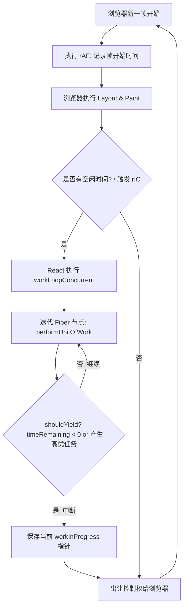

# 📝 面试问题解构：React Fiber 架构中 rAF、rIC 与迭代器的调度与渲染机制

---

## 1. 🌐 知识背景与底层原理

### 引入背景（Why & When）
在 React 15 及更早版本中，React 采用的是**栈协调（Stack Reconciler）**。其核心渲染过程是递归的。一旦开始，就无法中断，直到整棵虚拟 DOM 树比对完成。
*   **痛点**：当 DOM 节点极其庞大时，JS 线程会长时间（超过 16ms，甚至数百毫秒）独占主线程。这导致浏览器无法及时响应用户输入、动画丢帧，产生明显的卡顿感。
*   **演进**：2017 年 React 16 引入了 **Fiber 架构**。为了解决单线程阻塞问题，React 引入了**协程（Coroutine）**和**合作式多任务调度（Cooperative Scheduling）**的思想，将大任务拆分为微小的“工作单元”（Fiber 节点），并在浏览器空闲时分片执行。

### 解决的核心问题（What）
Fiber 架构核心解决了**“在浏览器高负载下，如何保证 UI 交互的流畅度（即 60fps 帧率）”**。
为了实现这一点，React 需要：
1.  **可中断、可恢复**的更新机制。
2.  **优先级划分**（如用户输入 > 动画 > 数据请求）。
3.  **精确掌控浏览器的空闲时间**，在主线程空闲时执行低优先级渲染，在有高优先级任务时立即出让控制权。

---

### 核心原理剖析（How）

#### 1. 迭代器（Iterator）思想与 Fiber 链表遍历
在 React 15 中，递归调用栈是隐式的，无法中途退出。
React 16+ 将树状结构改造成了**单向链表结构**。每个 Fiber 节点都有 `child`（指向第一个子节点）、`sibling`（指向下一个兄弟节点）和 `return`（指向父节点）指针。

这种设计本质上实现了一个**显式的深度优先遍历（DFS）迭代器**。其工作循环（Work Loop）如下：

```javascript
function workLoopConcurrent() {
  // performUnitOfWork 执行一个 Fiber 节点，并返回下一个要执行的 Fiber 节点
  // shouldYield() 判断是否需要向浏览器出让控制权
  while (workInProgress !== null && !shouldYield()) {
    workInProgress = performUnitOfWork(workInProgress);
  }
}
```
因为迭代状态（即 `workInProgress` 指针）保存在内存中，而不是 JS 调用栈中，所以这个迭代器**随时可以被中断，并在下一次调度中恢复执行**。

#### 2. requestAnimationFrame (rAF) 与 requestIdleCallback (rIC) 的理论协同
在标准的浏览器帧生命周期中，一个 16.6ms（60fps）的物理帧包含以下阶段：

```
|--- 一帧 (16.6ms) ------------------------------------------------------------------------|
  Input  -->  Timer  -->  rAF  -->  Layout (Reflow)  -->  Paint  -->  rIC (Idle Period)
```

*   **`requestAnimationFrame` (rAF)**：在**样式计算和布局绘制之前**触发。它是执行动画和高优先级 UI 变更的黄金时期。
*   **`requestIdleCallback` (rIC)**：在浏览器**完成布局和绘制之后**，如果当前帧还有剩余时间（物理帧未耗尽），或者用户处于无交互的空闲状态，浏览器会调用 rIC，并传入一个 `deadline` 对象。通过 `deadline.timeRemaining()` 可以获取当前帧剩余的毫秒数。

#### 3. 理想中的调度流 (Conceptual Flow)
在概念上，React 可以利用 `rAF` 记录一帧的开始时间，并利用 `rIC` 在帧末尾的空闲期（Idle Period）迭代执行 Fiber 链表：



#### 4. 生产环境的残酷现实：为什么 React 弃用了原生 rIC？
尽管上述模型很完美，但 React 在生产环境中**并没有采用原生 `requestIdleCallback`**，原因如下：
1.  **兼容性极差**：Safari 和 IE 完全不支持。
2.  **触发频率不稳定**：rIC 的触发受浏览器策略影响。当标签页切换到后台时，rIC 的触发频率会被压缩到 1s 甚至几十秒一次。
3.  **时间控制不精准**：rIC 的最大空闲时间可达 50ms（为了不影响用户交互），但对于 16.6ms 一帧的渲染来说，50ms 太长了，容易引起卡顿。

#### React 的替代方案：Scheduler (MessageChannel + postMessage)
React 团队自己实现了一个高性能的 `Scheduler` 库：
*   **时间片（Time Slicing）**：React 默认一帧的执行时间约为 **5ms**。
*   **宏任务调度**：利用 `MessageChannel`（优先于 `setTimeout`，因为其在事件循环中更早触发且没有 4ms 的最小延迟）发送消息，在下一个宏任务中触发 Fiber 迭代。
*   **计算出让（shouldYield）**：
    ```javascript
    function shouldYield() {
      // performance.now() 获取当前高精度时间
      // currentTime - startTime >= 5ms 
      return performance.now() - startTime >= yieldInterval;
    }
    ```

---

### 典型应用场景（Where）
*   **复杂大列表/大表单渲染**：用户输入时，页面不卡顿，React 在后台静默分片渲染长列表。
*   **并发模式（Concurrent Mode）**：开启 `useTransition` / `useDeferredValue`。将不紧急的渲染标记为低优先级，使其在后台“迭代”执行，一旦有高优先级的用户输入，立即中断并响应输入。

---

### 引入的缺陷与折中（Trade-offs）
1.  **双缓存机制（Double Buffering）与内存开销**：为了支持中断和恢复，React 内存中会同时存在两棵 Fiber 树：已展示的 `current` 树和正在内存中构建的 `workInProgress` 树，内存开销加倍。
2.  **生命周期/渲染分级（Render & Commit）**：
    *   **Render 阶段（可中断）**：计算 Diff。因为会被中断和重复执行，所以此阶段的函数（如函数组件体、Hooks）**不能含有副作用（Side Effects）**。
    *   **Commit 阶段（不可中断）**：一次性将 Diff 结果写入 DOM。必须同步、连续完成，否则会导致 UI 渲染不完整（撕裂现象）。

---

### 潜在的避坑陷阱（Pitfalls）
*   **在 Render 阶段写副作用代码**：由于并发调度下 Render 阶段会被多次中断、重试，如果你在函数组件体内（不是在 `useEffect` 里）写了修改全局变量、发送请求等副作用，会导致这些副作用被**意外触发多次**。
*   **饥饿问题（Starvation）**：如果高优先级任务源源不断地进来，低优先级的 Fiber 迭代任务可能永远得不到执行（React 内部通过为每个任务设置 `expirationTime` / `Lane`，当低优先级任务快过期时，会强制将其升格为同步任务来解决此问题）。

---

## 2. 🎯 面试官的真实提问目的

*   **表层目的**：
    *   考察候选人是否了解 React Fiber 的基本概念。
    *   验证候选人对浏览器运行机制（Event Loop、Frame Lifecycle）的基本认知。

*   **深层目的（区分度所在）**：
    *   **底层架构思维**：是否理解将“递归”重构为“链表迭代器”对任务可中断性的决定性作用。
    *   **工程落地与权衡**：是否知道 React **并没有**直接使用原生的 `requestIdleCallback`，并能说出其缺陷以及 React 是如何使用 `MessageChannel` 模拟实现的。这能秒杀只会背八股文、没有看过源码或做过深层技术调研的候选人。
    *   **运行环境理解**：是否对浏览器的一帧（Frame）渲染流水线（rAF、Layout、Paint、rIC）有严谨、闭环的知识体系。

---

## 3. 📊 回答的科学 10 分制评估体系

| 评估维度/核心要点 | 对应分值 | 判定标准 (怎样才能拿分) | 扣分项/未达标表现 |
| :--- | :---: | :--- | :--- |
| **要点 1：Fiber 链表与迭代器模式** | **2 分** | 清晰阐述 React 15 递归不可中断的痛点；说明 Fiber 结构（child/sibling/return）本质是**显式深度优先遍历迭代器**，通过保存 `workInProgress` 指针实现中断与恢复。 | 无法解释 Fiber 为什么能被中断，或者说不清楚链表和递归在调用栈上的区别。 |
| **要点 2：物理帧生命周期与 rAF/rIC 理论** | **2 分** | 准确画出或描述浏览器一帧的执行顺序（rAF -> Layout -> Paint -> rIC）。说明 rAF 用于在绘制前处理高优动画，rIC 用于在绘制后利用空闲时间执行低优 Fiber 迭代。 | 混淆 rAF 和 rIC 的触发时机；说不清 `deadline.timeRemaining()` 的作用。 |
| **要点 3：React 摒弃原生 rIC 的原因与 Scheduler 替代方案** | **3 分** | **高分分水岭**：主动指出原生 rIC 存在兼容性差、标签页后台运行频率暴跌、50ms 帧时长不可控等问题。指出 React `Scheduler` 采用 `MessageChannel` (宏任务) 配合高精度时间戳（约 5ms 一帧）进行自建调度。 | 认为 React 生产环境就是直接用了原生的 `requestIdleCallback`（八股文受害者）。 |
| **要点 4：并发模式下的中断、恢复与两阶段（Render/Commit）划分** | **3 分** | 阐述 `shouldYield` 的判断逻辑（5ms 时间片耗尽或有高优输入）。说明中断后如何保留状态，以及为了防止 UI 撕裂，将过程分为可中断的 Render 阶段（无副作用）和不可中断的 Commit 阶段。 | 无法说出如何保证 UI 一致性，或者不理解为什么 Render 阶段不能有副作用。 |

---

## 4. 🧠 问题复杂度评级

*   **复杂度评级**：⭐ ⭐ ⭐ ⭐ ⭐ （4.5/5 星）
*   **评级依据与受众**：
    *   **受众**：该题目非常适合评估**高级前端开发工程师（Senior）**及**前端架构师/专家（Staff/Principal）**。
    *   **难点所在**：
        1.  **跨领域结合**：它不仅考查 React 框架，更考查浏览器底层原理（Event Loop、Rendering Pipeline）以及数据结构（树转链表、迭代器模式）。
        2.  **真伪源码检验**：网上的浅显文章大多会误导读者认为“React 就是用 rIC 做的”，能够精准指出原生 rIC 的缺陷并给出 `MessageChannel` 替代方案，需要对 React 源码有相当深度的钻研。
