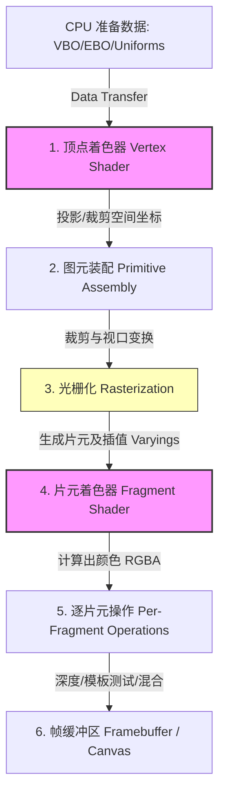

# 📝 面试问题解构：WebGL 的渲染管线流程

---

## 1. 🌐 知识背景与底层原理

### 引入背景（Why & When）
在 WebGL 诞生之前，网页端若想实现高性能的 3D 交互，必须依赖 Flash、Silverlight 等第三方插件，这带来了严重的安全隐患、性能瓶颈以及跨平台兼容性问题。

随着 HTML5 标准的推进，2011 年 Khronos Group 发布了 **WebGL 1.0** 规范（基于 **OpenGL ES 2.0**）。它首次允许 JavaScript 直接调用客户端 GPU 的计算资源，无需任何插件即可在 Canvas 上进行硬件加速的 3D 渲染，开启了 Web 端高性能三维图形时代。

### 解决的核心问题（What）
WebGL 渲染管线（Rendering Pipeline）解决的核心问题是：**如何将内存中的三维几何数据（顶点、纹理、光源等），高效率地转化为屏幕上呈现的二维像素（Pixel）数组。**

在“可编程管线”出现前，OpenGL 采用的是“固定管线”（不可编程），开发者只能调整有限的开关参数。WebGL 引入了**可编程管线**，核心解决了两大痛点：
1. **顶点变换的灵活性**：允许开发者通过 **顶点着色器（Vertex Shader）** 自定义控制顶点在三维空间中的投影、缩放、旋转及骨骼动画。
2. **像素计算的无限可能**：允许开发者通过 **片元着色器（Fragment Shader）** 自定义光照、阴影、纹理映射及后期特效。

### 核心原理剖析（How）
WebGL 渲染管线是一个流水线式的处理过程，数据从 CPU 发送至 GPU，经历以下核心阶段：

#### 1. 顶点输入（Vertex Buffer Objects, VBO）
开发者在 CPU 端准备好顶点的三维坐标、法向量、纹理坐标（UV）、颜色等数据，并将其打包写入显存（VBO/EBO）。

#### 2. 顶点着色器（Vertex Shader）- **[可编程]**
GPU 为每个顶点执行一次该着色器程序。
- **输入**：属性变量（Attributes）、全局变量（Uniforms）。
- **核心任务**：计算顶点在裁剪空间（Clip Space）中的坐标，赋值给内置变量 `gl_Position`。同时可以向片元着色器传递易变变量（Varyings）。
- **坐标变换流程**：
  $$\text{Model Space} \rightarrow \text{World Space} \rightarrow \text{View Space} \rightarrow \text{Clip Space} \rightarrow \text{NDC (Normalized Device Coordinates)}$$

#### 3. 图元装配（Primitive Assembly）
将顶点连接成基本的几何图形（点、线、三角形，由 `gl.drawArrays` 或 `gl.drawElements` 指定）。
- **裁剪（Clipping）**：丢弃视锥体（Frustum）之外的几何图形。
- **透视除法（Perspective Division）**：将裁剪空间坐标 $(x, y, z, w)$ 除以 $w$，转换为 NDC 空间坐标 $(x/w, y/w, z/w)$，范围为 $[-1, 1]$。

#### 4. 光栅化（Rasterization）
将矢量几何图元转换为二维的“片元（Fragments）”网格（即潜在的屏幕像素候选者）。
- **插值（Interpolation）**：将顶点着色器输出的 `varying` 变量（如颜色、纹理坐标）在三角形内部进行线性插值，为每个片元生成对应的值。

#### 5. 片元着色器（Fragment Shader）- **[可编程]**
GPU 为光栅化产生的每个片元执行一次该着色器。
- **输入**：插值后的 `varying` 变量、全局 `uniform`（如纹理贴图）。
- **核心任务**：计算并决定该片元的最终颜色，输出给内置变量 `gl_FragColor`。这是进行光照计算、纹理采样、阴影处理的绝对核心阶段。

#### 6. 逐片元操作（Per-Fragment Operations / 混合与测试）
这是将片元最终写入帧缓冲区（Framebuffer）的最后一道关卡，包含一系列测试：
- **裁剪测试（Scissor Test）**：是否在指定的矩形区域内。
- **模板测试（Stencil Test）**：用于遮罩特效。
- **深度测试（Depth Test / Z-Buffer）**：比较当前片元与已有像素的深度值，决定是否被遮挡。
- **混合（Blending）**：处理半透明物体的颜色合成（如 $C_{final} = C_{src} \times \alpha + C_{dest} \times (1 - \alpha)$）。

---

### 典型应用场景（Where）
- **Web 3D 游戏**：如基于 Three.js、PlayCanvas 或 Babylon.js 开发的 H5 游戏。
- **数据可视化**：大规模散点图、地理信息系统（GIS，如 Mapbox, Deck.gl）。
- **H5 动效与特效**：3D 酷炫官网首页、产品 3D 交互式展示。
- **图像与视频处理**：利用 GPU 的并行计算能力，对网页视频或图片进行实时滤镜、人脸混合等高通量计算。

---

### 引入的缺陷与折中（Trade-offs）
- **高昂的学习与开发成本**：相比传统 HTML/CSS 动画，WebGL 需要开发者精通线性代数（矩阵变换）、3D 图形学原理以及复杂的 GLSL 语言。
- **单线程与多线程的通信瓶颈（CPU - GPU 瓶颈）**：JavaScript 运行在 CPU 单线程，而 WebGL 执行在 GPU。如果频繁跨边界传递大数据（如每帧通过 JS 更新数万个顶点），会导致严重的性能抖动。
- **调试困难**：由于 GLSL 运行在 GPU 上，无法使用传统的 JS `console.log` 或断点。代码出错通常表现为一团黑屏（Black Screen of Death），定位困难。

---

### 潜在的避坑陷阱（Pitfalls）
1. **状态机污染**：WebGL 底层是一个巨大的**状态机**。如果在渲染 A 物体时修改了全局状态（如开启了深度测试或绑定了新的 Buffer），但在渲染 B 物体前忘记重置，会导致 B 物体渲染异常。
2. **内存泄露（GPU 显存）**：JS 的垃圾回收机制（GC）无法自动回收 GPU 内部的 VBO、Textures 和 Shader Program。若不断创建新的纹理而不手动调用 `gl.deleteTexture(texture)`，显存很快就会溢出，导致浏览器崩溃。
3. **精度问题导致闪烁（Z-Fighting）**：深度测试精度有限。如果两个平面距离过近，由于浮点数精度误差，会出现交叉闪烁的现象。
4. **Context Lost（上下文丢失）**：当系统显存不足或 GPU 驱动重启时，浏览器会触发 `webglcontextlost` 事件。若无处理机制，页面将直接挂掉且无法恢复。

---

## 2. 🎯 面试官的真实提问目的

- **表层目的**：
  评估候选人是否对三维图形学的核心工作流有最基本的认知。能说出“顶点着色器 -> 光栅化 -> 片元着色器”说明其读过 WebGL 教程，过了八股文的第一关。

- **深层目的**：
  1. **底层探究精神**：候选人是否只停留在 Three.js/Babylon.js 等高层框架的 API 调用上（“API Boy”），还是真正理解这些框架底层是如何向 GPU 提交数据的。
  2. **工程调优与踩坑经验**：候选人是否知道渲染管线的瓶颈通常在哪（例如：Draw Call 数量、顶点传输带宽、片元着色器的 Overdraw 像素重复绘制）。
  3. **图形学基础理论**：是否真正理解各种空间坐标系变换（MVP 矩阵）的数学本质。

- **区分度要点**：
  - **初级/中级（Junior/Mid）**：能熟练背诵管线步骤，知道顶点和片元着色器的作用，能手写简单的 GLSL。
  - **高级/专家（Senior/Staff）**：
    - 能清晰解释 **GPU 硬件并行计算** 的运作模式（SIMD 架构）。
    - 能够指出管线中的性能瓶颈（如顶点提交过多、Draw Call 过多、Overdraw、显存带宽限制）。
    - 能够说出 **WebGL 2.0 (OpenGL ES 3.0)** 带来的新管线特性（如 Transform Feedback、Uniform Buffer Objects、MRT 多渲染目标）。
    - 能提出具体的优化方案（如：实例化渲染 Instanced Rendering、批处理 Batching、延迟渲染 Deferred Shading、纹理图集 Texture Atlas）。

---

## 3. 📊 回答的科学10分制评估体系

| 评估维度/核心要点 | 对应分值 | 判定标准 (怎样才能拿分) | 扣分项/未达标表现 |
| :--- | :---: | :--- | :--- |
| **要点 1：基础管线阶段与职责** | 3.0 分 | 能准确说出：VBO/EBO -> 顶点着色器 -> 图元装配 -> 光栅化 -> 片元着色器 -> 逐片元操作（测试/混合）。并能解释每个阶段的基本功能。 | 阶段顺序说错；分不清顶点着色器和片元着色器的输入输出；对光栅化的概念模糊不清。 |
| **要点 2：数据传递与坐标变换** | 2.5 分 | 1. 讲清楚 CPU 到 GPU 的数据流动形式（Attributes、Uniforms、Varyings 的区别与应用）。 2. 详述坐标系变换：Model -> World -> View -> Projection -> NDC -> Window 空间。 | 概念混淆，例如把 attribute 错当作片元着色器的直接输入；对矩阵变换（MVP）的作用及空间转换关系说不清楚。 |
| **要点 3：底层机制（状态机与硬件）** | 2.0 分 | 1. 强调 WebGL 的**状态机**（State Machine）本质。 2. 提及 GPU 硬件并行机制，并指出 GPU 是多核心 SIMD 架构，解释为何着色器没有 `if-else` 的高分支效率。 | 缺乏对 WebGL 状态机制的认知，以为它是面向对象的编程；无法解释为什么着色器要尽量避免写复杂的条件分支。 |
| **要点 4：实战性能优化与踩坑** | 2.5 分 | **（高级分水岭）** 主动结合实战谈优化： 1. 针对 **CPU-GPU 瓶颈**：减少 Draw Calls、合并 Geometry、使用 Instanced Drawing。 2. 针对 **VRAM 优化**：防止 GPU 内存泄漏，复用 Buffer 与 Textures。 3. 针对 **Overdraw**：谈及提前深度测试（Early-Z）或延迟渲染（Deferred Shading）。 4. 提及 **Context Lost** 应对。 | 完全是理论派背诵，没有提及任何实战优化经验；不知道如何防止 GPU 内存泄露。 |

---

## 4. 🧠 问题复杂度评级

- **复杂度评级**：⭐ ⭐ ⭐ ⭐ （4星 - 偏难）
- **评级依据与受众**：
  - **适合受众**：高级前端开发、前端特效/游戏开发、GIS 工程师、三维可视化专家。
  - **难点所在**：
    1. **抽象度极高**：WebGL 的数据流是跨语言（JavaScript -> GLSL）和跨硬件（CPU -> GPU）的，涉及大量的非显式状态切换（Binding/Unbinding），容易让没有图形学功底的纯前端望而生畏。
    2. **数学与硬件门槛**：该题目需要理解矩阵乘法、透视投影、插值等数学原理，同时需要对 GPU 的多核并行架构有硬件级别的常识性认知，非一日之功可掌握。
