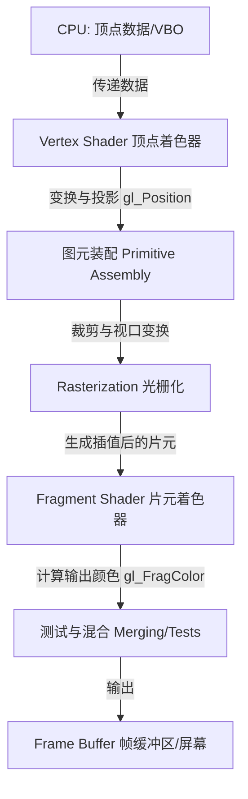

# 📝 面试问题解构：请说明顶点着色器和片元着色器的基本应用

在三维计算机图形学和游戏开发领域，**顶点着色器（Vertex Shader）**和**片元着色器（Fragment/Pixel Shader）**是可编程渲染管线（Programmable Rendering Pipeline）中最核心的两个阶段。

下面我们将从底层原理、应用场景、面试官意图、量化评估以及难度评级五个维度，对这个问题进行全方位的深度解构。

---

## 1. 🌐 知识背景与底层原理

### 引入背景（Why & When）
在 2000 年代初期（DirectX 8/9，OpenGL 2.0 时代）之前，GPU 采用的是**固定管线（Fixed-Function Pipeline）**。当时的开发者只能通过配置有限的开关和参数来控制渲染效果（如开关某盏灯、设置固定的材质反射率），无法自定义光照模型或实现复杂的物理特效。
为了打破这种限制，GPU 引入了**可编程管线**，允许开发者编写自定义代码直接在 GPU 上运行，而顶点着色器和片元着色器正是这一变革的基石。

### 解决的核心问题（What）
*   **顶点着色器**：解决的是**“物体在哪里，长什么样”**的问题。它将三维空间中的几何顶点数据进行变换和投影。
*   **片元着色器**：解决的是**“每个像素最终呈现什么颜色”**的问题。它决定了物体的质感、光影和细节。

### 核心原理剖析（How）
以下是数据在渲染管线中的流动过程：

1.  **顶点着色器（Vertex Shader）**：
    *   **输入**：单个顶点的属性（位置、法线、切线、纹理坐标 UV、顶点色等）。
    *   **处理**：对每个顶点独立执行一次。最核心的任务是通过**MVP 矩阵**（Model-View-Projection）将顶点从局部坐标系转换到裁剪空间（Clip Space）。
    *   **输出**：`gl_Position`（裁剪空间坐标），以及传递给片元着色器的自定义属性（`varying` 或 `out` 变量）。
2.  **光栅化（Rasterization，承上启下的硬件阶段）**：
    *   将几何图元（三角形）离散化为二维屏幕上的**片元（Fragment）**。
    *   在此过程中，硬件会自动对顶点着色器输出的属性（如 UV、颜色、法线）进行**重心坐标插值**（Barycentric Interpolation），生成每个片元对应的属性值。
3.  **片元着色器（Fragment Shader）**：
    *   **输入**：光栅化插值后的片元属性。
    *   **处理**：对每个片元（潜在的像素）独立执行一次。
    *   **输出**：最终的片元颜色（如 `gl_FragColor`）和深度值。

---

### 典型应用场景（Where）

| 着色器类型 | 典型应用场景 | 具体实现机制 |
| :--- | :--- | :--- |
| **顶点着色器** | **几何变换 & MVP 变换** | 将 3D 模型正确投影到 2D 屏幕上。 |
| | **骨骼动画与蒙皮 (Skinning)**| 在 GPU 端根据骨骼矩阵实时计算顶点位置，实现角色动画。 |
| | **顶点位移特效 (Displacement)** | 利用正弦波模拟**水体波动**、利用噪声模拟**风吹草动**或旗帜飘扬。 |
| | **看板效果 (Billboard)** | 实时修改顶点，使粒子（如火焰、落叶）始终朝向摄像机。 |
| **片元着色器** | **纹理贴图映射 (Texturing)** | 采样纹理（弥散贴图、法线贴图、高光贴图等）来表现物体表面细节。 |
| | **光照与阴影计算 (Lighting)** | 实现经典光照（Lambert, Phong）及现代物理渲染（PBR），计算阴影。 |
| | **后处理特效 (Post-processing)**| 对整个屏幕画面进行高斯模糊、色彩校正、景深、HDR 等处理。 |
| | **程序化生成 (Procedural Coding)**| 利用数学公式（如噪声、SDF）在没有贴图的情况下实时计算图案。 |

---

### 引入的缺陷与折中（Trade-offs）
*   **GPU 计算负载分配**：片元着色器的执行次数（通常与屏幕分辨率及超采样相关，数百万次）远多于顶点着色器（与网格顶点数相关，数万到数百万次）。在设计算法时，需要权衡是将计算放在顶点阶段（开销小但精度低，会有锯齿拉伸）还是片元阶段（精度高但开销极大）。
*   **数据传输开销**：顶点着色器输出到片元着色器的数据需要经过光栅化插值，传输过多的 `varying` 变量会占用宝贵的寄存器和带宽。

### 潜在的避坑陷阱（Pitfalls）
1.  **分支污染（Branch Divergence）**：在片元着色器中使用复杂的 `if-else` 条件分支，会导致 GPU 线程束（Warp/Wavefront）内的线程无法并行，从而性能暴跌。
2.  **精度丢失（Precision Issues）**：在移动端 WebGL/OpenGL ES 中，不合理地在片元着色器中使用 `lowp`（低精度）可能导致色彩断层或计算错误，而盲目使用 `highp` 会严重消耗性能。
3.  **逐顶点计算带来的视觉走样**：将高光反射（Specularity）放在顶点着色器中计算（如 Gouraud 着色），在低模上会出现明显的三角形棱角感，必须改用逐像素计算（Phong 着色）。

---

## 2. 🎯 面试官的真实提问目的

*   **表层目的**：检查候选人是否掌握图形学的基本概念，是否知道渲染管线中“顶点”和“像素”的职责边界，避免连基本 API 都写不出来的“纯纸面工程师”。
*   **深层目的**：
    1.  **工程实践经验**：候选人是否写过非平凡（Non-trivial）的 Shader？是否做过粒子系统、骨骼动画或后处理？
    2.  **性能优化思维（核心区分点）**：候选人是否理解“顶点数”与“像素数”的量级差异？是否懂得**“能放在顶点着色器计算的，就绝不放在片元着色器”**这一核心优化原则？
    3.  **底层插值原理**：是否真正理解光栅化阶段是如何将顶点数据转化为片元输入数据的。

### 区分度要点 (Junior vs. Senior)
*   **Junior (初级)**：能说出顶点着色器管位置，片元着色器管颜色；能举出换颜色、贴图的例子。
*   **Mid (中级)**：能清晰描述 MVP 变换、法线贴图、光影计算；能手写简单的 GLSL 代码；理解光栅化插值的过程。
*   **Senior/Staff (高级/专家)**：能主动讨论 **性能瓶颈定位**（Vertex-bound vs. Pixel-bound）、**移动端带宽优化**、**GPU 内部架构（SM、Warp）**对 Shader 编写的限制；能够给出诸如“如何将片元着色器中的向量计算插值化移动到顶点着色器”的重构方案。

---

## 3. 📊 回答的科学 10 分制评估体系

| 评估维度/核心要点 | 对应分值 | 判定标准 (怎样才能拿分) | 扣分项/未达标表现 |
| :--- | :---: | :--- | :--- |
| **要点 1：管线概念与基本职责** | 2 分 | 能准确说出两个着色器在渲染管线中的位置，顶点着色器处理顶点位置（空间变换），片元着色器处理最终像素颜色。 | 混淆两者的基本职责；对渲染管线没有整体概念。 |
| **要点 2：典型应用场景举例** | 2 分 | 能够针对两类着色器分别列举出至少 2-3 个实际应用场景（如：顶点着色器实现风吹草动、骨骼动画；片元着色器实现光照、纹理映射、后处理）。 | 只能说出“算位置”和“涂颜色”，举不出任何具体的特效或业务场景。 |
| **要点 3：数据流动与插值机制** | 2 分 | 能够清晰解释顶点数据是如何通过**光栅化（Rasterization）**和**重心坐标插值**传递给片元着色器的，理解 `Attribute` -> `Varying/Out` -> `In` 的流动。 | 讲不清两个着色器之间的数据是如何建立关联的，不知道中间存在光栅化插值阶段。 |
| **要点 4：性能优化与折中思考** | 2 分 | **（加分项）** 主动提到顶点着色器与片元着色器的执行频率差异（顶点数 vs. 像素数），并阐述如何通过将计算从片元转移到顶点来优化性能（如逐顶点光照 vs. 逐像素光照）。 | 认为片元着色器里写什么算法都无所谓，缺乏性能敏感度。 |
| **要点 5：高级工程踩坑经验** | 2 分 | **（高级专用加分项）** 提到 GPU 硬件特性，如避免片元着色器分支带来的性能惩罚、移动端精度限定符的使用、或者 Early-Z（提前深度测试）对着色器执行顺序的影响。 | 缺乏实际 Shader 调优和排错经验，完全是理论背书。 |

---

## 4. 🧠 问题复杂度评级

*   **复杂度评级**：⭐ ⭐ ⭐ （3 星，中等难度）
*   **评级依据与受众**：
    *   **适合受众**：该问题是游戏开发（Unity/Unreal）、3D 前端开发（Three.js/WebGL）、图形学程序员、计算几何算法工程师的**必考基石题**。
    *   **难点解析**：
        *   **易学难精**：虽然概念极为基础，但要答出“深度”和“亮点”，必须结合**矩阵几何数学**、**硬件架构（GPU 并行原理）**以及**性能优化实践**。
        *   普通的背诵者只会回答“顶点改形状，片元上颜色”，而优秀的候选人能以此问题为切入点，展示出其对整个 GPU 架构和渲染管线瓶颈的深刻洞察。
