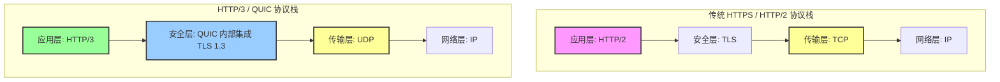

# 📝 面试问题解构：QUIC 协议是否基于 TCP 实现？

---

## 1. 🌐 知识背景与底层原理

### 引入背景（Why & When）
互联网的基石是 **TCP/IP 协议栈**。经过几十年的演进，应用层协议（如 HTTP/1.1、HTTP/2）在传输层高度依赖 TCP 协议。然而，随着移动互联网的爆发和对极速响应的需求，**TCP 的固有缺陷**成为了瓶颈。
2012年，Google 提出了 **QUIC（Quick UDP Internet Connections）协议**，并在 2021年被 IETF 正式标准化为 RFC 9000。QUIC 的引入是为了彻底解决 TCP 在现代网络环境下的“历史包袱”。

### 解决的核心问题（What）
在 QUIC 出现之前，基于 TCP 的网络传输面临以下核心痛点：
1. **TCP 建立连接延时大**：传统的 HTTPS 连接需要经过 TCP 三次握手 + TLS 握手，最少需要 2~3 个 RTT（Round-Trip Time）。
2. **队头阻塞（Head-of-Line Blocking, HoL）**：HTTP/2 虽然实现了多路复用，但因为 TCP 协议是保证字节流顺序的，一旦某个 TCP 分片丢失，整条连接上的所有流（Streams）都会被阻塞，直到该分片重传成功。
3. **网络迁移（Connection Migration）成本高**：TCP 连接由“源 IP、源端口、目的 IP、目的端口”四元组唯一确定。当手机用户从 Wi-Fi 切换到 4G/5G 时，IP 地址改变，TCP 连接必须断开并重新建立。
4. **协议僵化（Ossification）**：TCP 协议栈实现在操作系统内核中。由于防火墙、路由器等网络中间设备（Middleboxes）只认传统的 TCP 头部格式，导致修改 TCP 协议极其困难，升级成本极高。

---

### 核心原理剖析（How）

> **直接回答：QUIC 协议绝对不是基于 TCP 实现的，而是基于无连接的 UDP 协议实现的。**

QUIC 在 **用户空间（User Space）** 重新实现了可靠传输、拥塞控制和流量控制。其协议栈对比如下：

#### QUIC 的关键工作机制：
1. **基于 UDP 的可靠性重构**：QUIC 发送的每个数据包都有一个唯一的、单调递增的 Packet Number，即使是重传包，其 Packet Number 也是新的。这彻底解决了 TCP 的重传二义性问题（Retransmission Ambiguity）。
2. **彻底解决传输层队头阻塞（HoL）**：QUIC 将连接划分为多个独立的 **Stream（流）**。
   - 每个 Stream 拥有独立的滑动窗口和流量控制。
   - 当 Stream 1 的包丢失时，只有 Stream 1 的接收会受阻；Stream 2 和 Stream 3 的数据包仍能立刻交付给上层应用。
3. **极速握手（0-RTT / 1-RTT）**：QUIC 将传输握手和加密握手（TLS 1.3）合二为一。
   - 首次连接：只需 **1-RTT** 即可完成连接建立与密钥协商。
   - 再次连接：利用之前缓存的 Session Ticket，可实现 **0-RTT** 极速数据发送。
4. **基于连接 ID（Connection ID）的连接迁移**：QUIC 不再用四元组标识连接，而是使用一个 64 位或 128 位的客户端与服务端协商出的 **Connection ID（CID）**。即使 IP 地址或端口发生变化，只要 CID 不变，连接依然可以无缝维持。

---

### 典型应用场景（Where）
* **实时音视频/直播**：如抖音、腾讯视频、Zoom 等。QUIC 的低延迟和抗丢包能力能显著减少卡顿。
* **移动端业务（弱网环境）**：地铁、电梯等信号频繁交替、高丢包的场景，利用 QUIC 的连接迁移和抗丢包算法。
* **出海业务与跨国传输**：在高延迟、高丢包率的跨国链路上，QUIC 的拥塞控制（如 BBR 算法）表现远超 TCP。

---

### 引入的缺陷与折中（Trade-offs）
* **CPU 消耗显著增加**：由于 QUIC 的分包、组包、加密解密和拥塞控制全部在**用户空间**完成（无法利用操作系统的内核级 TCP 优化和网卡硬件卸载 LSO/GRO），导致服务器的 CPU 消耗通常比 TCP 高出 **20% ~ 50%**。
* **网络中间件阻断风险**：许多企业防火墙、运营商网关默认对 UDP 流量实施限速（Rate Limiting）甚至直接屏蔽（Drop），误以为是大流量 DDoS 攻击。

---

### 潜在的避坑陷阱（Pitfalls）
* **UDP 黑洞效应（UDP Black Hole）**：在实际部署中，必须实现**降级机制（Fallback）**。当客户端通过 QUIC 建连失败时，必须能够无缝降级到普通的 HTTP/2 (TCP + TLS)，否则会导致服务完全不可用。

---

## 2. 🎯 面试官的真实提问目的

* **表层目的**：考察候选人是否了解 HTTP/3 和 QUIC 的最基本常识（基于 UDP 而非 TCP）。
* **深层目的**：
  * **计算机网络底层功底**：候选人是否真正理解 **TCP 队头阻塞** 与 **HTTP 队头阻塞** 的区别？
  * **系统架构与权衡思维（Trade-off）**：是否清楚为什么不能直接在内核中修改 TCP（协议僵化问题），而必须在用户空间基于 UDP 重构？
  * **工程实战经验**：是否遇到过 UDP 被运营商限速的坑？在弱网环境下，QUIC 是如何进行优化的？
* **区分度要点**：
  * **Junior（普通）**：只能背出“QUIC 是基于 UDP 的，用于 HTTP/3”这一句结论，说不清楚 TCP 为什么慢，也解释不清楚队头阻塞的本质。
  * **Senior（资深）**：能清晰地从“协议僵化、TLS+TCP 握手开销、TCP 队头阻塞、连接迁移”四个维度系统阐述 QUIC 的设计初衷；能画出协议栈对比；懂得实战中 CPU 消耗上升、UDP 黑洞降级等工程现实问题。

---

## 3. 📊 回答的科学 10 分制评估体系

| 评估维度/核心要点 | 对应分值 | 判定标准 (怎样才能拿分) | 扣分项/未达标表现 |
| :--- | :---: | :--- | :--- |
| **要点 1：明确回答与基本栈结构** | **2 分** | 斩钉截铁指出 **QUIC 是基于 UDP** 实现的，并能画出/描述出 “HTTP/3 -> QUIC -> UDP” 的层级结构。 | 犹豫不决，或错误地认为是在 TCP 之上做了一层封装。 |
| **要点 2：痛点剖析 (Why & When)** | **3 分** | 深刻解释 TCP 协议的三大硬伤： 1. **TCP 队头阻塞**（需讲清与 HTTP/2 队头阻塞的区别）； 2. **中间设备硬化 (Ossification)** 阻碍内核升级； 3. **多重握手延迟** (TCP + TLS)。 | 仅罗列名词（如“TCP慢”），无法解释什么是队头阻塞或中间设备硬化。 |
| **要点 3：QUIC 核心机制 (How)** | **3 分** | 能够清晰阐述以下机制中的至少两点： 1. **Connection ID** 支撑的连接迁移； 2. 整合 TLS 1.3 实现的 **0-RTT/1-RTT** 握手； 3. 独立的 **Stream 级别流量控制**。 | 对技术细节描述模糊，混淆了 Connection ID 与传统四元组的概念。 |
| **要点 4：实战避坑与降级设计** | **2 分** | 主动提及 **UDP 黑洞问题及 Fallback 降级方案（如 Alt-Svc 机制）**，以及用户态协议栈带来的 **CPU 开销上升** 痛点。 | 认为 QUIC 是完美无缺的“银弹”，完全没有实战部署中的高并发、CPU 负载及防火墙阻断概念。 |

---

## 4. 🧠 问题复杂度评级

* **复杂度评级**：⭐ ⭐ ⭐ ⭐ （4星）
* **评级依据与受众**：
  * **目标受众**：主要针对 **中高级研发工程师、架构师、系统运维专家**。
  * **难点所在**：表面上是一个“是与否”的简单选择题，但往深处追问，会涉及 **TCP 的滑动窗口、重传二义性、TLS 握手细节、Linux 内核态与用户态性能差异、网络拥塞控制算法（如 BBR）**。能够把 QUIC 的来龙去脉、底层设计和实战妥协讲清楚的候选人，网络功底通常极其扎实。
