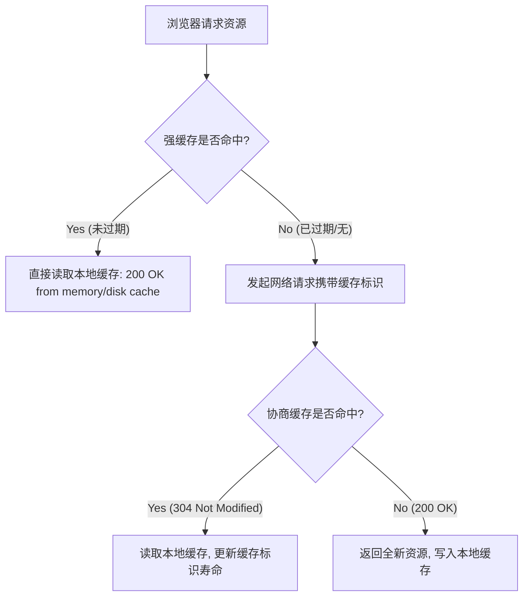

# 📝 面试问题解构：强缓存和协商缓存的区别

## 1. 🌐 知识背景与底层原理

### 引入背景（Why & When）
在 Web 1.0 向 Web 2.0 及 SPA（单页应用）演进的过程中，网页资源（JS、CSS、图片、字体等）的体积呈爆炸式增长。如果每次打开页面都从服务器重新下载所有资源，不仅**用户等待时间长（白屏问题严重）**，还会对**服务器带宽和性能造成极大的压迫**。为了解决这些痛点，HTTP 协议引入了客户端缓存机制。

---

### 解决的核心问题（What）
HTTP 缓存主要解决两个核心痛点：
1. **网络传输延迟（Latency）**：减少不必要的网络请求，实现页面毫秒级加载。
2. **带宽与计算资源浪费（Bandwidth & CPU）**：避免服务器重复发送未发生改变的数据。

---

### 核心原理剖析（How）

浏览器在请求资源时，会先根据响应头判断是否命中缓存。缓存分为**强缓存**和**协商缓存**，其本质区别在于**“是否需要向服务器发起网络请求进行验证”**。

#### ① 强缓存 (Strong Cache)
*   **工作机制**：浏览器直接从本地缓存（内存 `memory cache` 或磁盘 `disk cache`）读取资源，**不发送请求到服务器**。
*   **状态码**：`200 OK (from disk cache)` 或 `200 OK (from memory cache)`。
*   **核心控制属性**：
    *   `Expires` (HTTP/1.0)：服务器绝对时间（例如 `Expires: Wed, 21 Oct 2025 07:28:00 GMT`）。**缺点**：若客户端本地时间被篡改或不准，会导致缓存混乱。
    *   `Cache-Control` (HTTP/1.1)：相对时间（例如 `Cache-Control: max-age=31536000`，单位为秒）。**优先级高于 `Expires`**。

#### ② 协商缓存 (Negotiated Cache)
*   **工作机制**：浏览器本地缓存已过期或设置了不直接使用强缓存，浏览器会**携带缓存标识向服务器发起请求**，由服务器判断资源是否发生改变。
*   **状态码**：
    *   若资源未变：返回 `304 Not Modified`（不返回实体数据，仅更新响应头，省带宽）。
    *   若资源已变：返回 `200 OK`（返回全新的资源及新的缓存头）。
*   **核心控制属性（成对出现）**：
    *   **基于修改时间**：
        *   响应头：`Last-Modified`（精确到秒）
        *   请求头：`If-Modified-Since`（询问：在此时间后是否有修改？）
    *   **基于内容指纹（ETag）**：
        *   响应头：`ETag`（资源的唯一 Hash 值）
        *   请求头：`If-None-Match`（询问：这个 ETag 值变了吗？）
        *   *注：`ETag` 优先级高于 `Last-Modified`，解决了时间戳只能精确到秒、以及文件内容未变但修改时间变了的问题。*

---

### 典型应用场景（Where）
*   **首选强缓存**：静态资源（如 Webpack/Vite 打包后的 JS、CSS、图片、字体）。这些资源通常文件名带有 Hash 值（如 `index.a8f2c.js`），一旦内容改变，文件名也会变，因此可以安全地设置超长强缓存（如 1 年）。
*   **首选协商缓存**：单页应用的入口文件 `index.html`。因为 HTML 文件引入了其他的 JS/CSS，一旦发布新版，HTML 中的引用路径会变。必须每次都向服务器确认 HTML 是否有更新（通过协商缓存或 `Cache-Control: no-cache`）。

---

### 引入的缺陷与折中（Trade-offs）
*   **缓存穿透与更新延迟**：如果对未带 Hash 的静态资源配置了超长强缓存，一旦线上代码有 Bug 需要紧急修复，用户在缓存过期前无法看到修复后的代码（除非手动强制刷新 `Ctrl+F5`）。
*   **服务器计算开销**：使用 `ETag` 时，服务器（或 CDN）需要计算文件的 Hash 值。对于超大文件，频繁计算 ETag 会消耗 CPU 资源。

---

### 潜在的避坑陷阱（Pitfalls）
*   **`no-cache` 与 `no-store` 的混淆**：
    *   `Cache-Control: no-cache`：**不直接使用强缓存**，而是必须走**协商缓存**验证。
    *   `Cache-Control: no-store`：**彻底禁用缓存**，任何时候都直接下载最新资源。
*   **CDN 缓存策略冲突**：源站配置的缓存策略与 CDN 节点配置的缓存策略不一致，导致客户端拿到了过期的资源。

---

## 2. 🎯 面试官的真实提问目的

*   **表层目的**：考察候选人对前端性能优化最基本手段——HTTP 缓存机制的掌握程度，属于“前端八股文”必考题。
*   **深层目的**：
    *   **协议理解深度**：是否能清晰区分 HTTP/1.0 和 HTTP/1.1 的演进（如为什么引入 `Cache-Control` 和 `ETag`）。
    *   **工程实战经验**：是否知道在实际项目部署中（如单页应用 SPA）如何针对不同文件（HTML、JS、CSS、图片）配置不同的缓存策略。
    *   **细节掌控力**：是否理解 `no-cache` 和 `no-store` 的本质区别，是否了解 `304` 的网络交互开销。
*   **区分度要点**：
    *   **Junior (初级)**：能背出概念，知道强缓存不发请求，协商缓存发请求，知道 `Cache-Control` 和 `ETag` 等名词，但对具体的字段关联和交互流程模糊。
    *   **Mid (中级)**：能清晰画出交互流程图，准确说明 `Expires/Cache-Control` 和 `Last-Modified/ETag` 的配对关系、优先级和优缺点，能说出 `no-cache` 的真实含义。
    *   **Senior/Staff (高级/专家)**：能够结合**前端部署方案**谈缓存（如前端非覆盖式发布：HTML 设置协商缓存，静态资源加 Hash 且设置长期强缓存）。能解释浏览器 `Memory Cache` 和 `Disk Cache` 的区别，甚至能谈及 Service Worker 缓存及 CDN 缓存对客户端缓存的影响。

---

## 3. 📊 回答的科学10分制评估体系

| 评估维度/核心要点 | 对应分值 | 判定标准 (怎样才能拿分) | 扣分项/未达标表现 |
| :--- | :---: | :--- | :--- |
| **要点 1：核心概念与交互机制** | 3 分 | 1. 准确说明强缓存**不发请求**，直接读取本地数据。 2. 准确说明协商缓存**发送请求**，由服务器决定返回 `304` 还是 `200`。 | 1. 概念混淆，分不清哪个要发请求。 2. 认为协商缓存不占用网络带宽。 |
| **要点 2：协议字段与优先级** | 3 分 | 1. 准确说出强缓存的 `Expires` 和 `Cache-Control`，且后者优先级高。 2. 准确说出协商缓存的 `Last-Modified` 和 `ETag` 双向携带字段，且 `ETag` 优先级高并说明原因（精度高，避免时间误差）。 | 1. 字段拼写错误或配对错误（如把 ETag 和 Expires 配对）。 2. 说不清优先级，或无法解释为什么 ETag 优于 Last-Modified。 |
| **要点 3：细节辨析（no-cache vs no-store 等）** | 2 分 | 1. 完美解释 `no-cache` 并非不缓存，而是每次都必须进行协商缓存校验。 2. 区分 `no-store` 是真正的不缓存。 | 1. 将 `no-cache` 误解为完全不缓存（这是最常见的“背书式”错误）。 |
| **要点 4：前端工程化实战结合** | 2 分 | 1. 主动结合实际项目（SPA 部署），说明 `index.html` 与 `hash 静态资源` 的缓存策略差异。 2. 提及浏览器内存缓存（Memory Cache，如 Base64 图片/较小JS）与磁盘缓存（Disk Cache）的物理存储差异。 | 1. 缺乏实战经验，无法说明缓存策略在生产环境如何落地。 2. 认为所有资源缓存机制在浏览器中处理方式完全相同。 |

---

## 4. 🧠 问题复杂度评级

*   **复杂度评级**：⭐ ⭐ ⭐ （3星，中级难度）
*   **评级依据与受众**：
    *   **受众**：该问题是**所有前端开发、全栈开发及运维/网关工程师**的必修课。适合从校招到高级别的所有候选人。
    *   **难点所在**：题目本身概念不难，但**上限极高**。难点在于从简单的“概念背诵”上升到“底层原理（TCP/HTTP）”以及“前端工程化部署、CDN 架构、浏览器渲染机制（Memory/Disk）”的联动理解。能否流畅、系统地回答这道题，是检验一个程序员“工程素养”和“网络功底”的试金石。
