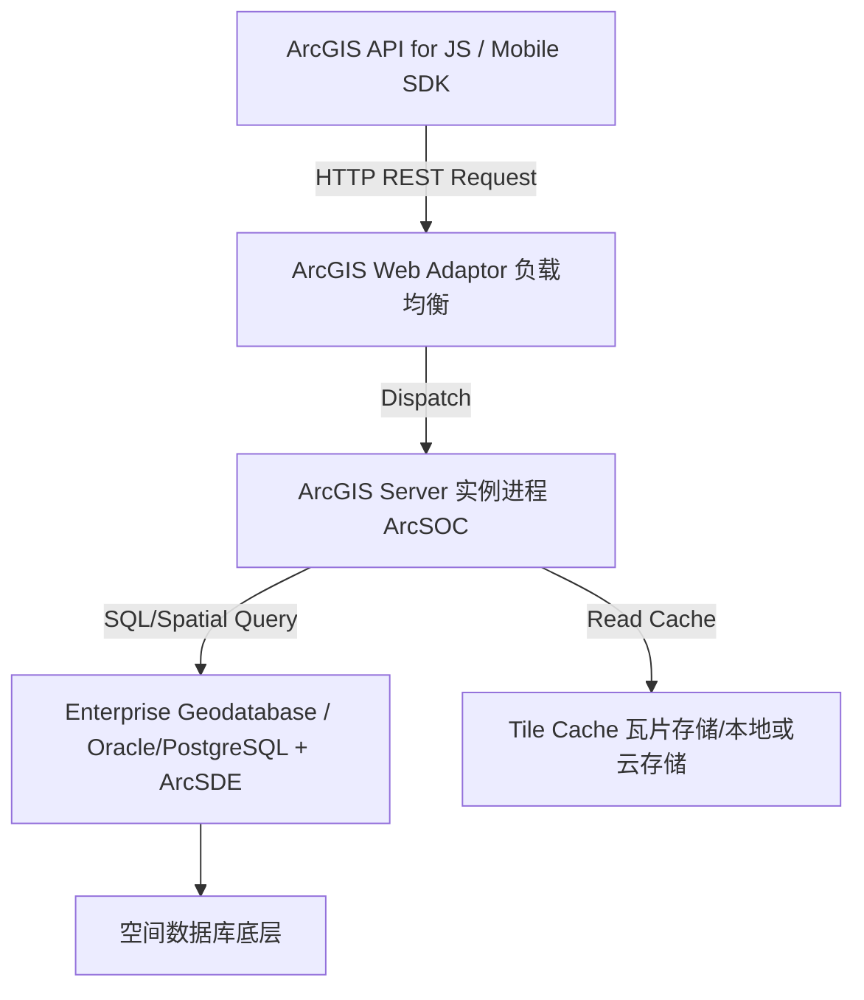

# 📝 面试问题解构：你在项目中有没有使用过 ArcGIS，具体如何应用？

---

## 1. 🌐 知识背景与底层原理

### 引入背景（Why & When）
地理信息系统（GIS）在城市规划、资产管理、物流监控、灾害预警等领域扮演着核心角色。在早期的信息化阶段，空间数据的存储、查询和可视化极其零散。**ArcGIS** 作为 Esri 公司推出的旗舰级企业 GIS 解决方案，在 2000 年代伴随着“数字城市”和“智慧城市”的浪潮成为行业标准。它将地理空间数据与关系型数据库无缝结合，实现了空间数据的工业化生产与管理。

### 解决的核心问题（What）
在 ArcGIS 出现或普及之前，地学工作者和软件开发者面临以下痛点：
1. **空间数据格式割裂**：CAD 矢量、遥感栅格、传统关系数据难以在同一系统内进行拓扑关联。
2. **空间查询效率极低**：传统数据库无法高效处理“查询某点周围 5 公里内所有学校”这类空间邻近性查询。
3. **地图渲染性能差**：在 Web 端渲染海量矢量数据时，浏览器容易崩溃。
**ArcGIS 提供了全套栈的解决方案（Desktop/Pro + Enterprise/Server + APIs）**，标准化了空间数据存储（Geodatabase）、空间服务发布（REST API）和前端渲染（ArcGIS API for JS）。

### 核心原理剖析（How）
ArcGIS Enterprise 的底层核心是**服务驱动架构**。以下是典型的 Web GIS 应用架构流向图：

#### 关键技术机制：
1. **空间索引（Spatial Indexing）**：ArcGIS 在数据库层（如 PostgreSQL/Oracle 结合 ArcSDE）使用 **Grid Index** 或 **R-tree** 空间索引。它将二维空间划分为多级网格，查询时先通过外包矩形（Bounding Box）过滤，再进行精确的几何拓扑计算，避免全表扫描。
2. **地图瓦片技术（Map Tiling）**：
   - **切片地图服务（Map Image Layer - Cached）**：预先在服务器端将地图渲染为 256x256 像素的金字塔形图片（Raster Tiles），前端根据层级（LOD）和行列号直接请求图片，降低服务器 CPU 实时渲染压力。
   - **矢量瓦片（Vector Tiles）**：将矢量几何数据打包成 Protocol Buffers (PBF) 格式传输，由前端（GPU）进行渲染，支持动态切换样式且占用带宽极小。
3. **空间参考系统（SRS/CRS）**：处理地球椭球体（如 WGS84、CGCS2000）到二维平面投射（如 Web Mercator、高斯-克吕格）的复杂数学变换。

### 典型应用场景（Where）
* **智慧城市/管网管理（Web GIS）**：城市地下给排水管网的拓扑分析、爆管分析（流向分析）。
* **国土空间规划（Spatial Analysis）**：多因子适宜性评价（通过 GP 服务进行栅格叠加分析）。
* **实时位置监控（Dynamic Tracking）**：结合 GeoEvent Server，接收物联网设备传入的 GPS 坐标，进行电子围栏触发与实时轨迹渲染。

### 引入的缺陷与折中（Trade-offs）
* **高昂的授权费用（Cost）**：ArcGIS 是闭源商业软件，Enterprise 许可极其昂贵，这迫使许多中小型项目流向开源生态（PostGIS + GeoServer + Leaflet/Mapbox）。
* **架构重且不灵活（Heavyweight）**：ArcGIS Server 占用内存和 CPU 资源巨大（每个 ArcSOC 进程都是资源大户），微服务化难度较高。
* **开发生态相对封闭**：其前端 JS API 虽然强大，但包体积臃肿，与现代前端框架（Vue/React）的构建工具（如 Vite、Webpack）集成时，常遇到配置繁琐和打包体积过大的问题。

### 潜在的避坑陷阱（Pitfalls）
* **坐标系漂移（Datum Shifts）**：在国内开发中，由于政策原因存在“火星坐标系（GCJ-02）”、“百度坐标系（BD-09）”与国标“CGCS2000/WGS84”的偏差。如果直接将高德定位点叠加到 ArcGIS 发布的 CGCS2000 地图上，会出现数百米的偏移，必须进行**纠偏算法**或**坐标转换（七参数/四参数）**。
* **动态服务（Dynamic Map Service）高并发雪崩**：当大量用户同时缩放地图，且未使用瓦片缓存时，ArcGIS Server 会实时从数据库读取空间数据并渲染图片，极易导致 ArcSOC 进程耗尽，服务响应超时甚至崩溃。
* **SDE 锁冲突**：多用户在线编辑 Feature Service（要素服务）时，频繁的事务未提交会导致 Geodatabase 表锁死，影响整个系统的读写。

---

## 2. 🎯 面试官的真实提问目的

* **表层目的**：确认候选人简历中的“GIS 经验”是否真实，是否熟悉 ArcGIS 技术栈的基本组件（Pro, Server, Portal, JS API），而非仅仅调过几行高德/百度地图 API。
* **深层目的**：
  * **工程落地能力**：看候选人是否解决过实际生产环境中的痛点，如**大数据量渲染变慢**、**坐标系转换错误**、**三维场景加载卡顿**。
  * **架构思维**：考察候选人对“商业闭源（Esri）”与“开源 GIS（PostGIS/GeoServer/Cesium）”的边界认知，是否具备技术选型和成本控制（TCO）意识。
  * **底层探究精神**：是否理解 Web GIS 的基本协议（WMS, WFS, WMTS）及空间数据格式。
* **区分度要点**：
  * **Junior 级别**：仅在桌面端（ArcMap）配图、发布一个 MapServer，然后用 JS API 做个简单的点线面打点展示。对于性能优化、坐标系原理一问三不知。
  * **Mid 级别**：能够编写 Python（ArcPy）脚本自动化处理数据，发布过 GP（地理处理）服务，知道如何对切片进行预生成，解决过简单的坐标偏移问题。
  * **Senior/Staff 级别**：能够架构企业级分布式 GIS 系统；设计过高并发下的地图切片与多级缓存策略；解决过海量空间数据（如亿级轨迹数据）的存储与快速检索（如使用 PostGIS / ClickHouse / Elasticsearch + GeoHash）；在项目中做过深入的 ArcGIS 与开源技术栈的混合架构设计，具备清晰的技术权衡思维。

---

## 3. 📊 回答的科学10分制评估体系

| 评估维度/核心要点 | 对应分值 | 判定标准 (怎样才能拿分) | 扣分项/未达标表现 |
| :--- | :---: | :--- | :--- |
| **要点 1：技术栈完整性与项目应用背景** | **2 分** | 能够清晰叙述在什么项目中（如：智慧水务、国土空间规划），使用了 ArcGIS 技术栈的哪些组件（如 ArcGIS Pro 建模，Server 发布服务，JS API 4.x 构建前端），并准确说出业务闭环。 | 无法清晰描述项目背景，将 ArcGIS 与高德地图等轻量级 Web 地图混为一谈。 |
| **要点 2：空间数据管理与服务发布机制** | **2 分** | 准确阐述空间数据的存储方案（如 ArcSDE + Oracle/PostgreSQL），并解释不同服务类型（MapService 动态/切片、FeatureService 要素编辑、GP 空间分析服务）的选择依据与工作机制。 | 对服务类型不敏感，所有数据都用动态服务发布；对空间数据库的工作原理没有概念。 |
| **要点 3：底层原理与空间计算（硬核技术）** | **2 分** | 能够深入探讨 **空间索引**（Grid/R-Tree）原理、**坐标系转换**（WGS84、CGCS2000 与投影坐标系的转换机制），以及 **OGC 标准**（WMS、WMTS、WFS）。 | 讲不清坐标系与投影的区别，不知道为什么地图会出现偏移；不懂空间索引如何加速查询。 |
| **要点 4：性能优化与高并发实战踩坑** | **2 分** | 结合实际生产，分享过优化经历：如**动态切片（On-demand Caching）**、**矢量瓦片（Vector Tiles）应用**、**ArcSOC 进程池调优**、或者高并发下使用 Redis 缓存空间查询结果。 | 认为 ArcGIS 性能完美，未遇到过任何卡顿或崩溃；对大数量渲染只会说“没办法，硬件不够”。 |
| **要点 5：技术选型与开源替代（架构眼界）** | **2 分** | 主动分析 ArcGIS 的优缺点，展现 TCO（总拥有成本）意识。能够清晰对比 ArcGIS 与开源方案（GeoServer、PostGIS、Mapbox GL、Cesium）在成本、性能、定制化上的权衡。 | 表现出对 ArcGIS 的盲目迷信，不知道开源 GIS 生态，或无法客观评价其高昂成本和闭源劣势。 |

---

## 4. 🧠 问题复杂度评级

* **复杂度评级**：⭐ ⭐ ⭐ ⭐ 
* **评级依据与受众**：
  * **适用级别**：高级开发工程师、GIS 架构师、三维可视化专家。
  * **难点解析**：
    1. **跨学科壁垒**：该问题不仅考察软件工程（前端/后端/数据库），还深度绑定了**地理信息学（Geodesy/Cartography）**的专业知识。坐标系、投影变换、拓扑关系等概念对纯计算机背景的开发者有较高门槛。
    2. **企业级实战性强**：ArcGIS 软件庞大，没有在实际企业级项目（如政府、国企的大型 GIS 项目）中真刀真枪地部署、配图、调优过，仅凭背诵“八股文”极易在细节追问中露出破绽。
    3. **需要全局视野**：面试官通常会借此问题衍生到**开源 WebGIS（Cesium 3D, Deck.gl, Mapbox）**的对比，要求候选人不仅是个“ArcGIS 使用者”，更是一个具备架构选型能力的“GIS 解决专家”。
