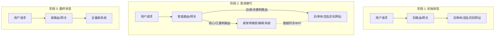

# 📝 面试问题解构：如何规划和执行网站重构？

在技术面试中，“网站重构”是一个极具含金量的开放性系统工程问题。它不仅考察候选人的技术深度，更直接考验其工程管理、风险控制、业务理解及架构演进的综合素养。

---

## 1. 🌐 知识背景与底层原理

### 引入背景（Why & When）
随着业务的快速迭代，网站（前端及相关BFF/网关层）不可避免地会积累技术债：代码耦合严重、打包构建缓慢、性能劣化、技术栈过时导致招聘和维护成本上升。重构通常发生在：
1. **业务拐点期**：现有架构已无法支撑新的业务模式或爆发式流量。
2. **技术滞后期**：旧技术栈（如 jQuery、AngularJS 1.x、Vue 2）失去官方支持，或严重阻碍研发效率。
3. **性能瓶颈期**：首屏加载慢、交互卡顿，直接影响转化率和用户体验。

### 解决的核心问题（What）
重构的核心目标是**在保证业务连续性（不停机、不引入新 Bug）的前提下，实现系统架构的平滑演进**。它解决的是研发效率、系统稳定性、性能体验以及技术可持续发展的问题。

### 核心原理剖析（How）
现代网站重构摒弃了“推倒重来（Big Bang）”的暴力做法，普遍采用**渐进式重构（Incremental Refactoring）**。其核心架构模式是**绞杀者模式（Strangler Fig Pattern）**。

#### 绞杀者模式架构演进：

**关键工作机制：**
1. **路由分流（Routing Split）**：利用 Nginx、CDN 或网关层，根据路径（Path）或用户画像（灰度）将流量分发至新旧系统。
2. **微前端/多页共存（Coexistence）**：通过微前端框架（如 Single-SPA, qiankun）或 MPA（多页面应用）模式，让新旧技术栈在同一个域名下无缝共存。
3. **数据桥接（BFF/Data Bridge）**：引入 BFF（Backend For Frontend）层，屏蔽后端接口变化对前端的影响，实现数据格式的平滑过渡。

### 典型应用场景（Where）
* 大型电商网站从 MPA 向 SPA（或 Next.js SSR）转型。
* 巨石前端应用（Monolithic Frontend）拆分为微前端架构。
* 传统 B 端管理后台的现代化升级（如从 AntD v3 升级到 v5，并引入自动化测试）。

### 引入的缺陷与折中（Trade-offs）
* **短期复杂度翻倍**：由于新旧系统并存，需要维护两套 CI/CD 流程、解决跨应用状态共享和样式污染。
* **双写与同步成本**：在重构数据结构时，可能需要双写数据库或同时调用新旧两套接口。
* **研发资源挤占**：重构会占用业务开发资源，容易引发技术团队与业务团队的冲突。

### 潜在的避坑陷阱（Pitfalls）
1. **“第二系统效应”（Second-System Effect）**：试图在重构中一次性解决所有历史问题，加入过多新功能，导致项目延期甚至流产。
2. **缺乏基准测试（Baseline）**：重构前没有对性能、线上报错率进行数字化埋点，导致重构后无法定量证明“变好了”。
3. **忽视暗功能（Dark Features）**：旧代码中隐藏的隐藏业务逻辑（如为了兼容某老客户写的 Hack 代码）在重构中被遗漏。

---

## 2. 🎯 面试官的真实提问目的

* **表层目的**：考察候选人是否掌握前端架构设计、构建工具优化、模块化划分等基本功。
* **深层目的**：
  * **风险意识**：是否知道如何安全地切流量？是否有回滚方案（Rollback Plan）？
  * **业务体感**：能否平衡“技术追求”与“业务发展”，是否懂得用数字化指标（如 LCP, TTI, 崩溃率）向非技术老板汇报重构价值。
  * **项目管理与推进力**：面对错综复杂的依赖，如何拆解任务，如何推动多团队协同。
* **区分度要点**：
  * **Junior (初级)**：通常回答“用 React/Vue3 重新写一遍”，只关注技术栈更新，缺乏平滑过渡方案，容易导致业务中断。
  * **Mid (中级)**：能想到分模块重构，知道使用组件化、Webpack 优化等手段，但缺乏系统化的风险控制机制（如监控、灰度）。
  * **Senior/Staff (高级/专家)**：具备**“在高速公路上换轮胎”**的胆识与方案。会提出：数据基线对比、绞杀者模式、双端对比测试、灰度发布策略、降级预案以及重构的 ROI（投资回报率）评估。

---

## 3. 📊 回答的科学10分制评估体系

| 评估维度/核心要点 | 对应分值 | 判定标准 (怎样才能拿分) | 扣分项/未达标表现 |
| :--- | :---: | :--- | :--- |
| **要点 1：现状评估与目标定义 (Define)** | 2 分 | 主动提出建立**性能与稳定性基线**（如 Lighthouse 指标、Sentry 报错率）。明确重构的业务与技术目标，拒绝为了重构而重构。 | 一上来就讨论选型 React 还是 Vue，缺乏现状分析和量化指标。 |
| **要点 2：迁移策略与架构设计 (Design)** | 3 分 | 给出清晰的**渐进式重构方案**（如微前端、Nginx 路由分发、绞杀者模式）。阐述新旧系统共存期间的数据流与样式隔离方案。 | 提出“一次性全量发布（Big Bang）”，忽视新旧共存期的技术挑战。 |
| **要点 3：执行阶段与风险控制 (Execute)** | 3 分 | 详细描述**灰度发布策略**（按地域/按用户百分比）、**影子测试/双写机制**、以及完备的**回滚预案**（如何在一分钟内切回旧版）。 | 缺乏测试和上线保障方案，认为代码写完、QA 测过就可以直接全量上线。 |
| **要点 4：团队协同与业务平滑 (Process)** | 2 分 | 能够说明如何在不冻结业务（Feature Freeze）的前提下进行重构，如何拆解任务给团队成员，以及如何与业务产品经理（PM）达成共识。 | 认为重构期间必须停止所有新业务开发；无法说服非技术人员支持重构。 |

---

## 4. 🧠 问题复杂度评级

* **复杂度评级**：⭐ ⭐ ⭐ ⭐ ⭐ （4.5 / 5 星）
* **评级依据与受众**：
  * **受众**：主要针对 **资深前端开发、前端架构师、技术经理/总监** 级别。
  * **难点**：该题目没有标准答案。它的难点不在于某个具体的 API，而在于**系统工程的闭环思维**。候选人不仅要懂底层技术（如微前端、构建工程化），还要懂运维（CDN/网关路由）、测试（差异化比对）、产品（灰度策略）和管理（研发资源平衡）。能在高压、多变环境下交出高可行性重构方案的人，才是团队急需的架构核心。
