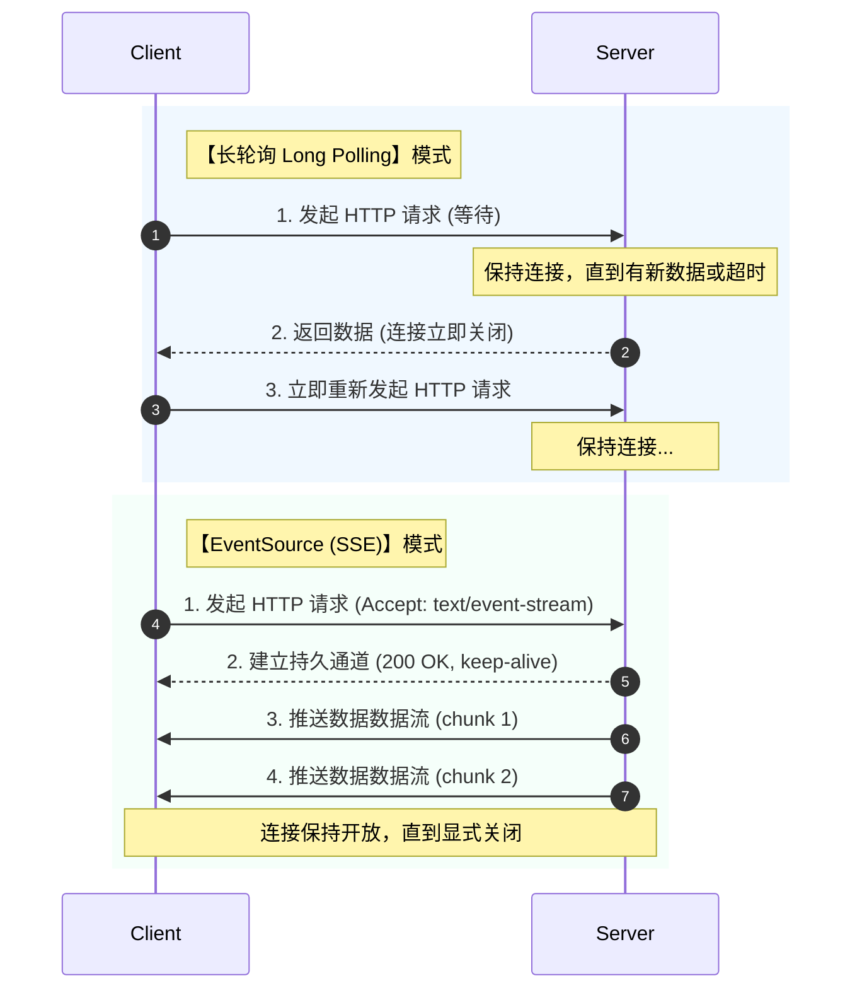

# 📝 面试问题解构：EventSource 和长轮询 (Long Polling) 的区别

## 1. 🌐 知识背景与底层原理

在 Web 开发中，实现“服务端向客户端推送实时数据”一直是核心需求之一。**EventSource (Server-Sent Events, 简称 SSE)** 和 **长轮询 (Long Polling)** 是这一演进过程中的两个重要里程碑。

### 引入背景（Why & When）
*   **长轮询（Long Polling）**：诞生于 2000 年代中期的 Comet 技术浪潮。在 WebSocket 和 SSE 出现之前，由于传统的 HTTP/1.0/1.1 是严格的“请求-响应”单向通信模型，为了实现实时性，开发者最初使用**短轮询（Short Polling）**，但其高频的无用请求对服务器造成了巨大灾难。长轮询作为一种“黑客式”的优化方案应运而生。
*   **EventSource（SSE）**：作为 HTML5 规范的一部分于 2011 年左右推出。随着 Web 规范的完善，业界需要一种**标准化、轻量级、专门用于服务端单向推送**的持久化连接机制，以替代复杂且消耗资源的长轮询。

### 解决的核心问题（What）
两者都是为了解决 **“如何让客户端低延迟地获取服务端高频更新的数据”**。
*   **长轮询**：解决了传统短轮询（Short Polling）中高频空请求导致的带宽浪费和高延迟问题。
*   **EventSource**：解决了长轮询中**频繁建立/断开 HTTP 连接的开销**，以及缺乏统一的状态重连、事件分类和标识（ID）追踪等标准协议层支持的痛点。

---

### 核心原理剖析（How）

#### 1. 工作工作流对比



#### 2. 底层协议与数据格式差异
*   **长轮询**：基于标准的 HTTP 请求。每次交互都是一个完整的 HTTP 事务。
*   **EventSource**：基于 HTTP 协议，但使用了特定的 MIME 类型：`text/event-stream`。
    *   服务端通过分块传输编码（Chunked Transfer Encoding）保持连接不中断，并以特定格式推送数据：
        ```http
        id: 12345
        event: message
        retry: 10000
        data: {"user": "Alice", "text": "Hello"}
        
        ```

---

### 典型应用场景（Where）

*   **EventSource (SSE) 的首选场景**：
    *   **大语言模型（LLM）对话流式输出**：如 ChatGPT、Claude 的打字机回复效果（当前最火爆的应用场景）。
    *   **社交媒体 Feed 流 / 实时新闻通知**：如微博更新、体育赛事比分文字直播。
    *   **监控仪表盘 / 股票行情推送**：单向的数据更新展示。
*   **长轮询 (Long Polling) 的首选场景**：
    *   **兼容极老旧浏览器**：需要兼容 IE 6/7/8/9 的企业级遗留系统（不支持 HTML5 EventSource）。
    *   **防火墙/代理极度严苛的环境**：某些企业内网代理会截断长连接（Keep-Alive）或数据流，此时长轮询的瞬时短连接兼容性最好。

---

### 引入的缺陷与折中（Trade-offs）

| 特性 | 长轮询 (Long Polling) | EventSource (SSE) |
| :--- | :--- | :--- |
| **连接复用** | 极低（每次收到数据都必须重新建连） | 极高（单条 TCP 连接持续推送） |
| **通信方向** | 双向（虽然每一次都是单向的请求-响应） | 严格单向（仅服务端 -> 客户端） |
| **网络开销** | 高（每次请求都要携带完整的 HTTP Header） | 极低（仅在首次建连时有 Header 开销） |
| **服务器并发压力** | 极大（频繁的 socket 关闭与创建，耗 CPU/内存） | 较小（维持挂起连接，配合异步 I/O 架构开销极低） |
| **网络阻塞限制** | 无明显限制 | **HTTP/1.1 下有浏览器单域名最大 6 个连接限制**（HTTP/2 下无此限制） |

---

### 潜在的避坑陷阱（Pitfalls）

1.  **EventSource 的最大克星：反向代理缓存与缓冲（Buffering）**
    *   **问题**：在使用 Nginx / Cloudflare 等反向代理时，默认会开启响应缓冲区。这会导致服务端的 SSE 消息被缓存在代理服务器中，客户端无法实时收到，而是“攒一大波”后一次性弹出。
    *   **解决**：服务端必须在响应头中明确加上 `X-Accel-Buffering: no`（针对 Nginx）以及 `Cache-Control: no-cache`。
2.  **浏览器连接数耗尽（HTTP/1.1 Limit）**
    *   **问题**：如果网站还在使用 HTTP/1.1，浏览器对同一域名的并发请求限制为 6 个。如果用户在浏览器里开了 6 个相同的 SSE 标签页，第 7 个标签页将会永久挂起并导致整个域名请求卡死。
    *   **解决**：必须升级到 **HTTP/2**（支持多路复用，无此限制），或者使用 WebSockets。
3.  **长轮询的“惊群效应”与服务端雪崩**
    *   **问题**：当服务器发生网络波动或重启后，成千上万个长轮询客户端会在同一时间瞬间重新发起连接请求，造成瞬时高并发流量（DDoS 效应）。
    *   **解决**：客户端重新发起长轮询时，必须引入**指数退避（Exponential Backoff）**和随机抖动（Jitter）机制。

---

## 2. 🎯 面试官的真实提问目的

*   **表层目的**：
    *   评估候选人对 Web 前端/后端基础通信技术的掌握程度。
    *   检查候选人是否只背诵了“WebSocket”这一种实时通信方案，而忽视了其他轻量化方案。
*   **深层目的**：
    *   **架构折中（Trade-off）思维**：是否理解没有完美的方案，只有契合场景的方案。能否说清楚“单向通信”与“双向通信”的选型依据。
    *   **生产实战经验**：是否真正踩过 Nginx 缓存导致 SSE 不输出的坑？是否知道 HTTP/1.1 下 6 个连接限制的痛点？（区分“背八股文”与“真正写过代码”的分水岭）。
    *   **前沿技术敏感度**：是否能联想到当前最火的 **LLM / ChatGPT 流式文本传输** 几乎清一色采用 SSE 这一事实。

---

## 3. 📊 回答的科学10分制评估体系

| 评估维度/核心要点 | 对应分值 | 判定标准 (怎样才能拿分) | 扣分项/未达标表现 |
| :--- | :---: | :--- | :--- |
| **要点 1：工作流与协议机制** | 3 分 | 1. 能清晰说出长轮询是“请求-等待-响应-再请求”的闭环；<br>2. 能说出 EventSource 是基于单一持久 HTTP 连接的 `text/event-stream` 协议。 | 只知道“长轮询是不断问，SSE 是服务端发”，说不清楚底层 HTTP 状态、Header 区别。 |
| **要点 2：协议原生特性与弹性** | 2 分 | 指出 EventSource 原生支持 **自动重连（retry）**、**连接状态追踪（Last-Event-ID）**、以及**事件分类（event type）**，而长轮询必须在应用层手动实现这些。 | 认为两者都需要在 JS 层手工写复杂的重连和去重逻辑，不知道 EventSource 的内置机制。 |
| **要点 3：底层性能与资源损耗** | 2 分 | 深入对比两者的性能：长轮询频繁握手（TCP 慢启动、HTTP Header 冗余包），SSE 连接复用；分析服务端线程挂起对服务器吞吐量的影响。 | 无法从网络层（TCP/HTTP Header）分析开销，觉得两者性能差不多。 |
| **要点 4：现代网络协议（HTTP/2）的影响** | 1 分 | 主动提及 **HTTP/1.1 协议下单域名 6 个连接限制** 对 SSE 的致命影响，并给出 **HTTP/2 多路复用** 如何优雅解决该问题的机制。 | 意识不到连接限制问题，或者混淆了端口限制与浏览器并发限制。 |
| **要点 5：生产避坑与现代实践（LLM）** | 2 分 | 1. 结合当下大模型（如 ChatGPT）流式生成，说明 SSE 的广泛应用；<br>2. 指出 Nginx 缓冲 `proxy_buffering` 导致的断流坑及解决方案。 | 缺乏实战体感，完全是纸上谈兵，无法给出任何实际开发中的调优建议。 |

---

## 4. 🧠 问题复杂度评级

*   **复杂度评级**：⭐ ⭐ ⭐  （3.5 / 5 星）
*   **评级依据与受众**：
    *   **适合受众**：中、高级前端开发工程师，中级后端/网关开发工程师。
    *   **难点所在**：
        1.  **跨栈知识**：该题不仅考前端 API（`new EventSource`），还深度依赖后端响应头配置、网络协议（HTTP/1.1 vs HTTP/2）以及网关（Nginx）的缓存机制。
        2.  **实战细节**：回答好此题，必须解释清楚“流（Streaming）”在 HTTP 协议中的表现形式（分块传输），以及在实际大模型应用开发中如何解决网络代理的拦截问题。
