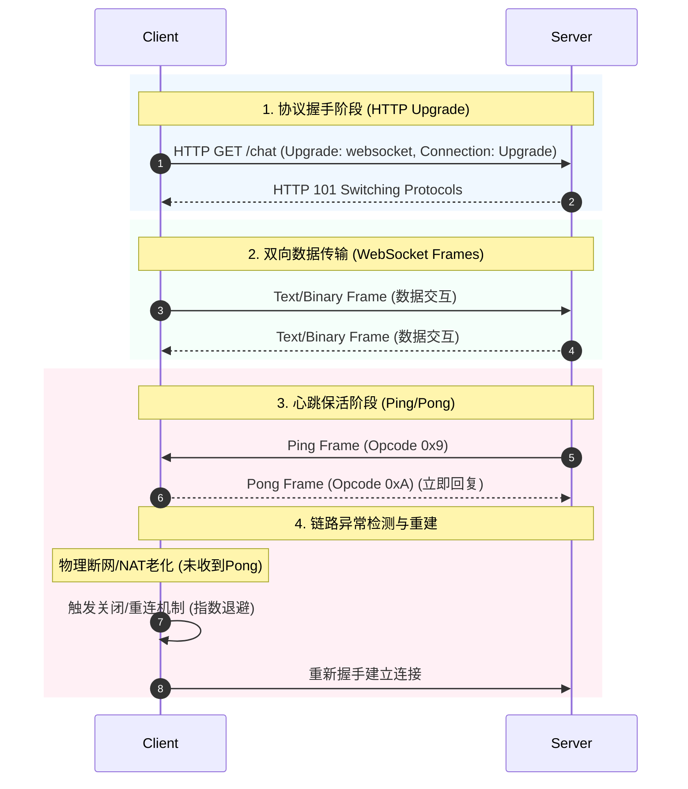

# 📝 面试问题解构：WebSocket 如何保持长连接

---

## 1. 🌐 知识背景与底层原理

### 引入背景（Why & When）
在 Web 早期，网页与服务器之间的交互基于标准的 **HTTP/1.0 或 HTTP/1.1** 协议。HTTP 是典型的**单向、无状态、请求-响应式**协议。
为了实现数据的实时推送（如在线聊天、股票行情、实时监控），业界先后演进出了以下几种方案：
1. **短轮询（Short Polling）**：客户端每隔几秒发送一次 HTTP 请求。*缺点：产生大量无用请求，浪费带宽和服务器资源。*
2. **长轮询（Long Polling）**：服务器收到请求后挂起，直到有新数据才响应。*缺点：依然需要频繁重建 TCP 连接，服务器积压大量挂起请求。*

为了彻底解决“**实时性、双向通信、低开销**”的痛点，IETF 在 2011 年发布了 **RFC 6455** 标准，正式引入了 **WebSocket 协议**。

---

### 解决的核心问题（What）
WebSocket 解决了 **如何在单个 TCP 连接上进行全双工（Full-Duplex）通信** 的问题。它避免了 HTTP 头部过大（Cookie、User-Agent 等）带来的带宽浪费，消除了频繁建立 TCP 连接的延迟，实现了服务器可以主动向客户端推数据的能力。

---

### 核心原理剖析（How）

WebSocket 维持长连接的底层机制是一个**多层级协同**的过程，主要分为**协议握手、数据分帧、心跳保活、异常重连**四个阶段：



#### 1. 协议升级 (Handshake)
WebSocket 并不是凭空建立的，它借用了 HTTP 的通道。客户端发送带有特殊请求头的 HTTP 请求：
```http
GET /chat HTTP/1.1
Host: server.example.com
Upgrade: websocket
Connection: Upgrade
Sec-WebSocket-Key: dGhlIHNhbXBsZSBub25jZQ==
Sec-WebSocket-Version: 13
```
服务器如果支持，则返回 `101 Switching Protocols` 响应。此时，底层 TCP 连接保持不断，双方停止使用 HTTP 协议，改用 **WebSocket 帧格式** 进行通信。

#### 2. 应用层心跳机制：Ping/Pong 帧
这是**保持长连接最关键的机制**。
WebSocket 协议本身在应用层定义了控制帧：
* **Ping 帧 (Opcode 0x9)**：可以由服务器或客户端发起，表示“你在吗？”。
* **Pong 帧 (Opcode 0xA)**：接收方收到 Ping 后，**必须**立即回复 Pong，表示“我在”。

**为什么需要应用层心跳，而不是直接靠 TCP 的 Keep-Alive？**
* **TCP Keep-Alive 的局限性**：TCP 保活发生在传输层，默认探测周期极长（通常是 2 小时）。它只能检测“操作系统是否活着”，无法检测“应用层是否假死”（如 JVM OOM、JS 线程阻塞）。
* **NAT 与防火墙老化问题**：公网传输中，路由器、防火墙或运营商的 **NAT（网络地址转换）网关** 会维护一个连接追踪表。如果一个连接长时间没有数据交互（通常超过几分钟），NAT 会在不通知双方的情况下悄悄“剪断”这个连接。应用层心跳可以持续产生流量，防止 NAT 记录失效。

#### 3. 客户端异常检测与退避重连
客户端（通常是浏览器或 App）需要监听网络状态：
* **心跳超时**：如果在设定的时间内（如 15 秒）未收到 Pong 回复，主动断开旧连接。
* **重连策略**：不能在断开后立即高频重连，否则会引发**惊群效应（Thundering Herd）**压垮服务器。必须使用**指数退避算法（Exponential Backoff）加随机扰动（Jitter）**（如间隔 1s、2s、4s、8s + 随机秒数）。

---

### 典型应用场景（Where）
* **即时通讯（IM）**：微信 Web 版、各类客服聊天系统。
* **金融实时行情**：股票、加密货币的价格秒级刷新。
* **协同办公**：Figma、语雀、Google Docs 的多人实时协作编辑。
* **在线多人游戏**：对延迟敏感的棋牌、竞技类网页游戏。

---

### 引入的缺陷与折中（Trade-offs）
1. **服务器资源消耗高**：HTTP 是无状态的，请求完即释放；WebSocket 要求服务器必须为每个连接保留内存（文件描述符 FD、内存 Session、维持心跳的定时器）。单机维持百万连接（C10M）对操作系统内核参数有极高要求。
2. **负载均衡复杂化**：普通的 HTTP 负载均衡器可以随意分发请求。而 WebSocket 是有状态的长连接，一旦连接建立，后续所有流量都必须打到同一台服务器。需要引入 **粘性会话（Sticky Sessions）** 或 **中间件转发（如 Redis Pub/Sub）**。
3. **不支持断线重传机制**：WebSocket 协议本身不保证消息的“可靠到达”（它基于 TCP 虽保证了传输顺序，但在网络切换断线瞬间的消息会丢失）。开发者必须在应用层设计**消息确认（ACK）与补发**机制。

---

### 潜在的避坑陷阱（Pitfalls）
* **假死连接（Zombie Connections）**：客户端直接关闭网页、或者手机进入电梯失去信号。由于没有走标准的 TCP 四次挥手流程，服务器在没有应用层心跳的情况下，会误认为连接还活着，白白占用 FD 和内存，导致资源泄露。
* **Nginx/网关默认超时**：使用 Nginx 代理 WebSocket 时，如果不配置 `proxy_read_timeout`（默认 60s），Nginx 会在 60 秒无数据传输后自动切断连接。必须配置合适的心跳周期或调大网关超时时间。

---

## 2. 🎯 面试官的真实提问目的

* **表层目的**：
  * 考察候选人是否了解 WebSocket 协议的基本工作流程。
  * 考察是否知道心跳机制（Ping/Pong）的作用。

* **深层目的**：
  * **网络底功**：是否分得清 TCP Keep-Alive 和应用层心跳的区别？是否深刻理解 NAT 超时机制？
  * **实战经验**：是否处理过由于网络抖动导致的连接断开？如何设计的重连机制（是否考虑了服务器雪崩防御）？
  * **架构思维**：在分布式/集群环境下，WebSocket 的 Session 如何管理？如何解决高并发长连接下的系统瓶颈？

* **区分度要点**：
  * **Junior**：知道用 `setInterval` 定时发 `send("ping")`，能说出断开后用 `reconnect()`。
  * **Mid**：能说出标准 RFC 的 Ping/Pong 帧，知道 NAT 老化和中间件超时的概念，能写出带简单退避逻辑的重连代码。
  * **Senior/Staff**：
    * 深入底层的 TCP 内核参数调整（`sysctl.conf` 中的 `fs.file-max`，TCP 读写缓冲区大小）。
    * 提出完备的防雪崩重连方案（指数退避 + Jitter）。
    * 讨论集群环境下，由于连接分散在不同服务器，如何利用 Redis 订阅/发布或消息队列实现跨节点消息路由（有状态服务的横向扩展）。

---

## 3. 📊 回答的科学10分制评估体系

| 评估维度/核心要点 | 对应分值 | 判定标准 (怎样才能拿分) | 扣分项/未达标表现 |
| :--- | :---: | :--- | :--- |
| **要点 1：协议基础与握手流程** | **2 分** | 清楚阐述 WebSocket 依赖 HTTP 101 协议升级、在单个 TCP 连接上实现双向通信。 | 语焉不详，说不清楚它与普通 HTTP 连接的关系，或者认为它不需要 TCP。 |
| **要点 2：心跳保活机制（核心）** | **3 分** | 准确说出 **RFC 5455 中的 Ping/Pong 帧** 机制。能清晰解释 **为什么 TCP Keep-Alive 无法替代应用层心跳**（突出 NAT 节点老化、应用层死锁假死两个维度）。 | 仅提到“客户端定时发个 json 字符串”，不知道底层有标准的 Ping/Pong 控制帧，或说不清为什么要用心跳。 |
| **要点 3：客户端韧性与重连设计** | **2 分** | 主动提到如何应对网络环境切换（如 Wi-Fi 转 5G）。给出科学的重连方案：**指数退避（Exponential Backoff）+ 随机抖动（Jitter）**，并合理解释原因（防惊群/防服务器雪崩）。 | 重连逻辑过于粗暴，直接用 `setInterval` 死循环高频重连。 |
| **要点 4：网关与中间件适配** | **1 分** | 提到反向代理（如 Nginx、ALB、K8s Ingress）的连接超时配置（如 Nginx 的 `proxy_read_timeout`），以及心跳频率要低于该超时时间。 | 忽略了真实生产环境中网关设备对长连接的影响。 |
| **要点 5：服务端高并发与分布式架构** | **2 分** | 讨论服务端如何支撑海量连接（系统 FD 限制、内存调优、Epoll 驱动）；主动分析在集群模式下，**有状态服务** 如何通过 Redis Pub/Sub、MQ 进行消息跨节点广播。 | 认为分布式环境和单机没区别；面对百万级连接没有调优和系统设计的概念。 |

---

## 4. 🧠 问题复杂度评级

* **复杂度评级**：⭐ ⭐ ⭐ 🌠 （3.5 星）
* **评级依据与受众**：
  * **中级候选人** 应该能拿满 1-3 点（基本概念、心跳、简单重连），此时该题是中等难度。
  * **高级/专家候选人** 会被追问到第 4-5 点（底层内核调优、高并发分布式路由、网络链路深度解析）。这时候它是一个非常好的、能够测出候选人网络底功与分布式架构能力的深度好题。
